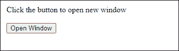
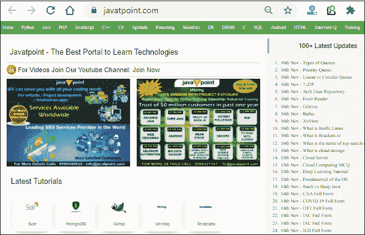
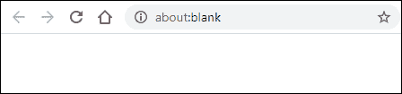
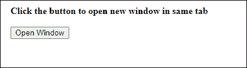
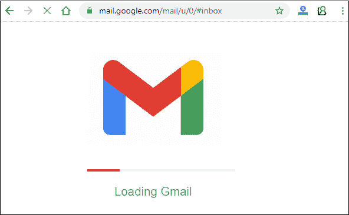
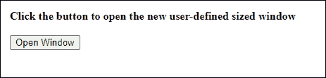
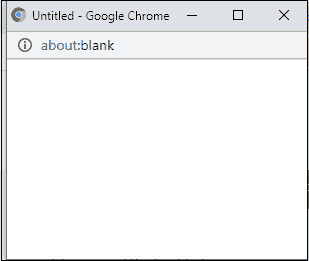
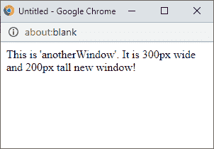
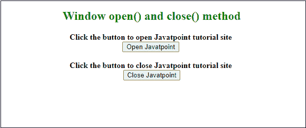

# JavaScript 窗口打开方法

> 原文:[https://www.javatpoint.com/javascript-window-open-method](https://www.javatpoint.com/javascript-window-open-method)

JavaScript 提供了打开和关闭浏览器窗口的内置方法，以执行额外的操作，如机器人窗口等。这些方法有助于打开或关闭浏览器窗口弹出窗口。以下是窗口方法:

*   **打开()**
*   **关闭()**

使用 **window.open** 方法将新网页打开到新窗口中，使用 **window.close** 方法关闭 window.open 方法打开的网页。详细参见 window.open()方法:

## Window.open()

是 [JavaScript](https://www.javatpoint.com/javascript-tutorial) 的预定义窗口方式，用于在浏览器中打开新的选项卡或窗口。这将取决于您的浏览器设置或窗口中传递的参数。open()方法将打开一个新窗口或选项卡。

这个方法几乎所有流行的网页浏览器都支持，像 [Chrome](https://www.javatpoint.com/google-chrome) 、 [Firefox](https://www.javatpoint.com/mozilla-firefox) 等。以下是窗口打开方法的语法和参数-

### 句法

该函数接受四个参数，但它们是可选的。

```

window.open(URL, name, specs, replace);

```

或者

也可以不使用**窗口**关键字使用该功能，如下图:

```

open(URL, name, specs, replace)

```

这两种语法没有区别。

### 参数列表

下面是 window.open()方法的参数列表。请注意-该方法的所有参数都是可选的，并且工作方式不同。

**URL:**window . open()函数的这个可选参数包含了你想要打开的网页的 URL 字符串。如果您没有在该功能中指定任何网址，它将打开一个新的空白窗口(**关于:空白**)。

**名称:**使用此参数，可以设置您要打开的窗口的名称。它支持以下值:

| _ 空白 | 传递的网址将加载到一个新的标签/窗口。 |
| 父项(_ p) | URL 将加载到已打开的父窗口或框架中。 |
| _self | 通过传递此参数，URL 将替换以前的输出，并且在同一框架中将打开一个新窗口。 |
| _top | URL 替换任何可以加载的框架集。 |
| 名字 | 提供新窗口的名称以显示文本或其上的任何数据。(注意-不是窗口的标题) |

上面指定的值以单引号或双引号的形式传递到 window.open()函数的 name 参数处。

**规格:**该参数包含用逗号分隔的设置。此参数中使用的元素不能有空格，**，例如，宽度=150，高度=100** 。

它支持几个值。

**替换:**和 window.open()方法的其他参数一样，这也是一个可选参数。它要么创建一个新条目，要么替换历史列表中的当前条目。它支持两个布尔值；这意味着它返回真或假:

| **真** | 如果 URL 替换了历史列表中的当前条目或文档，则返回 true。 |
| **假** | 如果 URL 在历史列表中创建新条目，则返回 false。 |

### 返回值

它将返回一个新打开的窗口。

### 例子

下面是一些 window.open()函数打开浏览器窗口/标签的例子。默认情况下，指定的网址在新的选项卡或窗口中打开。请参见以下示例:

### 1.使用网址参数打开()

这是一个简单的窗口打开方法的例子，里面有一个网站的网址。我们用了一个按钮。单击此按钮，window.open()方法将调用并在新的浏览器选项卡中打开网站。

**复制代码**

```

<html>
<body>
Click the button to open new window <br><br>
<button onclick="window.open('https://www.javatpoint.com')"> Open Window </button>

</body>
</html>

```

[Test it Now](https://www.javatpoint.com/oprweb/test.jsp?filename=javascript-window-open-method1)

**或**

这段代码可以写成如下形式-

**复制代码**

```

<html>
<body>
<script>
function openWindow() {
window.open('https://www.javatpoint.com');
}
</script>

Click the button to open new window <br><br>
<button onclick="openWindow()"> Open Window </button>
</body>
</html>

```

[Test it Now](https://www.javatpoint.com/oprweb/test.jsp?filename=javascript-window-open-method2)

**输出**

当您点击此**打开窗口**按钮时，javatpoint 站点将在同一窗口内的新选项卡中打开。



请看下面的截图:



### 2.不带参数的 open()

在这个例子中，我们不会传递任何参数给 window.open()函数，这样新的标签页就会在前一个窗口中打开。

**复制代码**

```

<html>
<body>
<script>
function openWindow() {
window.open();
}
</script>

Click the button to open new window <br><br>
<button onclick="openWindow()"> Open Window </button>
</body>
</html>

```

[Test it Now](https://www.javatpoint.com/oprweb/test.jsp?filename=javascript-window-open-method3)

**输出**

当您执行上述代码时，会出现一个按钮。


当您点击此**打开窗口**按钮时，一个空白窗口将在新的选项卡中打开。



### 3.使用名称参数打开()

在本例中，我们将在名称参数处指定 **_parent** 。您可以传递这些值中的任何一个(_parent、_blank、_top 等)。)在里面。

**复制代码**

```

<html>
<script>
function openWindow() {
	window.open('https://gmail.com', '_parent');
}
</script>

<body>
<b> Click the button to open new window in same tab </b> 
<br><br>
<button onclick="openWindow()"> Open Window </button>
</body>
</html>

```

[Test it Now](https://www.javatpoint.com/oprweb/test.jsp?filename=javascript-window-open-method4)

**输出**

执行代码并获得如下所示的输出。这将包含一个按钮，用于在同一父窗口中单击并打开新的网址。



当你点击这个按钮，Gmail 会在同一个父窗口下打开。



当您在第二个参数中传递不同的值时，您将看到不同值的差异。

### 4.定义新窗口的大小

在本例中，我们将指定新窗口的高度和宽度。为此，我们将使用 window.open()方法中的第三个参数(**spects**)并将窗口的高度和宽度用逗号分隔传递给该函数。因此，窗口将以指定的大小打开。

**复制代码**

```

<html>
<script>
function openWindow() {
	window.open("", "", "width=300,height=200");
}
</script>

<body>
<b> Click the button to open new window in same tab </b> 
<br><br>
<button onclick="openWindow()"> Open Window </button>
</body>
</html>

```

[Test it Now](https://www.javatpoint.com/oprweb/test.jsp?filename=javascript-window-open-method5)

**输出**

执行上面的代码，得到如下所示的输出。这将包含一个按钮，用于在同一父窗口中单击并打开新的网址。



当您单击此按钮时，一个新的空白窗口将在大小相同的父窗口下打开。



#### 请注意，您也可以将网址传递给 window.open()方法来打开任何网站。

### 打开一个有名字和消息的新窗口

我们可以在新窗口中显示任何用户定义的文本或表单，我们将在按钮点击时打开。为此，我们需要为新窗口提供任何名称，并在其中写入一些文本。该名称将传递给 window.open()方法。请参见下面的代码，它将如何用实际编码来实现。

**复制代码**

```

<html>
<script>
function openWindow() {
var newtab = window.open("", "anotherWindow", "width=300,height=150");
newtab.document.write("<p> This is 'anotherWindow'. It is 300px wide and 150px tall new window! </p>");
}
</script>

<body>
<b> Click the button to open the new user-defined sized window </b> 
<br><br>
<button onclick="openWindow()"> Open Window </button>
</body>
</html>

```

[Test it Now](https://www.javatpoint.com/oprweb/test.jsp?filename=javascript-window-open-method6)

**输出**

执行代码并获得如下所示的输出。它将包含一个按钮，用于在同一父窗口中单击并打开新的网址。


单击此按钮时，将打开一个新窗口，在 300*150 大小的父窗口下显示用户定义的消息。



JavaScript 还提供了内置的方法，即 close()关闭浏览器窗口。

### 关闭由窗口打开的窗口。打开()

在本例中，我们将向您展示如何关闭由 window.open()方法打开的窗口或选项卡。首先，我们将在一个新窗口(大小由代码定义)中使用按钮点击打开一个网站网址，然后使用另一个按钮关闭那个打开的窗口。请参见下面的代码如何实现:

**复制代码**

```

<html> 
<head> 
<title> Open and close window method example </title> 
<script>
    // function to open the new window tab with specified size
    function windowOpen() { 
         var newWindow = window.open( 
              "https://www.javatpoint.com/", "_blank", "width=500, height=350"); 
    } 

   // function to close the window opened by window.open() 
   function windowClose() { 
         newWindow.close(); 
   } 
</script> 
</head> 

<center>
<h2 style="color:green"> Window open() and close() method </h2>
<body> 
    <b> Click the button to open Javatpoint tutorial site </b><br>
    <button onclick="windowOpen()"> Open Javatpoint </button>
    <br><br> 
    <b> Click the button to close Javatpoint tutorial site </b><br>
    <button onclick="windowClose()"> Close Javatpoint </button> 
</body> 
</center>
</html>

```

[Test it Now](https://www.javatpoint.com/oprweb/test.jsp?filename=javascript-window-open-method7)

**输出**

当您执行代码时，您将得到如下所示的响应:



点击**打开 Javatpoint** 按钮，打开 Javatpoint 教程网站。我们已经指定了要打开的新弹出窗口的大小(高度和宽度)。


如果点击**关闭 Javatpoint** 按钮，这个打开的窗口将被最小化。

### 浏览器支持

一些 web 浏览器支持 window.open()方法，例如:

*   铬
*   Mozilla Firefox
*   互联网浏览器
*   歌剧
*   狩猎等等。

您可以在以上这些浏览器上使用并运行 window.open()方法。

#### 注意:您可以使用 JavaScript 的 close()方法来关闭打开的浏览器窗口或按窗口打开的选项卡。我们将在下一章详细讨论。

* * *