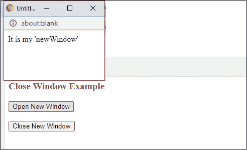

# JavaScript 窗口关闭方法

> 原文：<https://www.javatpoint.com/javascript-window-close-method>

JavaScript 提供了一个名为 **close()** 的内置函数来关闭使用 window.open()方法打开的浏览器窗口。与 window.open()方法不同，它不包含任何参数。这个 window.close()方法只需关闭 window.open()方法打开的窗口或选项卡。

请记住-您必须**定义一个全局 [JavaScript](https://www.javatpoint.com/javascript-tutorial) 变量**来保存 window.open()方法返回的值，close()方法稍后将使用该值来关闭该打开的窗口。

### 句法

```

window.close()

```

这里，**窗口**是窗口打开方法打开的那个窗口的名称。

### 参数列表

此方法没有任何参数。

## 关窗

让我们借助一个例子来理解。我们将通过一个例子向您展示如何关闭由 window.open()方法打开的窗口或选项卡。

首先，我们将在一个新窗口(大小由代码定义)中使用按钮点击打开一个网站网址，然后使用另一个按钮关闭那个打开的窗口。

### 例子

在本例中，我们不会在 open()方法中指定任何 URL。请参见下面的代码如何工作:

**复制代码**

```

<html>
<script>
var newWindow;

function openWindow() {
  newWindow = window.open("", "myWindow", "width=200,height=100");
  newWindow.document.write("<p>It is my 'newWindow'</p>");
}

function closeWindow() {
  newWindow.close();
}
</script>
<h3 style="color:brown"> Close Window Example </h3>
<body>
<button onclick="openWindow()">Open New Window</button>
<br><br>
<button onclick="closeWindow()">Close New Window </button>
</body>
</html>

```

[Test it Now](https://www.javatpoint.com/oprweb/test.jsp?filename=javascript-window-close-method1)

**输出**

您将获得与下面相同的输出。在这里，点击**打开新窗口**按钮，打开一个用户自定义的浏览器窗口。


将弹出一个新窗口，显示一条消息，如下所示。现在，点击**关闭新窗口**按钮关闭该弹出窗口。



### 例 2

此示例将在窗口中有一个网站网址。open()方法在新窗口中打开网站。然后我们将使用 close()方法关闭该窗口。

**复制代码**

```

<html> 
<head> 
<title> Open and close window method example </title> 
<script>
    var newWindow;
    // function to open the new window tab with specified size
    function windowOpen() { 
           newWindow = window.open( 
              "https://www.javatpoint.com/", "_blank", "width=500, height=350"); 
    } 

   // function to close the window opened by window.open() 
   function windowClose() { 
         newWindow.close(); 
   } 
</script> 
</head> 

<center>
<h2 style="color:green"> Window open() and close() method </h2>
<body> 
    <b> Click the button to open Javatpoint tutorial site </b><br>
    <button onclick="windowOpen()"> Open Javatpoint </button>
    <br><br> 
    <b> Click the button to close Javatpoint tutorial site </b><br>
    <button onclick="windowClose()"> Close Javatpoint </button> 
</body> 
</center>
</html>

```

[Test it Now](https://www.javatpoint.com/oprweb/test.jsp?filename=javascript-window-close-method2)

**输出**

当您执行代码时，您将得到如下所示的响应:


点击**打开 Javatpoint** 按钮，打开 Javatpoint 教程网站。我们已经指定了要打开的新弹出窗口的大小(高度和宽度)。


如果点击**关闭 Javatpoint** 按钮，这个打开的窗口将被最小化。

### 浏览器支持

一些网络浏览器支持此窗口功能，例如:

*   铬
*   Mozilla Firefox
*   互联网浏览器
*   歌剧
*   狩猎等等。

可以在以上这些浏览器上运行 window.close() JavaScript 函数。

* * *