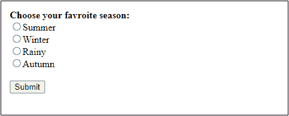
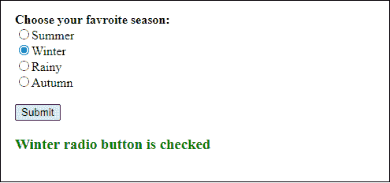
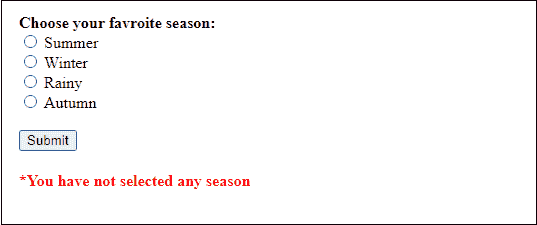
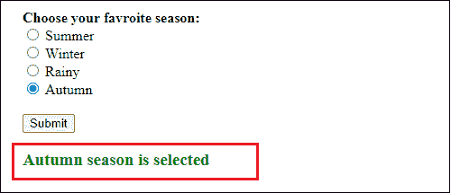

# 如何用 JavaScript 检查单选按钮？

> 原文:[https://www . javatpoint . com/如何使用 javascript 检查单选按钮](https://www.javatpoint.com/how-to-check-a-radio-button-using-javascript)

单选按钮是表单中用来接受用户输入的图标。它允许用户从单选按钮组中选择一个值。单选按钮基本上用于从多个中进行**单次选择，多用于图形用户界面表单。**

您只能在两个或多个单选按钮之间标记/选中一个单选按钮。在本章中，我们将指导您如何使用 [JavaScript 编程语言](https://www.javatpoint.com/javascript-tutorial)检查单选按钮。

为此，我们首先使用 [HTML](https://www.javatpoint.com/html-tutorial) 设计一个包含单选[按钮](https://www.javatpoint.com/html-button-tag)的表单，然后我们将使用 JavaScript 编程来检查单选按钮。我们还将检查选择了哪个单选按钮值。

## 创建单选按钮

下面是创建一组单选按钮的简单代码。

**复制代码**

```

<p> Choose your favroite season: </p>
<input type="radio" name="JTP" id="summer" value="summer">Summer<br> 
<input type="radio" name="JTP" id="winter" value="winter">Winter<br> 
<input type="radio" name="JTP" id="rainy" value="rainy">Rainy<br>
<input type="radio" name="JTP" id="autumn" value="autumn">Autumn<br>

```

[Test it Now](https://www.javatpoint.com/oprweb/test.jsp?filename=how-to-check-a-radio-button-using-javascript1)

## 检查单选按钮

我们不需要编写任何特定的代码来检查单选按钮。一旦在 [HTML 表单](https://www.javatpoint.com/html-form)中创建或指定它们，就可以对它们进行检查。

但是，我们必须编写 JavaScript 代码来获取选中的单选按钮的值，我们将在下面的章节中看到:

## 检查单选按钮是否被选中

在 JavaScript 中，有两种方法可以检查标记的单选按钮或识别选择了哪个单选按钮。JavaScript 为此提供了两种 DOM 方法。

*   **[【get element byid】](https://www.javatpoint.com/document-getElementById()-method)**
*   **查询选择器**

输入单选按钮选中属性用于检查复选框是否被选中。使用 **document.getElementById('id ')。为此勾选了**方法。它将以布尔值的形式返回单选按钮的选中状态。它可以是真的，也可以是假的。

**如果选择了单选按钮，则为真-** 。

**如果单选按钮未被选择/选中，则为假-** 。

请参见下面的 JavaScript 代码，了解其工作原理:

### 例子

例如，我们有一个名为 Summer 的单选按钮，id = 'summer '。现在，我们将使用此按钮 id 检查单选按钮是否被标记。

**复制代码**

```

if(document.getElementById('summer').checked == true) { 
         document.write("Summer radio button is selected"); 
} else {
         document.write("Summer radio button is not selected"); 
}

```

### querySelector()

querySelector()函数是 JavaScript 的一个 DOM 方法。它使用内部单选按钮的公共名称属性。该方法用于检查选择了哪个单选按钮，如下所示。

```

document.querySelector('input[name="JTP"]:checked')

```

### 例子

例如，我们有一组单选按钮，所有按钮的名称属性名称为“季节”。现在，在这些被命名为季节的按钮之间，我们将检查哪一个被选中。

**复制代码**

```

 var getSelectedValue = document.querySelector( 'input[name="season"]:checked'); 
 if(getSelectedValue != null) { 
          document.write("Radio button is selected");
} else {
          document.write("Nothing has been selected");
}

```

## 获取选中单选按钮的值:

### 使用 getElementById()

下面是使用 getElementById()方法获取选中单选按钮的值的代码:

**复制代码**

```

if(document.getElementById('summer').checked) { 
       var selectedValue = document.getElementById('summer').value;
       alert("Selected Radio Button is: " + selectedValue);  
}

```

### 使用查询选择器()

下面是使用 querySelector()方法获取选中单选按钮的值的代码:

**复制代码**

```

var getSelectedValue = document.querySelector( 'input[name="season"]:checked'); 
 if(getSelectedValue != null) { 
          alert("Selected radio button values is: " + getSelectedValue.value);
}

```

## 获取所选单选按钮值的完整代码

在这个例子中，我们将把上面所有的代码放在一起，创建并检查一个单选按钮。之后，我们还将获取所选单选按钮的值。

**复制代码**

```

<html>
<body>
<br><b> Choose your favroite season: </b><br>
<input type="radio" id="summer" value="Summer">Summer<br> 
<input type="radio" id="winter" value="Winter">Winter<br> 
<input type="radio" id="rainy" value="Rainy">Rainy<br>
<input type="radio" id="autumn" value="Autumn">Autumn<br><br>     

<button type="button" onclick=" checkButton()"> Submit </button> 

<h3 id="disp" style= "color:green"> </h3>
<h4 id="error" style= "color:red"> </h4>
</body>

<script>
function checkButton() {  
            if(document.getElementById('summer').checked) { 
                document.getElementById("disp").innerHTML 
                    = document.getElementById("summer").value 
                    + " radio button is checked"; 
            } 
            else if(document.getElementById('winter').checked) { 
                document.getElementById("disp").innerHTML 
                    = document.getElementById("winter").value 
                    + " radio button is checked";   
            } 
            else if(document.getElementById('rainy').checked) { 
                document.getElementById("disp").innerHTML 
                    = document.getElementById("rainy").value 
                    + " radio button is checked";   
            } 
            else if(document.getElementById('autumn').checked) { 
                document.getElementById("disp").innerHTML 
                    = document.getElementById("autumn").value 
                    + " radio button is checked";   
            }
            else { 
                document.getElementById("error").innerHTML 
                    = "You have not selected any season"; 
            } 
        } 
    </script> 
</html>

```

[Test it Now](https://www.javatpoint.com/oprweb/test.jsp?filename=how-to-check-a-radio-button-using-javascript2)

**输出**

当您执行上述代码时，它将在 web 上运行，并给出如下所示的输出:



选择其中一个单选按钮，点击**提交**按钮，获得所选值。



如果您没有选择任何季节，直接点击**提交**按钮，会显示一条错误消息- **您没有选择任何季节**，因为我们已经使用了验证。



## 获取所选单选按钮的值:querySelector()

### DOM querySelector()方法

querySelector()函数是 JavaScript 的一个 DOM 方法。该方法用于获取与文档中指定的 [CSS 选择器](https://www.javatpoint.com/css-selector)匹配的元素。请记住，您需要在 HTML 代码中指定单选按钮的 name 属性。

在 **[<脚本>](https://www.javatpoint.com/html-script-tag)** 选项卡中作为 **document.querySelector(【输入[name="JTP"]:选中】)**，从单选按钮组中选中单选按钮值。它通过使用一小段代码获取所选单选按钮的值来最小化代码的长度。

```

var selectedValue = document.querySelector('input[name="JTP"]:checked')

```

请参见下面的代码，它将如何与 HTML 表单一起使用:

**复制代码**

```

<html>
<body>
<br><b> Choose your favroite season: </b><br>
<input type="radio" name="season" id="summer" value="Summer"> Summer <br> 
<input type="radio" name="season" id="winter" value="Winter"> Winter <br> 
<input type="radio" name="season" id="rainy" value="Rainy"> Rainy <br>
<input type="radio" name="season" id="autumn" value="Autumn"> Autumn 
<br><br>     

<button type="button" onclick=" checkButton()"> Submit </button> 

<h3 id="disp" style= "color:green"> </h3>
<h4 id="error" style= "color:red"> </h4>
</body>

<script>
    function checkButton() {  
            var getSelectedValue = document.querySelector( 
                'input[name="season"]:checked'); 

            if(getSelectedValue != null) { 
                document.getElementById("disp").innerHTML 
                    = getSelectedValue.value 
                    + " season is selected"; 
            } 
            else { 
                document.getElementById("error").innerHTML 
                    = "*You have not selected any season"; 
            } 
        }  
    </script> 
</html>

```

[Test it Now](https://www.javatpoint.com/oprweb/test.jsp?filename=how-to-check-a-radio-button-using-javascript3)

**输出**

当您执行上面的代码时，它会在 web 上显示如下所示的输出。从这里，选择你最喜欢的季节。


当您在给定单选按钮之间选择一个值并点击**提交**按钮时，您将在网页上获得所选值。



如果您在没有选择任何单选按钮的情况下点击**提交**按钮，它将显示一条错误消息- **您没有选择任何季节**。


所以，在这里你可以看到两个 **getElementById('季节')。值**和**document . queryselector(' input[name = " JTP "]:checked ')**工作相同。两者都用于查找选中的单选按钮值。你可以用任何一个。

## getElementById 与 querySelector

DOM 方法 getElementByID()和 querySelector()的工作原理几乎相同。然而，它们在性能和代码大小等方面也没有什么不同。让我们看看它们之间的一些区别:

### 代码长度

用 getElementById 编写的代码比 querySelector 长一点。使用 getElementById 方法，我们需要单独检查每个单选按钮选中了哪一个。

另一方面，如果使用 querySelector DOM 方法，只需放一行代码来检查标记的单选按钮并获取其值。因此，结论是 querySelector 需要更少的代码。

### 表演

这两个函数都提供了良好的性能，但是您只需要知道哪一个更好。 **getElementById** 方法比 **querySelector** 方法快得多。querySelector 方法也有点复杂。

### DOM 方法使用的值

getElementById 方法在检查标记的按钮时总是使用每个单选按钮的唯一 Id，并返回与 id 匹配的第一个元素。

而 querySelector 为所有单选按钮使用一个通用的**名称(选择器)**来获取标记的单选按钮，并返回与指定选择器匹配的第一个元素。

* * *