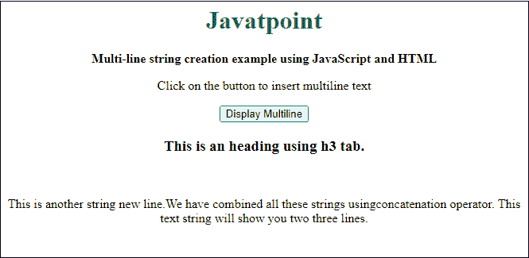

# JavaScript 多行字符串

> 原文：<https://www.javatpoint.com/javascript-multi-line-string>

字符串操作很容易学习，但在 JavaScript 中最难掌握。早期，JavaScript 不支持多行字符串。2015 年以后，支持多行字符串的 ES6 (ECMAScript 6)引入了字符串文字。

现在，有几种方法可以处理多行字符串。在本章中，我们将逐一讨论这些处理多行字符串的不同方法。

以下是使用多行字符串的几种方法:

## 方法 1

多行显示字符串文本是 [JavaScript](https://www.javatpoint.com/javascript-tutorial) 最简单的方式。使用文档中的换行符(< br >)或[HTML](https://www.javatpoint.com/html-tutorial)。write()函数从新行开始文本。

### 例子

下面是使用 JavaScript 编程实现多行字符串的实际方法:

**复制代码**

```js

<html> 
<head> 
<title> Multiple new lines example </title> 
</head> 
<script>
       document.write("This is first line display using JavaScript.");
       document.write("<br>");  
       document.write("This is second line and divided using break line tab of HTML.");
       document.write("<br>");  
       document.write("Now, we again printed another new line.")
</script>
</html>

```

[Test it Now](https://www.javatpoint.com/oprweb/test.jsp?filename=javascript-multi-line-string1)

**输出**

当您执行此代码时，三个文本字符串将在网页上显示，使用 HTML 的[换行符(< br >)进行分割。](https://www.javatpoint.com/html-br-tag)

```js
This is first line display using JavaScript.
This is second line and divided using break line tab of HTML.
Now, we again printed another new line.

```

### 示例 2:连接单个字符串

在本例中，我们将使用 JavaScript 编程简单地打印多行字符串，没有任何换行符:

**复制代码**

```js

<html> 
<head> 
<title> Multiple new lines example </title> 
</head> 
<script>
       var myString ='Javatpoint is a website of technologies, ' +
         'which provides tutorials of different technologies and tools. ' +
         'Here you will get tutorials in detail' +
         'like theory as well as practical implementation.' +
         '<br> We will try to provide you the best knowledge from our side.' +
         'Student, teachers, and industry professionals can learn from here.';

       document.write(myString);
</script>
</html>

```

[Test it Now](https://www.javatpoint.com/oprweb/test.jsp?filename=javascript-multi-line-string2)

**输出**

当您将执行此代码时，两个文本段落将在网络上向您显示，它们将使用 HTML 的换行符标签(
)进行分割。

```js
Javatpoint is a website of technologies, which provides tutorials of different technologies and tools. Here you will get tutorials in detail 'like theory as well as practical implementation.
We will try to provide you the best knowledge from our side. 'Student, teachers, and industry professionals can learn from here.

```

### 例 3

这是一个使用 JavaScript 编程进行多行文本打印的简单示例。在本文中，我们只使用了 HTML
标签来将句子分成多行:

**复制代码**

```js

<html> 
<head> 
<title> Multiple new lines example </title> 
</head> 
<script>
       var multilineString ='JavaScript is a programming language that is useful for web development at client-side execution.' +
         'This language is very light-weighted mostly used to put validations, so they check at the client-side.' +
         '<br> Nowadays, it is very trending in market for web development.' +
         '<br> As it also allows dynamic execution of code.';

       document.write(multilineString);
</script>
</html>

```

[Test it Now](https://www.javatpoint.com/oprweb/test.jsp?filename=javascript-multi-line-string3)

**输出**

当您将执行此代码时，三个段落将在网页上显示您，这些段落将使用 HTML 的换行符标签(
)进行划分。

```js
JavaScript is a programming language that is popular for web development at the client-side execution. This language is very light-weighted mostly used to put validations, so they check at client-side. 
Nowadays, it is very trending in market for web development.
As it also allows dynamic execution of code.

```

**方法二:**也可以将< p >或< b >或[标题](https://www.javatpoint.com/html-heading)制表符(< h1 >至< h6 >)内的文本字符串，分割成多行或多段。请参见下面的代码:

**复制代码**

```js

<script>
       var multilineString ='<p> This is fist line of the paragraph. </p>' +
         '<b> This text will show you in bold letters in next line. </b>' +
         '<p> Now, it is again a simple text line. </p>';

       document.write(multilineString);
</script>

```

[Test it Now](https://www.javatpoint.com/oprweb/test.jsp?filename=javascript-multi-line-string4)

**输出**

上面传递的行将显示在多个新行中。这些行从使用段落和粗体选项卡的新行开始。

```js
This is first line of the paragraph. 
This text will show you in bold letters in next line. 
Now, it is again a simple text line.

```

**方法 3:** 在这个方法中，我们将打印一个多行字符串。这主要是在你想写段落写作的时候。

**例**

您可以在多个 HTML 标签内编写多行文本文本，以便清晰理解[段落](https://www.javatpoint.com/html-paragraph)。借助一个示例，请参见:

**复制代码**

```js

<html> 
<head> 
<title> Create multi-line strings </title> 
</head> 

<body> 
<center>
<h1 style="color: green"> Javatpoint </h1> 
<b> Multi-line string creation example using JavaScript and HTML </b> 

<p> Click on the button to insert multi-line text </p> 
<button onclick="showMultilineString()"> Display Multiline </button> 

<span id="multiline"> </span>
<script> 
	function showMultilineString() { 
	  multilineString = 
			"<div>" + 
			   "<h3>This is an heading using h3 tab. </h3>" + 
			   "</br><p> This is another string new line." + 
			   "We have combined all these strings using" + 
			   "concatenation operator. This text string will show you two three lines.</p> " + 
			"</div>" ;

	     document.getElementById('multiline').innerHTML = multilineString; 
     } 
</script> 
</center>
</body> 
</html>

```

[Test it Now](https://www.javatpoint.com/oprweb/test.jsp?filename=javascript-multi-line-string5)

**输出**

一个输出将通过执行上面的命令在网上显示你。见下面的回答；您将看到一个**显示多行**按钮，向您显示一个文本字符串。


点击此**显示多行**按钮，一个文本字符串将显示多行。请参见下面的输出:



* * *