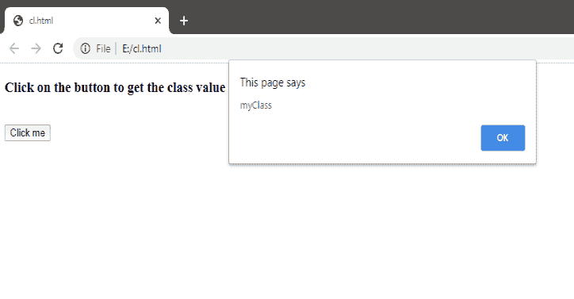
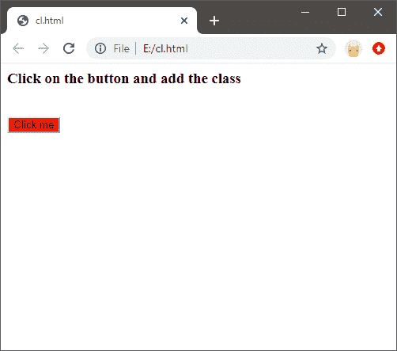
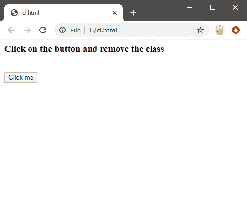
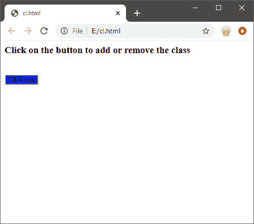
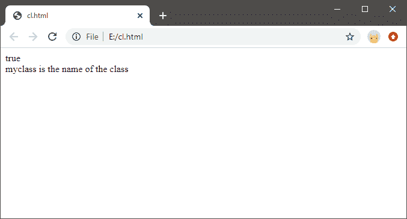
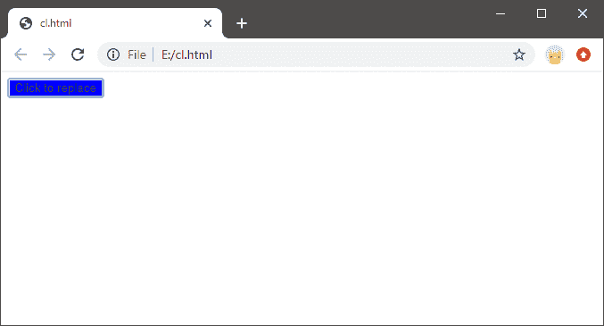
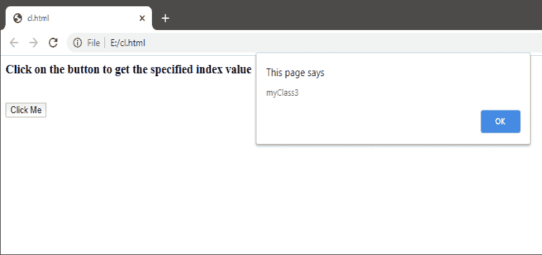

# JavaScript 类列表

> 原文：<https://www.javatpoint.com/javascript-classlist>

JavaScript classList 是 JavaScript 的一个 DOM 属性，它允许对元素的 CSS(级联样式表)类进行样式化。JavaScript classList 是一个只读属性，它返回 CSS 类的名称。相对于 JavaScript 的其他属性，它是 JavaScript 的一个属性，包括样式和类名。style 属性返回 CSS 类元素的颜色或其他样式，className 用于返回 [CSS](https://www.javatpoint.com/css-tutorial) 文件中使用的类的名称。但是，className 和 classList 属性返回我们在 CSS 文件中使用过的类的名称，但方式不同。className 属性以字符串的形式返回类的名称，而 [JavaScript 的 classList 属性以数组的形式返回类的名称。](https://www.javatpoint.com/javascript-tutorial)

在这里，我们将简要讨论 JavaScript 类列表，并讨论它的方法及其实际实现。

### JavaScript 类列表属性示例

下面是一个 JavaScript classList 属性的例子，通过它我们可以得到一个元素的类值。

```js

<html>
<body>
<h3>Click on the button to get the class value </h3></br>
<input type="button" id="btn" value="Click me" class="myClass" onclick="getClass()">
<script>
    function getClass()
    {
      var e = document.getElementById("btn");
      alert(e.classList);
    }
  </script>
</body>
</html>

```

上述代码的输出如下所示:



## JavaScript 类列表属性

classList 属性用于表示类元素的值，它是一个**domtokinlist**对象。它是一个只读属性，但是我们可以通过操作程序中使用的类来修改它的值。JavaScript classList 属性由以下方法组成，通过这些方法，我们可以对类元素执行不同的操作:

*   **add():**add()方法用于向元素添加一个或多个类。
*   **remove():**remove()方法用于从元素中存在的类的数量中移除一个或多个类。
*   **toggle():**toggle()方法用于切换元素的指定类名。这意味着在一次点击中指定的类被添加，而在另一次点击中该类被移除。它被称为元素的切换属性。
*   **replace():**replace()方法用于用新类替换现有类。
*   **contains():**JavaScript class list 属性的 contains()方法用于返回布尔值作为输出。如果该类存在，则该值作为 true 返回，否则返回 false。
*   **item():**item()方法用于显示特定索引处的类名。因此，它返回类名。

这些是 JavaScript 类列表中使用的一些方法。

我们将逐一讨论。

### classList.add()

用于向 CSS 元素添加一个或多个类的函数。

**示例:**

下面的例子展示了如何使用 classList.add()方法添加一个类:

```js

<html>
<head>
<style>
    .myClass {background: red;}
  </style>
</head>
<body>
<h3> Click on the button and add the class</h3> </br>
  <input type="button" id="Btn" value="Click me" class="Class1" onclick="getClass();">
<script>
    function getClass()
    {
      var e = document.getElementById("Btn");
      e.classList.add("myClass");
    }
  </script>
</body>
</html>

```

在代码中，当用户单击按钮时，新类将与现有类一起添加。点击按钮后的输出如下所示:



### classList.remove()

remove()函数用于从元素中移除现有的类。

下面的示例显示了如何使用 classlist.remove()方法移除一个或多个类:

```js

<html>
<head>
<style>
    .myClass {background: red;}
  </style>
</head>
<body>
<h3> Click on the button and remove the class </h3> </br>

  <input type="button" id="Btn" value="Click me" class="class1 myClass" onclick="getClass();">
<script>
    function getClass()
    {
      var e = document.getElementById("Btn");
      e.classList.remove("myClass");
    }
  </script>
</body>
</html>

```

在上面的代码中，当用户单击按钮时，特定的指定类将从现有的 CSS 类中移除。点击按钮后的输出如下所示:



### Classlist.toggle()

toggle()按钮用于将类切换到元素。这意味着添加一个新的类或删除现有的类。

下面是一个例子，它将使我们理解如何使用 toggle()方法来添加或移除类。

**示例:**

```js

<html>
<head>
<style>
    .myClass1{background: red;}
    .myClass2 {background: blue;}
</style>
</head>
<body>
<h3> Click on the button to add or remove the class</h3> </br>
  <input type="button" id="Btn" value="Click me" class="class1 myClass1" onclick="get_toggle();">
<script>
    function get_toggle()
    {
      var e = document.getElementById("Btn");
      e.classList.toggle("myClass2");
    }
  </script>
</body>
</html>

```

在代码中，当用户单击按钮时，该类将被添加到 CSS 类或从 CSS 类中移除。点击按钮后的输出如下所示:



### Classlist.contains()

contains()方法用于检查指定的类是否存在于 CSS 类中，对于该类，它返回布尔值 true 或 false。

下面是一个示例，说明如何使用 contains()方法搜索类(如果存在或不存在):

**示例:**

```js

<html>
<body>
  <input type="button" id="Btn" value="Click to check" class="myClass" onclick="getClass();">
<script>
    function getClass()
    {
      var e = document.getElementById("Btn");
      document.write(e.classList.contains("myClass")+"<br>"+"myclass is the name of the class");
}
  </script>
</body>
</html>

```

在上面的代码中，可以看到当用户点击按钮时，它会检查指定的类是否存在于 CSS 类中。如果存在，将返回布尔值 true。否则，它将返回 false。点击按钮后，上述代码的输出如下所示:



### classlist.replace()

replace()方法用于用新类替换现有类。这并不意味着从元素中移除该类，而是用新类的属性替换现有类的属性。

下面是一个例子，通过这个例子我们可以理解如何用一个新的类替换一个现有的类:

**示例:**

```js

<html>
<head>
  <style>
    .myClass1 {background: red;}
    .myClass2 {background: blue;}
  </style>
</head>
<body>
 <input type="button" id="Btn" value="Click to replace" class="myClass1" onclick="replace_Class();">
<script>
    function replace_Class()
    {
      var e = document.getElementById("Btn");
      e.classList.replace("myClass1", "myClass2");
    }
  </script>
</body>
</html>

```

在上面的代码中，当用户单击按钮时，现有的类属性被新的类属性替换。点击按钮后的输出如下所示:



### classList.item()

item()函数用于返回指定索引值处的类名。

下面是一个示例，它将使我们理解如何使用 item()方法返回值:

**示例:**

```js

<html>
<body>
<h3> Click on the button to get the specified index value</h3></br>
 <input type="button" id="Btn" value="Click Me" class="myClass1 myClass2 myClass3 myClass4" onclick="get_Class();">
<script>
    function get_Class()
    {
      var e = document.getElementById("Btn");
      alert(e.classList.item(2));
    }
  </script>
</body>
</html>

```

在代码中，当用户单击按钮时，将显示指定索引上的类。点击按钮后，我们得到指定的索引类值，如下所示:



这些是类列表 DOM 对象的一些方法，都是关于类列表的。

* * *