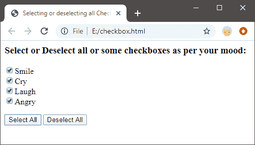
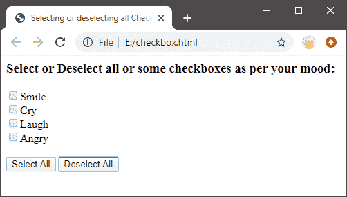

# 如何使用 JavaScript 选中所有复选框

> 原文：<https://www.javatpoint.com/how-to-select-all-checkboxes-using-javascript>

为了选择一个页面的所有复选框，我们需要创建一个 select all()函数，通过这个函数我们可以一起选择所有的复选框。在这一部分，我们不仅将学习选择所有复选框，而且我们还将创建另一个功能，取消选择所有选中的复选框。

那么，让我们看看如何在一个 [JavaScript](https://www.javatpoint.com/javascript-tutorial) 代码中选中和取消选中所有复选框。

## 选中 JavaScript 代码中的所有复选框

我们将实现并理解一个例子，其中我们将创建两个按钮，一个用于选择所有复选框，另一个用于取消选择所有选中的复选框。示例代码如下所示:

```js

<html>
<head>
		<title>Selecting or deselecting all CheckBoxes</title>
		<script type="text/javascript">
			function selects(){
				var ele=document.getElementsByName('chk');
				for(var i=0; i<ele.length; i++){
					if(ele[i].type=='checkbox')
						ele[i].checked=true;
				}
			}
			function deSelect(){
				var ele=document.getElementsByName('chk');
				for(var i=0; i<ele.length; i++){
					if(ele[i].type=='checkbox')
						ele[i].checked=false;

				}
			}			
		</script>
	</head>
<body>
	<h3>Select or Deselect all or some checkboxes as per your mood:</h3>
	<input type="checkbox" name="chk" value="Smile">Smile<br>
	<input type="checkbox" name="chk" value="Cry">Cry<br>
	<input type="checkbox" name="chk" value="Laugh">Laugh<br>
	<input type="checkbox" name="chk" value="Angry">Angry<br>
     <br>
		<input type="button" onclick='selects()' value="Select All"/>
		<input type="button" onclick='deSelect()' value="Deselect All"/>
      </body>
</html>

```

**输出:**

**当我们点击‘全选’按钮时，我们得到:**



**当我们取消选择所有复选框时，我们会得到:**



**代码解释**

1.  上面完整的代码是基于 HTML 和 JavaScript 的。
2.  在 html 正文部分，我们创建了四种输入类型作为复选框，另外两种输入类型作为按钮。对于输入类型为按钮，我们创建了一个按钮，用于选择将调用 onClick()函数的复选框，以及另一个按钮，用于取消选择将调用 onClick()取消选择()函数的复选框(如果选择了任意/全部)。
3.  因此，当用户单击“全选”按钮时，它会移动到脚本部分，在那里找到 Select()函数并执行其中的语句。
4.  类似地，当用户在选择复选框后点击“全部取消选择”按钮时，取消选择()功能被调用。此外，如果用户只选择了一个或两个复选框，那么点击“全部取消选择”按钮，也将取消选择它们。如果用户没有选择任何复选框，然后点击“全部取消选择”按钮，将不会显示或执行任何操作。

用户可以创建许多这样的使用复选框的例子，并尝试这样的功能。

因此，通过这种方式，用户可以全选或取消全选复选框。

* * *