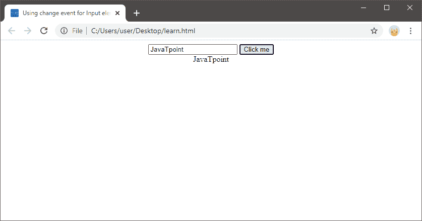
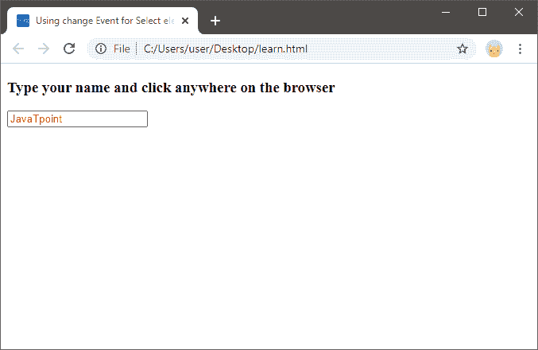
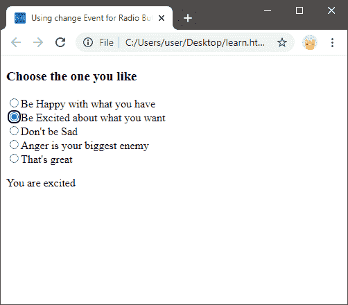
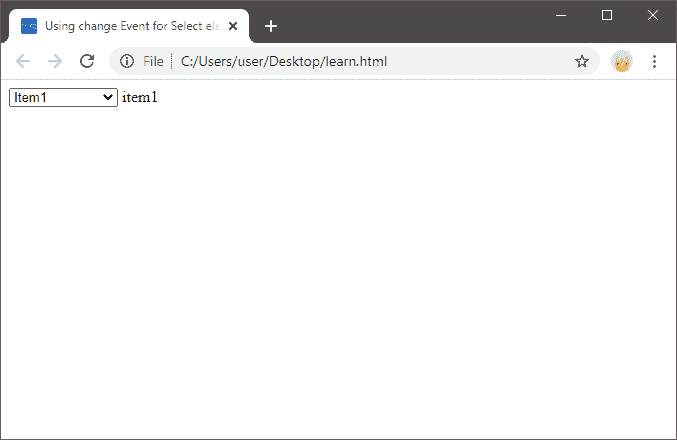

# JavaScript 更改事件

> 原文：<https://www.javatpoint.com/javascript-change-event>

JavaScript change 事件是一种事件类型，当元素的焦点发生变化时，就会执行该事件。JavaScript 的变更事件继承了事件的所有方法和属性。

在这里，在这一节中，我们将了解并实现在不同的 [JavaScript](https://www.javatpoint.com/javascript-tutorial) 元素上更改事件的实际使用，例如输入文本、复选框、单选按钮、选择元素等。

为了在 JavaScript 元素上使用变更事件，我们需要添加一个事件处理程序方法，我们可以使用元素的 **addEventListener()** 或 **onChange** 属性。两者的语法如下:

**addEventListener()方法**

```

element.addEventListener('change', function() {
//statement codes
})

```

**变更属性**

```

<input type="text/radio/file" onchange="changeHandler(event)">

```

我们将使用这两种方式来讨论 JavaScript 变更事件。

## 在输入元素上使用 JavaScript 更改事件

不同的元素有不同的输入类型，如文本框、单选按钮或复选框。当您给出输入，然后移动到另一个元素时，例如在按钮上按下按钮或鼠标，变更事件就会发生。然而，当我们专注于输入时，变更事件不起作用。让我们借助一些例子来看看。

下面是一些例子，可以帮助我们理解变更事件的用法:

### 例 1:

**使用输入元素上的更改事件作为文本:**

```

<!DOCTYPE html>
<html>
<head>
    <meta charset="UTF-8">
   <meta name="viewport" content="width=device-width, initial-scale=1.0">
    <title>Using change event for Input elements</title>
</head>
<body align="center">
   <input type="text" class="txtclass">
	<input type="button" value="Click me">
	</br>
	<label id="show"> </label>
    <script>
      let source = document.querySelector('.txtclass');
       let target = document.querySelector('#show');
        source.addEventListener('change', function () {
            target.textContent = this.value;
       });
    </script>
</body>
</html>

```

**上述代码的输出如下所示:**



当我们点击“点击我”按钮时，焦点从文本框中消失，这意味着变更事件将会发生。同样，我们可以看到，当我们提供输入时，变更事件将不起作用。点击按钮后，文本显示在标签中。

### 例 2:

**使用 onChange 属性:**

```

<!DOCTYPE html>
<html>
<head>
    <meta charset="UTF-8">
    <meta name="viewport" content="width=device-width, initial-scale=1.0">
    <title>Using change Event for Select element</title>
</head>
<body>
<h3>Type your name and click anywhere on the browser</h3>
    <input type="text" id="id_1" onChange="show()">
	<script>
      function show(){
		var x=document.getElementById('id_1');
		x.style.color='red';
		}

    </script>
</body>
</html>

```

**输出:**



在上面的代码中，当我们在文本框中键入一些文本时，onChange 事件的焦点就消失了，但是只要我们单击屏幕上的某个地方，onChange 属性就会开始工作。

## 在单选按钮上使用更改事件

在单选按钮的情况下，更改事件在我们选择任何单选按钮后生效。我们将在下面的代码中看到:

```

<!DOCTYPE html>
<html>
<head>
    <meta charset="UTF-8">
    <meta name="viewport" content="width=device-width, initial-scale=1.0">
    <title>Using change Event for Radio Buttons</title>
</head>
<body>
	<h3>Choose the one you like</h3>
    <input type="radio" id="happy" name="status">Be Happy with what you have</br>
    <input type="radio" id="excited" name="status">Be Excited about what you want</br>
    <input type="radio" id="sad" name="status">Don't be Sad </br>
	<input type="radio" id="angry" name="status">Anger is your biggest enemy</br>
	<input type="radio" id="none" name="status">That's great</br>
<p id="show"></p>
    <script>
        let show = document.querySelector('#show');
        document.body.addEventListener('change', function (e) {
            let target = e.target;
            let display_msg;
            switch (target.id) {
           case 'happy':
                    display_msg = 'You are happy';
                    break;
            case 'excited':
                    display_msg = 'You are excited';
                    break;
             case 'sad':
                   display_msg = 'You are sad';
                   break;
	case 'angry':
                   display_msg = 'You are angry';
                   break;
	case 'none':
                   display_msg = 'none';
                   break;
            }
            show.textContent = display_msg;
        });
    </script>
</body>
</html>

```

**以上输出如下所示:**



当我们单击任一单选按钮时，会显示指定的消息，这意味着单击单选按钮时，焦点会从该按钮上消失。

## 在选择元素上使用更改事件

在选择元素的情况下，更改事件在特定值的选择完成时起作用。下面我们讨论了一个例子，通过这个例子我们可以理解 select 元素对一个值的作用。

**示例:**

```

<!DOCTYPE html>
<html>
<head>
    <meta charset="UTF-8">
    <meta name="viewport" content="width=device-width, initial-scale=1.0">
    <title>Using change Event for Select element</title>
</head>
<body>
    <select id="item">
        <option value="">Select an item</option>
        <option value="item1">Item1</option>
        <option value="item2">Item2</option>
        <option value="item3">Item3</option>
    </select>
    <label id="show"></label>
    <script>
        let source = document.querySelector('#item');
        let target = document.querySelector('#show');
        source.addEventListener('change', function () {
            target.textContent = this.value;
        });
    </script>
</body>
</html>

```

**输出:**



在上面的输出中，我们可以看到，当我们从列表中选择值时，名称会显示在旁边。这是因为当我们选择一个值时，即选择完成时，变更事件起作用。但是，当我们进行选择时，更改事件不起作用。

* * *