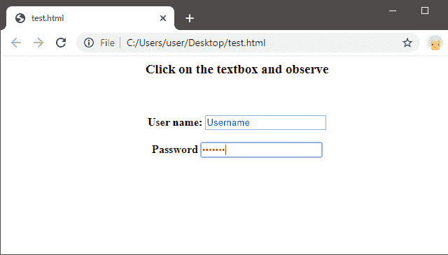

# JavaScript focusout 事件

> 原文：<https://www.javatpoint.com/javascript-focusout-event>

JavaScript 的 **focusout** 事件是在元素即将失去焦点时执行的事件处理程序。除此之外，我们还了解了**模糊，**，这也是 [JavaScript](https://www.javatpoint.com/javascript-tutorial) 中使用的事件处理程序。模糊和聚焦都是焦点事件，但两者有区别。区别在于*模糊事件不冒泡*，而*聚焦事件冒泡*。因此，当用户发现一个元素或其子元素将要失去焦点时，用户应该收听该元素的 **onfocusevent** 。

因此，如果用户执行以下操作，将调用 focusout 事件:

1.  当用户在活动元素外单击时，焦点会丢失。
2.  切换到另一个应用程序或文件。
3.  使用 TAB 键/访问键导航离开活动元素，因此焦点会丢失。
4.  在活动元素上调用模糊方法。
5.  在可以是活动的非活动元素上调用 setActive 方法。
6.  在可以活动的非活动元素上调用 focus 方法。

#### 注意:focusin 事件与 focusout 事件正好相反，在 focus out 事件中，当用户在活动元素上创建焦点时，会执行事件操作。对于 focusin，我们使用 onFocusIn 事件处理程序。

### 聚焦输出事件示例

借助下面的例子，让我们来看看并理解中的**焦点和**中的**事件:**

```

<html>
<head>
    <script type="text/javascript">
        function Focus_In (event) {
            event.srcElement.style.color = "red";
			        }
        function Focus_Out (event) {
            event.srcElement.style.color = "blue";
		}
</script>
</head>
<body>
<center>    <h3>Click on the textbox and observe </h3><br></br>
    <form onfocusin="Focus_In (event)" onfocusout="Focus_Out (event)">
    <b>    User name: <input type="text value="Username"/></b><br/>
<br>
    <b>   Password <input type="password" value="*******"/></b> </center>
    </form>
</body>
</html>

```

**代码解释**

1.  上面的代码是基于 html 和 JavaScript 的代码。
2.  在 html 的正文部分，我们创建了一个包含用户和密码字段的表单。
3.  在 JavaScript 的脚本部分，我们创建了两个函数，其中 Focus_In 用于 focusin 事件，Focus_Out 用于 focusout 事件。
4.  在创建表单时，我们调用了焦点输入和焦点输出函数。
5.  将执行两个操作——当用户点击任意一个文本框时，文本的颜色变为红色，这意味着焦点在里面。因此，调用了 Focus_In 函数。另一个动作发生在用户点击页面上的任何地方，但没有点击活动部分(即文本框的文本或文本框中的密码)时，这意味着焦点丢失，因此颜色变回蓝色。因此，在这种情况下会调用 Focus_Out 函数。
6.  还要注意，当用户在网络浏览器上执行代码时，除非用户不做任何操作，否则文本的颜色会显示为黑色。

上述代码的输出如下所示:



* * *