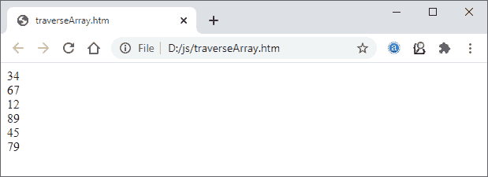

# 使用 JavaScript 遍历数组对象

> 原文:[https://www . javatpoint . com/traverse-array-object-use-JavaScript](https://www.javatpoint.com/traverse-array-object-using-javascript)

JavaScript 没有提供任何特定的内置函数来遍历数组元素/对象。您可以简单地使用 for 循环或直接通过元素索引遍历数组。一个数组包含多个相同类型的元素，可以使用 for 循环遍历这些元素。

在本章中，我们将讨论遍历数组的所有方法:

**简单数组遍历**

在本例中，我们将直接从数组索引遍历数组。

**复制代码**

```

<script>
// declare and initialize an array
var message = ["Have", " a", " good", " day"]; 

//traverse the array elements
document.write("array[0] = " + message[0]);
document.write("<br> array[1] = " + message[1]);
document.write("<br> array[2] = " + message[2]);
document.write("<br> array[3] = " + message[3]);
</script>

```

[Test it Now](https://www.javatpoint.com/oprweb/test.jsp?filename=traverse-array-object-using-javascript1)

**输出**

保存代码并在浏览器上运行。数组将遍历并打印数组元素。

```
array[0] = Have 
array[1] = a 
array[2] = good 
array[3] = day

```

**截图**


**遍历并显示数组元素**

本示例将使用数组索引直接遍历数组，并显示数组字符串。

**复制代码**

```

<script>
// declare and initialize an array
var message = ["Have", " a", " good", " day"]; 

//traverse the array elements
document.write(message[0]);
document.write(message[1]);
document.write(message[2]);
document.write(message[3]);
</script>

```

[Test it Now](https://www.javatpoint.com/oprweb/test.jsp?filename=traverse-array-object-using-javascript2)

**输出**

保存代码并在浏览器上运行。数组将遍历并打印数组元素。

```
Have a good day

```

**截图**


除此之外， [JavaScript](https://www.javatpoint.com/javascript-tutorial) 还提供了其他各种遍历数组的方法。我们在这里讨论最常用和最简单的方法。

## 用于循环的遍历数组

当数组很长或变量太多时，上述方法不能有效工作。因此，我们必须尝试任何其他方法来遍历数组，以节省时间和精力。

为了克服这个问题，循环的概念出现了，它通过提供一个小代码来帮助遍历数组。我们现在将使用不同的循环遍历数组元素，并在 web 上显示它们。可以对循环或每个循环使用 while、do-while 来遍历数组。类似于 [C](https://www.javatpoint.com/javascript-tutorial) 、 [C++](https://www.javatpoint.com/cpp-tutorial) 、 [Java](https://www.javatpoint.com/java-tutorial) 等其他编程语言。

### 例 1

下面是一个使用 for 循环遍历数组并打印数组字符串元素的示例。

**复制代码**

```

<script>
// declare and initialize an array
var message = ["Die", " with", " memories,", " not", " dreams"]; 

//traverse the array and print the elements
for(var i=0; i< message.length; i++){
document.write(message[i]);
}
</script>

```

[Test it Now](https://www.javatpoint.com/oprweb/test.jsp?filename=traverse-array-object-using-javascript3)

**输出**

保存代码并在浏览器上运行。数组将遍历并打印数组元素。

```
Die with memories, not dreams

```

**截图**

请参见上面 JavaScript 代码的网页截图:


### 例 2

下面是使用 for 循环遍历数组并打印该数组中的整数元素的示例。

**复制代码**

```

<script>
// declare and initialize an array with integer values
var integerArray = [34, 67, 12, 89, 45, 79]; 

//traverse the array using for loop 
for(var i=0; i< integerArray.length; i++) {
       //display the array elements
      document.write(integerArray[i] + "<br>");
}
</script>

```

[Test it Now](https://www.javatpoint.com/oprweb/test.jsp?filename=traverse-array-object-using-javascript4)

**输出**

保存代码并在浏览器上运行。数组将遍历并打印数组元素。

```
34
67
12
89
45
79

```

**截图**

请参见上面 JavaScript 代码的网页截图:



### 示例 3:使用 while 循环遍历

在这个例子中，我们将使用 **while 循环**遍历一个数组，然后显示这个数组中存在的元素。

**复制代码**

```

<script>
// declare and initialize an array with integer values
var integerArray = [34, 67, 12, 89, 45, 79]; 
var i=0;

document.write("Elements in array: <br>");
//traverse the array using while loop
while( i< integerArray.length) {
   //display the array elements
   document.write(integerArray[i] + "<br>");
   i++;
}
</script>

```

[Test it Now](https://www.javatpoint.com/oprweb/test.jsp?filename=traverse-array-object-using-javascript5)

**输出**

保存代码并在浏览器上运行。数组将遍历并打印数组元素。

```
Elements in array:
34
67
12
89
45
79

```

**截图**

请参见上面 JavaScript 代码的网页截图:


## 使用 forEach()方法遍历数组

除了基本循环(for、while 和 do-while 循环)之外，JavaScript 还有一个循环，或者你也可以称之为名为 **forEach()** 的数组方法。它不同于基本循环，因为它为数组中的每个元素调用一次函数。

### 句法

它的语法也不同，看看 forEach()方法的语法:

```

arr.forEach(functionName);

```

### 例子

此示例将向您展示 forEach()方法如何处理数组元素。首先，与 forEach()方法连接的数组将调用用户定义的函数。然后这个函数将打印遍历所有数组元素并在网上显示它们。请参见下面的代码:

**复制代码**

```

<script>
// declare an array and provide value in it 
var message = ["It", " is", " very", " beautiful", " day"]; 
var index = 0;

//call the user-defined function with array
message.forEach(traverseArray);

//definition of user-defined function
function traverseArray(ele, index)
{
    //display the array elements using index 
    document.write(ele);
}
</script>

```

[Test it Now](https://www.javatpoint.com/oprweb/test.jsp?filename=traverse-array-object-using-javascript6)

**输出**

保存代码并在浏览器上执行，向您展示所有在 web 上打印的数组元素。请参见以下回应:

```
It is very beautiful day

```

**截图**

请参见上面 JavaScript 代码的网页截图:


## 使用 every()方法遍历数组

此方法不同于基本循环和 forEach()方法。它基本上是用来遍历一个数组以及程序员指定的一些条件。every()方法是一个 [JavaScript 函数](https://www.javatpoint.com/javascript-function)，用数组的所有元素测试指定的条件。

如果所有元素都满足条件并通过测试(作为函数提供)，则返回**真**。否则，返回**假**。

### 句法

以下是每个()方法的语法:

```

arr.every(condition);

```

### 例 1

在这个例子中，我们将遍历整个数组，并检查给定值是否大于 18 条件，以验证是否都是成年人。请参见下面的代码:

**复制代码**

```

<script> 
//define an array with elements
var age = [22, 28, 36, 26, 34, 31];

//put a condition to check all the values are greater then 18
const adult = x => x > 18; 

if (age.every(adult)) { 
    //display the message if all array values are > 18
    document.write('All are adults'); 
} 
else { 
    //display the message if any one of them is less than 18
    document.write('Atleast one is not adult'); 
} 
</script>

```

[Test it Now](https://www.javatpoint.com/oprweb/test.jsp?filename=traverse-array-object-using-javascript7)

**输出**

保存代码并在浏览器上执行，如果所有数组值都是> 18，浏览器会显示响应“**都是成年人**”。否则会显示“**至少有一个不是成年人。**”见以下回应:

```
Atleast one is not adult

```

**截图**

请参见上面 JavaScript 代码的网页截图:


### 例 2

在这个例子中，我们将遍历整个数组来检查数组中所有给定的值是否都是偶数。为此，我们将进行条件检查(偶数= x=> x%2 == 0)。如果都是偶数，它将返回真；否则，它将返回 false。请参见下面的代码:

**复制代码**

```

<script> 
//define an array with elements
var age = [12, 47, 16, 26, 34, 59];

//put a condition to check all the values are greater than 18
const adult = x => x > 18; 

if (age.every(adult)) { 
    //display the message if all array values are > 18
    document.write('All are adults'); 
} 
else { 
    //display the message if any one of them is less than 18
    document.write('Atleast one is not adult'); 
} 
</script>

```

[Test it Now](https://www.javatpoint.com/oprweb/test.jsp?filename=traverse-array-object-using-javascript8)

**输出**

保存代码并在浏览器上执行，如果所有数组值都是> 18，浏览器会显示响应“**都是偶数**”。否则，将显示“**至少有一个不是偶数**请参见以下回应:

```
Atleast of them is not an even number

```

**截图**

请参见上面 JavaScript 代码的网页截图:


## 使用地图遍历数组

映射是由 JavaScript 编程语言提供的一种方法，它在数组的每个元素上应用一个函数，然后返回一个新数组。这样，它遍历整个数组。

在遍历数组时，还可以使用 map()函数对数组元素执行操作。基本上，它遍历整个数组，对数组的每个元素执行一些操作。

### 句法

以下是 JavaScript 的 map()方法的语法:

```

arr.map(condition);

```

它返回一个新创建的数组。

请看下面地图()的使用示例:

### 例 1

在这个例子中，我们将使用 JavaScript 的 map()函数遍历整个数组，对数组元素执行 Math.sqrt()操作。看看它将如何用 JavaScript 方法来完成:

**复制代码**

```

<h3> Perfrom sqrt on each element of array using map() </h3>
<script>
//initialize an array with value
var numbers1= [4, 16, 36, 64, 100, 144, 196, 256, 324, 400];

//call the user-defined function using map
var numbers2 = numbers1.map(myFunction);

//display the array elements before and after performing sqrt operation
document.write("Inital array elements: " + numbers1);
document.write("<br> <br>");
document.write("Array after sqrt: " + numbers2);

//function definition where perform sqrt on each element of array
function myFunction(value, index, array) {
  return Math.sqrt(value);
}
</script>

```

[Test it Now](https://www.javatpoint.com/oprweb/test.jsp?filename=traverse-array-object-using-javascript9)

**输出**

保存代码并在浏览器上执行，浏览器会显示执行 **sqrt** 操作前后的所有数组元素。在这里，map()函数将帮助遍历数组的每个元素。

请参见上面 JavaScript 代码的网页截图:


### 例 2

您也可以使用 map()执行简单的算术运算。参见下面给出的示例代码:

**复制代码**

```

<h3> Perfrom addition on each element of array using map() </h3>
<script>
//initialize an array with value
var numberArray = [5, 9, 8, 2, 6];

//call the user-defined function using map
var numbers2 = numberArray.map(myFunction);

//display the array elements before and after performing operation
document.write("Inital array elements: " + numberArray);
document.write("<br><br>");
document.write("<b> Add 10 to each element of the array </b><br>");
document.write("Newly created array: " + numbers2);

//function definition where perform simple addition on each element of array
function myFunction(ele, index, array) {
  return ele + 10; 
}
</script>

```

[Test it Now](https://www.javatpoint.com/oprweb/test.jsp?filename=traverse-array-object-using-javascript10)

**输出**

请参见上述代码的 web 输出。它将通过添加 10 来返回所有数组元素。


* * *