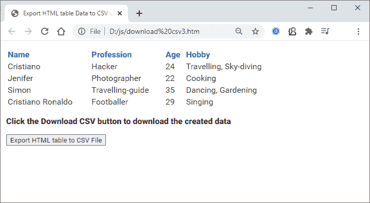
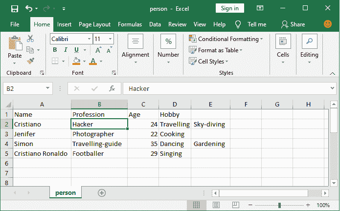

# 创建和下载 CSV 文件

> 原文：<https://www.javatpoint.com/javascript-create-and-download-csv-file>

当您使用网站和数据库时，CSV 文件是计算机科学的重要组成部分。在某些情况下，当用户在浏览器中有一些数据时，您可能希望让他们下载这些数据。在这种情况下，CSV 文件帮助程序员使用它们以表格形式下载网站数据。程序员使用 CSV 文件格式供用户下载网站数据。

CSV 是一种以表格形式存储网站数据的简单易行的形式。在 JavaScript 的帮助下，您可以从 HTML 页面收集数据并创建 CSV 文件，也可以手动创建数据。可以在 [MS-Excel](https://www.javatpoint.com/excel-tutorial) 中打开 CSV 文件，看到里面呈现的数据。几乎每个数据库都需要 CSV 文件来备份数据。

为了从网站导出数据，程序员使用 CSV 文件。CSV 文件可以使用 JavaScript 创建和下载。本章将介绍如何在 CSV 文件中下载网站 HTML 表数据。

## 怎么下载 CSV 文件？

在 JavaScript 的帮助下，您可以将 HTML 页面中的数据收集到一个 CSV 文件中，并轻松下载。使用带有 [HTML](https://www.javatpoint.com/html-tutorial) 的 [JavaScript 编程](https://www.javatpoint.com/javascript-tutorial)创建数据并以 CSV 格式下载。

本章将向您展示如何从客户端和服务器下载 CSV 文件。

### 为什么需要 CSV 文件？

*   CSV 文件以易于理解的表格形式存储和显示数据。
*   它易于使用和实现。所以，程序员更喜欢用 CSV 下载网站的数据。csv 格式。
*   它不需要任何第三方库来创建和下载。
*   通过使用简单的 JavaScript 方法和参数，您可以轻松地在网站中使用 CSV 文件。

以下示例是本章中创建和下载 CSV 文件的最简单示例之一。

### 履行

要为 CSV 文件创建数据，您只需要创建一个多维数组，其中包含 HTML 页面的数据。您可以出于学习目的手动创建数据，而不是直接从 HTML 页面中获取数据。

为此，您需要使用 JavaScript 创建一个多维数组，并手动提供不同的值(如-贾斯汀比伯，24 岁，歌手，伦敦作为姓名、年龄、职业和城市)来创建 CSV 文件。

请参见代码实现来创建和下载 CSV 文件。

## 创建和下载 CSV 文件

### 例 1

在这个例子中，我们将创建一个多维数组，并添加一些数据来创建一个 CSV 文件。除此之外，我们将添加一个按钮，由用户下载这些数据。当用户点击给定的按钮时，数据将开始下载。csv 文件格式。

**复制代码**

```

<html>
<head>
<title> Download CSV file </title>
</head>

<script>
//create CSV file data in an array
var csvFileData = [
   ['Alan Walker', 'Singer'],
   ['Cristiano Ronaldo', 'Footballer'],
   ['Saina Nehwal', 'Badminton Player'],
   ['Arijit Singh', 'Singer'],
   ['Terence Lewis', 'Dancer']
];

//create a user-defined function to download CSV file 
function download_csv_file() {

    //define the heading for each row of the data
    var csv = 'Name,Profession\n';

    //merge the data with CSV
    csvFileData.forEach(function(row) {
            csv += row.join(',');
            csv += "\n";
    });

    //display the created CSV data on the web browser 
    document.write(csv);

    var hiddenElement = document.createElement('a');
    hiddenElement.href = 'data:text/csv;charset=utf-8,' + encodeURI(csv);
    hiddenElement.target = '_blank';

    //provide the name for the CSV file to be downloaded
    hiddenElement.download = 'Famous Personalities.csv';
    hiddenElement.click();
}
</script>

<body>
<h3> Click the button to download the CSV file </h3>

<!-- create an HTML button to download the CSV file on click -->
<button onclick="download_csv_file()"> Download CSV </button>

</body>
</html>

```

[Test it Now](https://www.javatpoint.com/oprweb/test.jsp?filename=javascript-create-and-download-csv-file1)

**输出**

尝试在 web 上执行上述代码，并获得如下截图所示的输出:


点击**下载 CSV** 按钮下载该文件中创建的 CSV 数据，该 CSV 数据也会显示在网页上。


### 打开下载的 CSV 文件

看下载文件的扩展名，会是**。csv** 。作为参考，在 MS-Excel 的下载 CSV 文件中打开，看到里面的数据。打开 CSV 文件后，我们将在 excel 和记事本上向您显示输出。您可以看到 CSV 文件数据将以表格形式显示。

CSV 数据的 MS-Excel 上见下图截图。除此之外，您已经看到我们还在网络浏览器上显示了 CSV 数据。

**微软 Excel 上的 CSV 文件**


**记事本上的 CSV 文件**


## 将网页的 HTML 表格数据导出并下载到 CSV 文件中

还有一种方法可以下载 CSV 文件格式的网站数据。有时，您希望允许用户让他们将网站数据下载为 CSV 文件格式。JavaScript 使程序员能够使用其内置的方法将网站数据(网站的 HTML 表数据)导出到 CSV 文件中，该文件可以在 MS-Excel 中打开。

### 例子

在下面的例子中，我们将把网页中的 HTML 表格数据导出到一个 CSV 文件中，并下载这个 CSV 文件。我们将添加一个按钮，用户只需点击一下就可以下载这个 CSV 数据文件。当用户点击此按钮时，数据将开始下载。csv 文件格式。

**复制代码**

```

<html>
<head>
<title> Export HTML table Data to CSV using JavaScript </title>

<style>
*{
     color:#2b2b2b;
     font-family: "Roboto Condensed";
}
table { 
     width:40%;
}
th {
     text-align:left;
     color:#4679bd;
}
</style>
</head>

<script>
//user-defined function to download CSV file
function downloadCSV(csv, filename) {
    var csvFile;
    var downloadLink;

    //define the file type to text/csv
    csvFile = new Blob([csv], {type: 'text/csv'});
    downloadLink = document.createElement("a");
    downloadLink.download = filename;
    downloadLink.href = window.URL.createObjectURL(csvFile);
    downloadLink.style.display = "none";

    document.body.appendChild(downloadLink);
    downloadLink.click();
}

//user-defined function to export the data to CSV file format
function exportTableToCSV(filename) {
   //declare a JavaScript variable of array type
   var csv = [];
   var rows = document.querySelectorAll("table tr");

   //merge the whole data in tabular form 
   for(var i=0; i<rows.length; i++) {
	var row = [], cols = rows[i].querySelectorAll("td, th");
	for( var j=0; j<cols.length; j++)
	   row.push(cols[j].innerText);
	csv.push(row.join(","));
   } 
   //call the function to download the CSV file
   downloadCSV(csv.join("\n"), filename);
}
</script>

<body>
<!-- create table and provide data inside it -->
<table>
<tr>
	<th> Name </th>
	<th> Profession </th>
	<th> Age </th>
	<th> Hobby </th>
</tr>
<tr>
	<td> Cristiano </td>
	<td> Hacker </td>
	<td> 24 </td>
	<td> Travelling, Sky-diving </td>
</tr>
<tr>
	<td> Jenifer </td>
	<td> Photographer </td>
	<td> 22 </td>
	<td> Cooking </td>
</tr>
<tr>
	<td> Simon </td>
	<td> Travelling-guide </td>
	<td> 35 </td>
	<td> Dancing, Gardening </td>
</tr>
<tr>
	<td> Cristiano Ronaldo </td>
	<td> Footballer </td>
	<td> 29 </td>
	<td> Singing </td>
</tr>
</table>
<p><b> Click the Download CSV button to download the created data </b></p>

<!-- button to call the user-defined function to download CSV file data -->
<button onclick="exportTableToCSV('person.csv')"> Export HTML table to CSV File </button> 
</body>
</html>

```

[Test it Now](https://www.javatpoint.com/oprweb/test.jsp?filename=javascript-create-and-download-csv-file2)

**输出**

将上述代码复制并保存在一个文件中，然后在网络上执行。您将在网络浏览器的屏幕截图中获得如下所示的输出，该浏览器有一个包含数据行的 HTML 表:



点击给定的**导出到 HTML 表格到 CSV 文件**按钮，将数据下载到 CSV 文件格式。该文件将以 **person.csv** 的名称下载。


您可以在 MS-Excel 中打开此文件，查看其中包含的数据。打开下载的文件，看到里面的内容和网页的 HTML 表格内容一样。



* * *