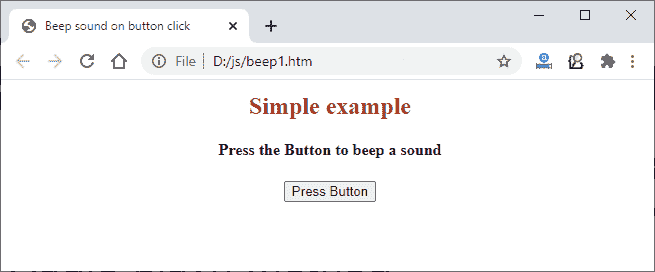
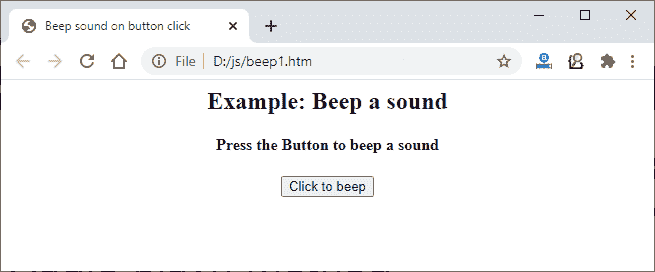
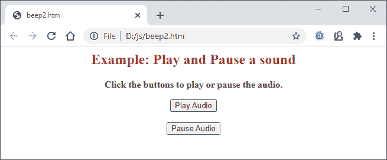
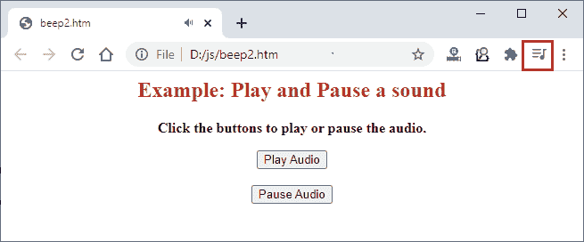
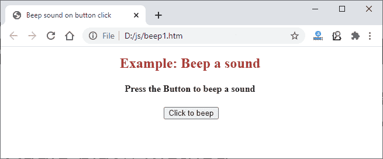

# JavaScript 中如何发出哔哔声？

> 原文：<https://www.javatpoint.com/how-to-make-beep-sound-in-javascript>

哔哔声通常用于网站的通知提醒。在其他一些情况下，您可能需要在网站中使用蜂鸣音。

你可以找到几个这种嘟嘟声的真实例子，比如在杂货店、图书馆和许多其他地方。本章将向您展示如何使用 [JavaScript 编程语言](https://www.javatpoint.com/javascript-tutorial)在网站中使用哔哔声。

以下是我们将在本章中讨论的案例:

*   警报通知
*   让网站更具互动性

在本章中，我们将向您展示如何在按钮点击时播放哔哔声。

## 在哪里使用哔哔声

很多时候，你已经注意到在条码扫描的时候会发出声音；它表示扫描成功。该声音是程序员用来向成功扫描的用户发送信号的嘟嘟声。

除此之外，你还在视频中多次听到这种嘟嘟声，以静音部分声音。可能还有其他一些使用这种蜂鸣音的情况。它有助于使网站更具互动性。

## 履行

要使用 JavaScript 在按钮点击时发出嘟嘟声，不需要很长的代码来实现。但是，您需要使用 [HTML](https://www.javatpoint.com/html-tutorial) 标签嵌入哔哔声音乐的来源，并在 **src** 中提供音频的链接。

我们将举一个例子，在按钮点击时，我们将调用一个用户定义的函数，该函数将包含蜂鸣音代码。

除此之外，我们将使用 JavaScript 的 play()函数来播放代码中提供的音乐或声音。下面是一个播放哔哔声的例子。

### 例 1

这是使用 JavaScript 编程语言播放蜂鸣音最简单、最短的代码。在这个例子中，我们将使用直接来自互联网的哔哔音乐，用 JavaScript 代码提供它的链接，然后点击播放。

**复制代码**

```

<html> 
<head> 
	<title> Beep sound document </title> 
</head> 

<body> 
<center>
	<h2 style="color:brown"> Simple example </h2>
	<h4> Press the Button to beep a sound </h4> 

             <!-- create a button to call the function to play a beep sound -->
	<button onclick="play()"> Press Button </button> 

	<script> 
            //JavaScript function to play the beep sound
            function play() { 
		var beepsound = new Audio( 
'https://www.soundjay.com/button/sounds/beep-01a.mp3'); 
		beepsound.play(); 
	} 
	</script> 
</center>
</body> 
</html>

```

[Test it Now](https://www.javatpoint.com/oprweb/test.jsp?filename=how-to-make-beep-sound-in-javascript1)

**输出**

在网络浏览器上执行这段代码时，它会显示如下图所示的输出以及一个按钮:



当你点击这个**按钮时，**会发出嘟嘟声。

### 示例 2:使用

<audio>选项卡</audio>

在这个例子中，我们将使用 [**<【音频】>**](https://www.javatpoint.com/html-audio) 和 [**<来源>**](https://www.javatpoint.com/html-source-tag) 标签来提供音乐的 **id** 和 **src** 并嵌入 JavaScript 代码。在这里，我们将通过在 JavaScript 代码中提供链接来获取来自互联网的哔哔声。

**复制代码**

```

<html> 
<head> 
	<title> Beep sound on button click </title> 
</head> 

<body> 
	<center>
	<h2> Example: Beep a sound </h2>
	<h4> Press the Button to beep a sound </h4> 

	<!-- Use audio tab to provide an id to sound for further using it in JavaScript code -->
	<audio id="beepAudio" > 
	<!-- Provide a link of beep sound from internet -->
	<source src= "https://www.soundjay.com/button/sounds/beep-01a.mp3"> 
	</audio> 
	<button onclick="beepSound()"> Click to beep </button> 

	<script> 
           //user-defined function to play a beep sound
	var audio = document.getElementById(' beepAudio'); 
	function beepSound () { 
		audio.play() 
	} 
	</script> 
    </center>
</body> 
</html>

```

[Test it Now](https://www.javatpoint.com/oprweb/test.jsp?filename=how-to-make-beep-sound-in-javascript2)

**输出**

在网络浏览器上执行代码；它将显示如下图所示的输出:



在这里，点击**点击哔声**按钮发出哔声。每次单击此按钮时，都会触发一个功能并发出蜂鸣声。

## 使用 JavaScript 播放和暂停声音

除了蜂鸣声之外，您可以使用任何其他声音在按钮点击时播放它，也可以使用 JavaScript 的 pause()功能停止播放该声音。

这些 play()和 pause()函数与程序员在函数中提供的声音对象一起使用。

### 例 3

请看这个例子，它实际上是如何实现的:

**复制代码**

```

<html>

<body>
<center>

<h2 style="color:brown"> Example: Play and Pause a sound </h2>

<audio id="myAudio">
  <!-- provide the address of the sound to be played -->
  <source src="https://www.soundjay.com/free-music/sounds/barn-beat-01.mp3">
  Your browser does not support the audio element.
</audio>

<p><b> Click the buttons to play or pause the audio. </b></p>

  <!-- create a button to play the music -->
<button onclick="playAudio()" > Play Audio </button>
<br><br>

  <!-- create a button to pause the music -->
<button onclick="pauseAudio()" > Pause Audio </button> 

</center>
</body>

<script>
var sound = document.getElementById("myAudio"); 

//function to play the audio
function playAudio() { 
  sound.play(); 
} 

//function to pause the audio
function pauseAudio() { 
  sound.pause(); 
} 
</script>

</html>

```

[Test it Now](https://www.javatpoint.com/oprweb/test.jsp?filename=how-to-make-beep-sound-in-javascript3)

**输出**

当您在 web 上执行上述代码时，您将获得具有两个按钮的输出。一个用于播放声音，另一个用于暂停/停止中间的声音。



点击**播放音频**播放曲目，点击**暂停音频**按钮停止播放中间的声音。

播放歌曲时，浏览器上会显示一个音乐按钮。



### 示例 4:使用<embed>标签

以下示例是另一个在按钮点击时发出嘟嘟声的示例。在这个例子中，我们将使用 HTML 的<embed>标签来提供来自互联网的 src 参数中嘟嘟声的链接。

**复制代码**

```

<html> 
<head> 
	<title> Beep sound on button click </title> 
</head> 

<body> 
	<center>
 	<h2 style="color:brown"> Example: Beep a sound </h2>
	<h4> Press the Button to beep a sound </h4> 

	<!-- Use embed to provide the link of beep sound from internet -->
	<embed src="https://www.soundjay.com/button/sounds/beep-01a.mp3" autostart="false" width="0" height="0" id="sound1"
enablejavascript="true">
	<button onclick="playSound('sound1')"> Click to beep </button> 

	<script> 
           //user-defined function to play a beep sound
	function playSound(beepSound) { 

            //get the sound in JavaScript variable and play it
    	var audio = document.getElementById(beepSound); 
		audio.play() ;
	} 
	</script> 
    </center>
</body> 
</html>

```

[Test it Now](https://www.javatpoint.com/oprweb/test.jsp?filename=how-to-make-beep-sound-in-javascript4)

**输出**

与前面的示例类似，这段代码将向您显示执行上述代码时的输出，如下图所示:



在这里，点击**点击哔声**按钮发出哔声。每次单击此按钮时，都会触发一个功能并发出蜂鸣声。

#### 注意:我们建议您使用

<audio>或<video>标签在您的网站中嵌入声音或视频。</video></audio>

* * *