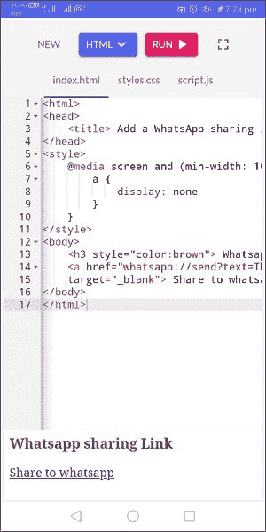
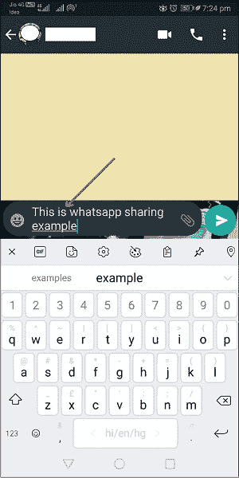
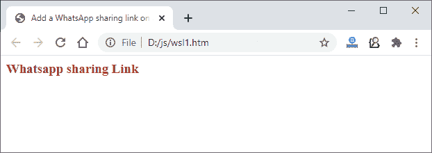
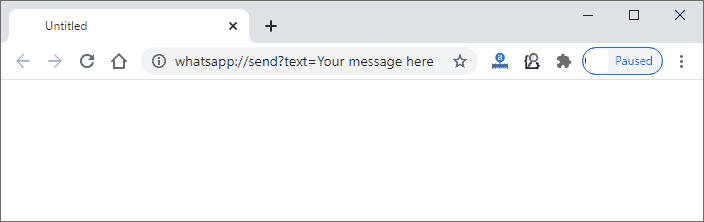
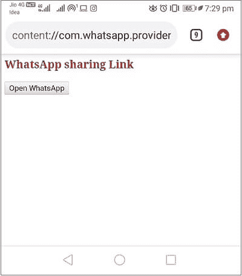
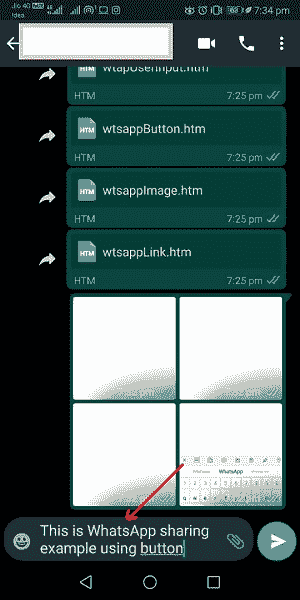
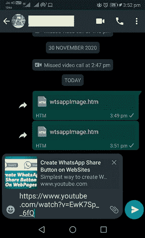
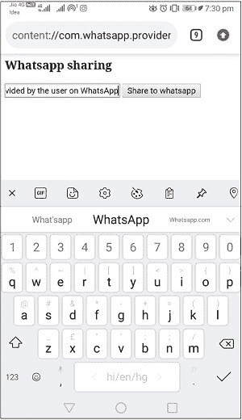
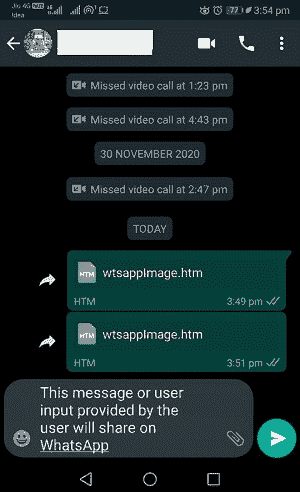

# 如何用 JavaScript 在网站中添加一个 WhatsApp 共享按钮？

> 原文:[https://www . javatpoint . com/how-add-a-whatsapp-share-button-in-a-site-use-JavaScript](https://www.javatpoint.com/how-to-add-a-whatsapp-share-button-in-a-website-using-javascript)

WhatsApp 是当今最受欢迎的移动消息应用之一。由**简·库姆**和**布莱恩·阿克顿**开发，但现在归脸书所有。最近，它有将近 150 万活跃用户。

由于 WhatsApp 是一个太受欢迎的聊天应用程序，大多数网站都需要一个 WhatsApp 共享选项。web 开发人员需要满足这一要求，并将其共享选项添加到他们的网站，以提高用户的效率。

本章将指导您使用 [JavaScript 编程语言](https://www.javatpoint.com/javascript-tutorial)向网站添加一个 WhatsApp 共享链接或按钮。本章将介绍为您的网站创建 WhatsApp 共享选项的以下方法:

*   **创建 WhatsApp 共享链接**
*   **创建 WhatsApp 共享按钮**
*   **使用图片**创建 WhatsApp 共享图标

## 为什么需要？

由于 WhatsApp 是最受欢迎的聊天应用，大多数网站都需要一个 WhatsApp 共享选项。WhatsApp 提供私人共享，这意味着共享是在少数人之间而不是公众之间进行的。

web 开发人员需要满足这一要求，并将其共享选项添加到他们的网站，以提高用户的效率。因此，用户可以使用该共享选项直接从网站轻松共享任何信息，而不是复制和粘贴共享。

## 添加 WhatsApp 共享链接的步骤

以下步骤将在网页上创建一个 WhatsApp 共享链接，通过该链接，您可以直接打开 WhatsApp 并使用它共享网站数据。

#### 注意:这不适用于笔记本电脑和电脑等大屏幕。它将在手机上完美工作。

对于大屏用户，在 JavaScript 代码中提供 WhatsApp 网址或链接。

**按照以下步骤操作:**

**步骤 1:** 使用 [HTML 锚点标签< a >](https://www.javatpoint.com/html-anchor) 设计一个简单的网页，上面有一个超链接。我们将使用此链接作为共享选项。

**HTML 代码**

```

<html> 
<head> 
    <title> Add a WhatsApp sharing link on a website </title> 
</head> 

<body> 
    <h3 style="color:brown"> WhatsApp sharing Link </h3> 
    <a> Share to WhatsApp </a> 
</body> 
</html>

```

[Test it Now](https://www.javatpoint.com/oprweb/test.jsp?filename=how-to-add-a-whatsapp-share-button-in-a-website-using-javascript1)

**第二步:**正如我们已经告诉过你的，这种方法在大屏幕(笔记本电脑/台式机/电脑)上是行不通的。所以，我们会添加 CSS 来隐藏大屏幕上的共享链接。 [CSS](https://www.javatpoint.com/css-tutorial) 代码隐藏大屏分享链接:

对此使用 CSS @media 查询。

CSS 代码

```

<style>
    @media screen and (min-width: 500px) {
        a {
            display: none
        }
    }
</style>

```

当我们将屏幕的最小宽度设置为 500 像素时，这段代码将隐藏您使用锚点标签创建的链接。出于测试目的，您可以将最小宽度增加到 1000，并在笔记本电脑上检查输出；它不会隐藏链接。

**第三步:**现在，用 JavaScript 实现以上两个步骤，让创建的超链接工作。所以，当你点击这个链接，它会直接从当前网页打开 WhatsApp。

**JAVASCRIPT 代码**

将下面的代码添加到 [HTML](https://www.javatpoint.com/html-tutorial) 代码中的定位标签

```

href="whatsapp://send?text=Your message here"

```

### 完整示例

请参见下面创建 WhatsApp 共享链接的完整代码:

```

<html> 
<head> 
    <title> Add a WhatsApp sharing link on a website </title> 
</head> 
<style>
     //css code to hide the WhatsApp sharing link on the large screen
    @media screen and (min-width: 1000px) {
        a {
            display: none
        }
    }
</style>

<body> 
    <h3 style="color:brown"> WhatsApp sharing Link </h3> 
    <!-- create a link using anchor tab -->
    <a href="whatsapp://send?text=This is WhatsApp sharing example using link" 		data-action="share/whatsapp/share"
		target="_blank"> Share to WhatsApp </a> 
</body> 
</html>

```

[Test it Now](https://www.javatpoint.com/oprweb/test.jsp?filename=how-to-add-a-whatsapp-share-button-in-a-website-using-javascript2)

**手机输出**

在手机上而不是台式机或笔记本电脑上检查并运行上述代码。你会得到如下的回答。在这里，点击**分享到 WhatsApp** 链接，会将你重定向到手机上的 WhatsApp messenger。



当您点击链接时，您的 WhatsApp 应用程序将在手机中打开，它会要求您选择联系人并与他们共享文本。这将共享文本参数(**中提供的文本，这是锚标签内部的 WhatsApp 共享示例**)。



#### 注意:你只会在手机上得到上面代码的这个输出。

**桌面输出**

如果您尝试在台式机或笔记本电脑等大屏幕上运行上述代码，您将在没有 WhatsApp 共享链接的情况下获得响应，如下图所示:



或者，如果您获得关于最小化浏览器屏幕大小的 WhatsApp 共享链接，您将通过单击该链接在浏览器的搜索栏中获得包含文本的空白响应。



## 创建一个 WhatsApp 共享按钮

现在，我们将创建一个 WhatsApp 共享按钮并将其添加到网页中。基本上，这段代码旨在向网站添加一个按钮，该按钮将引导您进入 WhatsApp 移动应用程序。点击此按钮，您将被重定向到 WhatsApp 应用程序，与您的联系人共享一些网络内容。

这个方法不需要很长的代码。只需要 JavaScript 的 **window.open()** 方法和 WhatsApp 的链接以及你想要分享的数据。

**针对移动 WhatsApp**

```

<button onclick="window.open('whatsapp://send?text=This is WhatsApp sharing example using button')"> Open WhatsApp </button>  

```

**桌面上的 WhatsApp Web**

```

<button onclick="window.open('https://web.whatsapp.com://send?text=This is whatsapp sharing example using button')"> Open WhatsApp </button>  

```

将下列代码之一添加到您想要打开 WhatsApp 的最终代码中。

### 例子

请参见手机在网页/网站上添加 WhatsApp 共享按钮的代码:

**复制代码**

```

<html> 
<head> 
    <title> Add a WhatsApp sharing button on a website </title> 
</head> 

<body> 
    <h3 style="color:brown"> WhatsApp sharing Link </h3> 

    <!-- create a button to open the WhatsApp onclick function -->  
    <button onclick="window.open('whatsapp://send?text=This is WhatsApp sharing example using button')"> Open WhatsApp </button>  

</body> 
</html>

```

[Test it Now](https://www.javatpoint.com/oprweb/test.jsp?filename=how-to-add-a-whatsapp-share-button-in-a-website-using-javascript3)

**手机输出**

在手机上运行上述代码，它会在网页上显示一个小的 HTML 按钮，如下图截图所示:



点击此**打开 WhatsApp** 按钮，该按钮将带您进入 WhatsApp 应用程序，选择数据并与您的联系人共享数据。查看手机截图:



## 使用图像创建一个 WhatsApp 共享图标

在这种方法中，我们将通过从互联网上获取图像并将其添加到网页中来创建一个 WhatsApp 图标，以创建 WhatsApp 的共享图标。当您单击此图像/图标时，它会将您重定向到 WhatsApp 应用程序，以便与您的联系人共享一些网络内容。

**针对移动 WhatsApp**

```

function openWhatsApp() {
	window.open('whatsapp://send?text= https://www.youtube.com/watch?v=ohpCMpderow');
    }

```

**对于 WhatsApp Web**

```

function openWhatsApp() {
	window.open('https://web.whatsapp.com://send?text= https://www.youtube.com/watch?v=ohpCMpderow');
    }

```

**本例要点:**

*   在这个例子中，我们直接从互联网上获取了 WhatsApp 图标的图像。因此，我们从网上提供了 WhatsApp 图像图标的链接，并设置了它的高度和宽度。
*   我们分享的是 Javatpoint 的 youtube 视频链接，而不是短信。为此，你不需要做什么特别的事情。你只需要用 WhatsApp 链接在文本的地方提供视频的链接。

**例如**‘whatsapp://send？**文字= https://www.youtube.com/watch?v=ohpCMpderow'**

### 例子

下面的代码将帮助您在网站上添加一个 WhatsApp 共享图标。请记住，下面的代码仅适用于 WhatsApp 移动应用程序。在网上，它什么也不会给你看。

**复制代码**

```

<html> 
<head> 
    <title> Add a WhatsApp sharing image icon on a website </title> 
</head> 

<script>
//user-defined function to open and share web content on WhatsApp
function openWhatsApp() {
	window.open('whatsapp://send?text= https://www.youtube.com/watch?v=ohpCMpderow');
    }
</script>

<body> 
    <h3 style="color:brown"> WhatsApp sharing Link </h3> 

    <!-- create an image icon to open the WhatsApp onclick -->   
    

</body> 
</html>

```

[Test it Now](https://www.javatpoint.com/oprweb/test.jsp?filename=how-to-add-a-whatsapp-share-button-in-a-website-using-javascript4)

**手机输出**

在手机上运行上述代码；它会显示一个 WhatsApp 的小图标。点击这个 WhatsApp 图像图标，查看它将如何响应的输出:


点击这个 WhatsApp 图像图标，您将获得如下所示的输出:



## 用户输入的 WhatsApp 共享链接

这是另一个例子，创建一个 WhatsApp 共享选项和一个输入字段，从用户那里获取输入。这意味着我们将从用户希望共享的输入字段中获取输入，并使用 JavaScript 通过提供共享按钮与他们在 WhatsApp messenger 上的联系人共享来发送此消息。

在本例中，我们将使用一个输入字段来接收用户的输入，并使用一个按钮来提交用户输入和一个 WhatsApp 共享链接。这将使用 JavaScript 编程来完成。

查看用户输入的 WhatsApp 共享代码:

### 例子

请参阅完整的代码，在网页上添加一个 WhatsApp 共享图标:

**复制代码**

```

<html> 
<head>  
<title> Add a WhatsApp sharing link on a website </title> 

<style> 
    /* To hide the button on large screens */ 
    @media screen and (min-width: 1000px) { 
	.mobileShow { 
	   display: none 
	} 
    } 
</style> 
</head> 

<body> 
    <h3>Whatsapp sharing</h3> 

    <input class="mobileShow" type="text" name="message"> 
    <button onclick="share()" class="mobileShow"> Share to WhatsApp </button> 

    <script src= 
"https://cdnjs.cloudflare.com/ajax/libs/jquery/3.2.1/jquery.js"> 
    </script> 

    <script> 
	// User-defined function to share some message on WhatsApp 
	function share() { 
	    // collet the user input 
	   var message = $("input[name=message]").val(); 
                // JavaScript function to open URL in new window 
	    window.open( "whatsapp://send?text=" + message, '_blank'); 
	} 
    </script> 

</body> 
</html>

```

[Test it Now](https://www.javatpoint.com/oprweb/test.jsp?filename=how-to-add-a-whatsapp-share-button-in-a-website-using-javascript5)

**输出**

当您在手机上执行上述代码时，它会显示一个文本字段来接受用户的输入，并显示一个按钮来将该输入共享给 WhatsApp。以上程序见手机截图:



在文本字段中提供消息，然后点击**共享到 WhatsApp** 按钮。它会将您重定向到您的 WhatsApp，以便与您的 WhatsApp 联系人共享该消息。



* * *