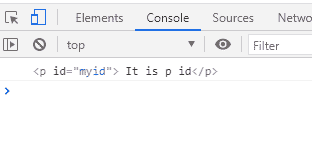

# JavaScript querySelector

> 哎哎哎:# t0]https://www . javatppoint . com/JavaScript-query selector

querySelector 是一种 JavaScript 方法，在元素搜索中起着至关重要的作用。

在本节中，我们将理解和讨论 querySelector()方法及其用法，并查看一个示例来实际理解 querySelector()方法的概念。

## 介绍 JavaScript querySelector()方法

一种元素接口方法，使我们能够搜索并返回文档中的第一个元素。它会找到与任何指定的 CSS 选择器或选择器组匹配的元素。但是，如果没有找到匹配的元素，它将返回 null。querySelector()方法只是文档接口的方法。文档接口是描述任何 [html](https://www.javatpoint.com/html-tutorial) 、 [XML](https://www.javatpoint.com/xml-tutorial) 或任何其他类型文档的通用方法和属性的接口。

### querySelector()方法如何执行搜索

我们知道有不同类型的搜索可以用于搜索元素。但是，querySelector()方法使用**深度优先的预排序**遍历文档的节点。其中，遍历从文档标记中的第一个元素开始，然后按照子节点数量的顺序遍历顺序节点。

**语法**

```

element = document.querySelector(selectors);

```

querySelector()方法是一种文档接口方法，因此它有这样的语法。

它有一个参数“选择器”，这是一个 DOM 字符串，有一个或多个有效的 CSS 选择器。

**返回类型**

如果没有找到匹配项，它可能会返回“null”，如果第一个元素与指定的 CSS 选择器(如果有)匹配，它将返回该元素。

但是，如果没有任何有效的 CSS 选择器，它将抛出一个“语法错误”异常。

现在，在查看示例实现之前，我们应该了解各种类型的 CSS 选择器。如果您不知道，请访问我们的 CSS 教程的[https://www.javatpoint.com/css-selector](https://www.javatpoint.com/css-selector)部分。

因此，我们现在将实现一个例子，在这个例子中，我们将覆盖一个 CSS 选择器，并通过使用 querySelector()方法保留它的第一个元素值。

### 实现查询选择器()示例

下面是一个示例代码，它将使我们理解 querySelector()方法的工作原理:

```

<html>
<head>
<meta charset="UTF-8">
<title> class="colors">Colors</title>
</head>
<body>
<h1> JavaScript Query Selector</h1>
<h1 class="myClass">Class 1</h1>
<p class="myClass"> Myclass</p>
<div id="firstid">
<p> It is the div p paragraph</p>
<p class="pclass"> div p class</p>
</div>
<p id="myid"> It is p id</p>
<div id="divid"> It is div id</div>
<script> <script>
 //Element selector
 var e=document.querySelector("p");
 console.log(e); 
 </script>
</body>
</html>

```

**上述代码的输出如下所示:**


**代码解释**

*   上面的代码是 html 和 JavaScript 的组合。
*   我们在代码中实现了不同的 CSS 选择器。
*   在 JavaScript 部分，我们使用了一个 querySelector()并调用了 CSS 的一个元素选择器。
*   因此，querySelector()方法现在转到使用深度优先的预排序方法遍历它的代码，并在找到第一个元素选择器时返回它。

这样，querySelector()方法就会被执行，您也可以尝试将 querySelector()方法用于其他 CSS 选择器。

让我们也来看看同样的例子，并用于其他 CSS 选择器。只需用以下描述的选择器代码替换元素选择器代码:

### 很少 CSS 选择器

**等级选择器**

```

//Class selector
var e=document.querySelector(".myClass");
console.log(e);

```

我们需要使用(。)运算符，其类名用于查找类的第一个元素。在输出中，您将看到 querySelector()从代码的开头开始搜索，并在 h1 类元素上完成搜索，因此它的返回具有指定的值，如下所示:


**识别选择器**

```

//ID selector
var e=document.querySelector("#myid");
console.log(e);

```

使用(#)来使用 CSS 的 ID 选择器。

**输出如下所示:**



**属性选择器**

```

//Attribute selector
var e=document.querySelector('[target]');
console.log (e);

```

上述代码的输出将为“null ”,因为在我们的代码中，我们没有使用任何如下所示的属性:


因此，有各种各样的 CSS 选择器，如果一个人对 CSS 选择器及其类型有完整的知识和理解，就可以使用它们。

## JavaScript querySelectorAll()方法

[JavaScript](https://www.javatpoint.com/javascript-tutorial) 的 querySelector()方法用于从代码中只选择第一个元素。但是万一我们想从代码中保留一个以上的 CSS 选择器值呢。因此，对于这种情况，我们使用了 Document 接口的另一种方法，称为 querySelectorAll()方法。querySelectorAll()方法是一种用于返回指定 CSS 选择器或 CSS 选择器组的所有匹配值的方法。

**语法**

```

elementList = parentNode . querySelectorAll (selectors);

```

在语法中，它包含选择器作为一个参数，这个参数包含一个或多个选择器，我们可以用它们来匹配值。

**返回**

如果找到匹配的列表或选择器，它将返回这些列表或选择器的指定值。否则，如果没有找到匹配，它将返回一个空节点列表。

另外，如果指定的 CSS 选择器有 [CSS 伪元素](https://www.javatpoint.com/css-pseudo-elements)，它将返回一个空列表。

**语法错误**

如果有语法错误，它将返回语法错误异常，即指定选择器的字符串无效。

### 例子

下面是我们用来解释 querySelector()方法的同一个例子，让我们看同一个例子来理解这两种方法之间的区别:

```

<html>
<head>
<meta charset="UTF-8">
<title> class="colors">Colors</title>
</head>
<body>
<h1> JavaScript Query Selector</h1>
<h1 class="myClass">Class 1</h1>
<p class="myClass"> Myclass</p>
<div id="firstid">
<p> It is the div p paragraph</p>
<p class="pclass"> div p class</p>
</div>
<p id="myid"> It is p id</p>
<div id="divid"> It is div id</div>
<script>
 //Element selector
 var e = document.querySelectorAll ("p");
 console.log(e); 
 </script>
</body>
</html> 

```

现在，您可以看到在第一个示例中，我们使用了 querySelector()方法的代码和它只输出第一个匹配的选择器值之间的区别。但是，当您观察第二个示例的输出时，您会看到它已经返回了指定选择器或选择器组的所有匹配值。上述代码的输出如下所示:


**代码解释**

*   上面的代码是 html 和 JavaScript 的组合。
*   我们在代码中实现了不同的 CSS 选择器。
*   在 JavaScript 部分，我们使用了一个 querySelectorAll()方法，并调用了 CSS 的一个元素选择器。
*   因此，querySelectorAll()方法现在转到使用深度优先预排序方法遍历它的代码，并返回指定为 query selectorall()方法参数的所有匹配元素值。

因此，以同样的方式，我们也可以对各种其他类型的 CSS 选择器使用 querySelectorAll()方法，它将返回指定为其参数的选择器的所有匹配值。为了实现该方法，请将各种选择器的 querySelector()方法替换为 querySelectorAll()方法，该方法将找到匹配项并返回指定元素的至少一个匹配值。

* * *