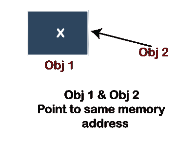
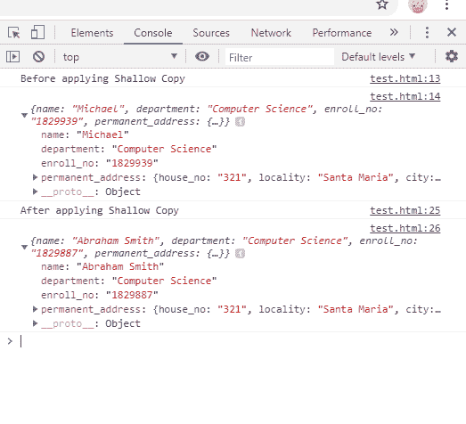

# JavaScript 中的浅拷贝

> 原文:[https://www.javatpoint.com/shallow-copy-in-javascript](https://www.javatpoint.com/shallow-copy-in-javascript)

对象的逐位拷贝称为“浅拷贝”。当有一个原始对象时，会创建一个新对象，复制与原始对象中相同的值。

要了解浅层复制，应该了解数据类型的类型。在本节中，我们将简要介绍数据类型，然后了解 [JavaScript](https://www.javatpoint.com/javascript-tutorial) 中的浅层副本。我们还将看一个例子，它将告诉浅拷贝是如何工作的。

### JavaScript 中的数据类型

基本上，下面给出了两种数据类型:

*   **原始数据类型:**包括布尔、字节、字符、短、长、双和 int。
*   **参考数据类型:**包括数组和对象。

我们将理解它在浅拷贝中的作用。

## 什么是浅拷贝

对象的浅拷贝指的是原始对象的引用位置/地址。在对象的任何字段引用其他对象的情况下，它只复制对象的引用地址(即内存地址)，而不创建新的对象。这就是浅拷贝和深拷贝的区别。浅层副本复制对象的顶层属性，但嵌套对象在原始对象和复制对象之间共享。浅层副本仅复制集合结构，不复制值。这意味着两个集合共享原始集合的元素。

一般来说，浅拷贝简单易用，因为不创建对象，只拷贝引用地址。不仅在阵列的情况下，同样的情况也适用于阵列。

因此，在原始数据类型的情况下，当我们创建原始数据类型变量的副本时，该值被复制到新变量指向的新内存地址。因此，每当我们制作副本时，它将创建一个新的内存位置，并且将是变量的真实副本。因此，如果我们执行 c = a，那么就会创建一个“a”的副本。所以，如果我们试图给 c 赋值，c 的值会改变，但不会影响变量 a 中存储的值，因为一旦初始化，值就只存储一次。

在引用数据类型的情况下，它存储对象的内存地址(即存储对象的位置)。因此，复制值在引用数据类型中运行良好。因此，浅拷贝和深拷贝都只是引用数据类型的类型。

现在，我们将借助一个例子来尝试理解浅层复制。

### 浅拷贝示例

考虑两个对象， **obj1** 和 **obj2** ，其中 obj2 是指 obj1。因此，obj2 将复制与 obj1 相同的内存地址，这意味着两个对象将具有相同的内存地址，并且将仅指向相同的地址。

您可以在下图中看到这个例子:



## 示例代码实现

下面我们提到了一个代码示例，其中我们为学生的详细信息创建了一个浅拷贝:

```

<script>
let student = {
    name: 'Michael',
    department: 'Computer Science',
            enroll_no: '1829939',
    permanent_address: {
        house_no: '200',
        locality: 'Simi Valley',
        city: 'New York',
        country: 'USA'
    }
};
console.log("Before applying Shallow Copy");
console.log(student);
let createcopy = Object.assign({}, student);
createcopy.name = 'Abraham Smith';
createcopy.enroll_no = '1829887';
createcopy.permanent_address.house_no = '321';
createcopy.permanent_address.locality = 'Santa Maria';
createcopy.permanent_address.city = 'California';
console.log("After applying Shallow Copy");
console.log(createcopy);
</script>

```

**输出:**

上述代码的输出如下所示:



### 代码解释:

*   在上面的代码中，我们创建了一个对象“student”，并为其初始化了一些详细的实体。
*   然后，在应用浅拷贝之前，我们在控制台上获得了已经初始化的值。
*   接下来，我们初始化了另一个对象“createcopy”，用于创建“学生”对象的浅层副本。然后使用 Object.assign 将“student”对象分配给“createcopy”。这意味着“student ”( obj 1)和“create copy ”( obj 2)对象将指向相同的内存地址，从上面显示的图像中可以理解。
*   然后，我们为“createcopy”对象和“student”对象实体设置了不同的值，即名称、注册号、永久地址。
*   最后，我们让控制台记录 obj2，即“createcopy”对象，然后我们可以在输出中看到，在修改之后，我们获得了相同实体的值的不同分配。
*   此外，我们应该注意到，只有那些实体值发生了变化，我们再次为“createcopy”对象分配了这些值。其余实体值相同，即“部门”和“国家”。

因此，以这种方式，可以创建一个对象的浅拷贝，并用于为对象属性分配不同的值。

* * *