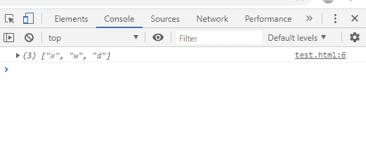
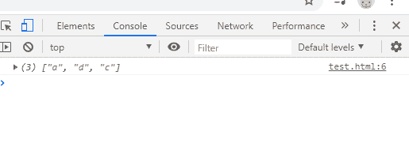
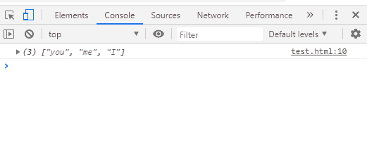
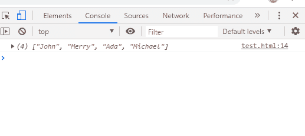
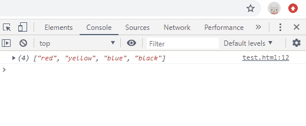
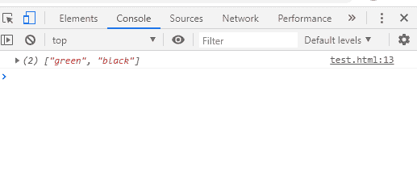

# 从阵列中删除重复项

> 原文：<https://www.javatpoint.com/removing-duplicate-from-arrays-in-javascript>

正如我们所知，数组有助于在内存中按顺序存储数据。但有时，我们可能会在一个数组中存储相同的值或重复的值。因此，我们需要从数组中移除这样的重复值。因此，我们可以通过某些方法从数组中移除元素。

因此，在本节中，我们将讨论这些方法，并通过相应的例子来理解它们。

一般来说，有些开发人员需要使他们的代码更加精确和优化，对于这样的任务，如果存在这样的元素，确实需要从数组中移除重复的元素。因此，有一些方法可以帮助从数组中移除重复的值。

那么，让我们开始逐一讨论这些方法。

## 使用 filter()方法

filter()方法用于从数组中获取重复值。方法创建一个新的元素数组，我们在其中传递特定的条件，如果任何这样的元素返回 false 或失败，它将不是一个筛选数组。

让我们实现一个示例，其中我们将使用 filter()方法过滤掉数组值。示例如下所示:

```

<script>
var array=["x","w","d","w","x"];
function filterDuplicates(new_array){
return new_array.filter((value,index) =>new_array.indexOf(value)===index);
}
console.log(filterDuplicates(array));
</script>

```

**输出:**



## 使用 Set()方法

Set()方法是另一种创建新集合的方法，或者我们可以说创建了一个集合来存储定义数组中的唯一值。下面是 Set()方法的基本代码实现:

```

<script>
var array=["a","a","d","c","d"];
function setDuplicates(new_array){
return [...new Set(new_array)]
}
console.log(setDuplicates(array));
</script>

```

**输出:**



## 使用 reduce()方法

reduce()方法是一种减少数组元素的方法，然后将数组中的这些值/元素组合成一个基于我们指定的 reduce 函数的最终数组。

下面是减少数组元素的代码实现:

```

<script>
var array=["you","me","I","you","me","I"];
function reduceDuplicates(new_array){
let collect=new_array.reduce(function (a,b){
if(a.indexOf(b)<0) a.push(b);
return a;
},[]);
return collect;
}
console.log(reduceDuplicates(array));
</script>

```

**输出:**



## 使用 forEach 和 includes()方法

如果给定数组中不存在元素，includes()方法返回 false，如果数组中存在元素，includes()方法返回 true。forEach 是帮助我们迭代数组中存在的值的循环。

下面是一个示例代码，它将帮助您理解这些方法从数组中移除重复值的工作原理:

```

<script>
var array=["John","Merry","Ada","Merry","Michael"];
function duplicates(new_array){
let collect=[];
new_array.forEach(value=>{
 if(!collect.includes(value))
 {
  collect.push(value)
 }
});
return collect;
}
console.log(duplicates(array));
</script>

```

**输出:**



## 使用 indexOf()和 push()方法

indexOf()方法和 push()方法可以一起使用，以便从数组中移除重复的元素，并从中取出所有不重复的元素。

下面是一个示例代码，将帮助您理解 indexOf()方法和 push()方法的工作原理:

```

<script>
var array = ["red","yellow","blue","black","blue"];
    function duplicates(new_array){
        var collect = [];
        for(i=0; i < new_array.length; i++){
            if(collect.indexOf(new_array[i]) === -1) {
                collect.push(new_array[i]);
            }
        }
        return collect;
    }
  console.log(duplicates(array));
</script>

```

**输出:**



因此，使用这些描述的方法，我们可以过滤并移除数组中存在的重复元素。

但是如果我们需要从数组中移除重复的对象，我们需要使用数组的属性名。类似于元素，这些也可以是在数组中重复出现的对象。

**因此，为了从给定的数组中移除重复的对象，我们可以使用下面显示的代码:**

```

<script>
    function removeDuplicates(new_array){
        var collect = [];
        for(var value of new_array){
            if(collect.indexOf(value) === -1){
                collect.push(value);
            }
        }
        return collect;
    }
    var colors = ["green","black","black"];
	console.log(removeDuplicates(colors));
</script>

```

**输出:**



一般来说，这种类型的重复值消除在我们从事任何项目时都是必需的，尤其是在。当我们是开发人员时，我们需要这样的方法，因为每个客户都需要一个完美的软件或应用程序，该软件或应用程序经过良好的优化、定制、友好和兼容，以便组织的价值可以增加。

因此，这些是开发人员在使用 [JavaScript](https://www.javatpoint.com/javascript-tutorial) 处理一些项目时可以使用的一些方法。

* * *