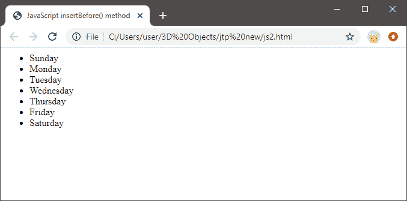

# JavaScript 插入前

> 哎哎哎:# t0]https://www . javatppoint . com/JavaScript-insert before

JavaScript insertBefore()是一种用于在指定父节点的另一个节点之前插入子节点的方法。

在本节中，我们将学习 insertBefore()方法，并看一个例子来理解 insertBefore()方法的实现。

## JS insertBefore()方法

如果我们想在父节点的另一个节点之前添加一个节点(子节点)，则使用 insertBefore()方法。

**语法**

```

parentNode.insertBefore(newNode, existingNode);

```

在上面的语法中，**父节点**是新的子节点将插入的指定父节点。这里，**新节点**表示将要在另一个节点之前插入的节点，**现有节点**表示新的子节点将要插入的节点。在这种情况下，如果现有的节点值为空，也就是说它不存在，那么新节点将被插入到父节点的子节点的末尾。

## insertBefore()函数的工作原理

该方法遵循以下步骤:

*   首先，该方法在代码中搜索指定的父节点。
*   然后，它查找现有的节点值，无论是否在父节点中找到。
*   如果没有找到用户希望在之前插入新节点的现有节点，则该方法返回 null。
*   接下来，如果现有节点在指定的父节点中可用，则方法在现有节点之前插入新节点，并返回插入的子节点。

## insertBefore()方法示例

**下面是一个示例代码，可以帮助我们理解 insertBefore()方法的工作原理:**

```

<html>
<head>
    <meta charset="utf-8">
    <title>JavaScript insertBefore() method</title>
</head>
<body>
    <ul id="weeks">
                      <li>Sunday</li>
                      <li>Monday</li>
                      <li>Wednesday</li>
		<li>Thursday</li>
		<li>Friday</li>
		<li>Saturday</li>
    </ul>
    <script>
        let x = document.getElementById('weeks');
        let add = document.createElement('li');
        add.textContent = 'Tuesday';
         //as we need to insert before 4th element
        weeks.insertBefore(add, x.childNodes[4]);
    </script>
</body>
</html>

```

**上述代码的输出如下所示:**



### 在上面的代码中:

**以上代码是基于 [html](https://www.javatpoint.com/html-tutorial) 和 [JavaScript](https://www.javatpoint.com/javascript-tutorial) 的代码:**

首先，我们创建了一个给定了 id ="weeks "的无序列表。该列表包含一些包含在 [< li >元素](https://www.javatpoint.com/html-lists)中的项目。

*   在
*   然后，我们为创建的新节点提供了一个值“星期二”。
*   最后，我们使用 insertBefore()方法在代码中查找指定的父节点，然后搜索指定的现有子元素，无论它是否出现在指定的父节点的代码中。
*   接下来，它成功地在无序列表中找到了现有的列表项(子节点)，因此它将新的子节点值，即新的列表项，放在现有的子节点值之前。
*   最后，insertBefore()方法将返回列表项值，该值已被放置为 newNode 值。
*   但是，如果我们尝试在方法中放入一个不存在的节点值，该方法将再次搜索该值，但不会存在这样的值。因此，它将返回 null。

因此，通过这种方式，我们可以在指定的父节点中插入一个子节点，并在现有的子节点之前插入新节点。

* * *