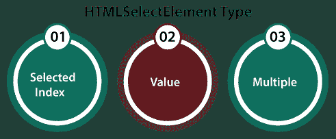
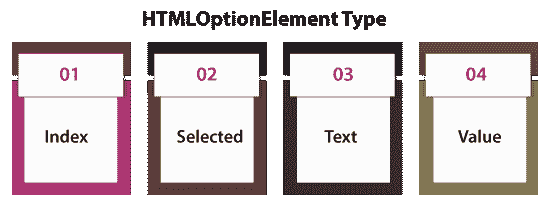

# 选择选项

> 原文:[https://www.javatpoint.com/javascript-select-option](https://www.javatpoint.com/javascript-select-option)

我们将在本教程的 [JavaScript](https://www.javatpoint.com/javascript-tutorial) 中了解如何管理<**选择** >选项。

## 选择选项

A [<选择>](https://www.javatpoint.com/html-select-tag) 选项方便我们进行选项列表。它允许我们选择一个或多个选项。我们使用<选项>和<选择>元素形成<选择>选项。

例如:

```

<select id="color">
<option value="1">Red</option>
<option value="2">Yellow</option>
<option value="3">Green</option>
<option value="4">Blue</option>
</select>

```

<select>选项允许我们一次选择一个选项，如上所述。</select>

如果我们希望有多个选择，我们可以将<select>属性包含到下面的多个 >元素中:</select>

```

<select id="color" multiple>
<option value="1">Red</option>
<option value="2">Yellow</option>
<option value="3">Green</option>
<option value="4">Blue</option>
</select>

```

## htmlselectelemont type

我们使用 HTMLSelectElement 类型与 JavaScript 中的<select>选项进行交互。</select>

HTMLSelectElement 类型包含以下有用的属性:



*   **selectedIndex-** 该属性给出从零开始的选择选项索引。未选择选项时，选择的索引将为-1。当<选择>选项允许多次选择时，选择索引给出第一个选项的值。
*   **value-**value 属性给出了最初选择的选项组件的 value 属性(如果有单个的话)，否则将返回空字符串。
*   **多重-** 当<选择>组件允许多个选择时，多重属性为真。它与多重属性相同。

## selectedIndex 属性

我们应用了类似 [querySelector()](https://www.javatpoint.com/javascript-queryselector) 或 [getElementById()](https://www.javatpoint.com/document-getElementById()-method) 的 DOM API。

该示例说明如何获取下面提到的所选选项索引:

```

<!DOCTYPE html>
<html>
<head>
<title>JavaScript Select Option Demo</title>
<link href="css/selectbox.css" rel="style sheet">
</head>
<body>
<form>
<label for="color">Select a Color</label>
<select id="color">
<option value="1">Red</option>
<option value="2">Yellow</option>
<option value="3">Green</option>
<option value="4">Blue</option>
</select>
<button id="btn">Get a Selected Index</button>
</from>
<script>
const btn = document.querySelector('#btn');
const sb = document.querySelector('#color');
btn.onclick = (event) =>
{
event.preventDefault();
alert(sb.selectedIndex);
};
</script>
</body>
</html>

```

**工作原理:**

*   最初，借助 querySelector()方法选择<select>和组件。</select>
*   然后，将 click 事件侦听器链接到此按钮，并在按钮被按下时，借助 alert()方法显示选定的索引。

## 价值属性

<select>元素的值属性依赖于 <选项> 组件及其 HTML 的多个属性:</select>

*   当未选择任何选项时，选择框的 value 属性将为空字符串。
*   选择框的 value 属性将是选择的选项的值，当选择了一个选项并包含 value 属性时。
*   当选择了一个选项并且该选项不包含任何值属性时，选择框的值属性将是所选选项的文本。
*   当选择了多个选项时，选择框的 value 属性将从关于过去两个规则的初始选定选项中导出。

考虑下面的例子:

```

<!DOCTYPE html>
<html>
<head>
<title>JavaScript Selected Value</title>
<link href="css/selectbox.css" rel="style sheet">
</head>
<body>
<div id="container">
<form>
<label for="color">Select a Color</label>
<select id="color">
<option value="1">Red</option>
<option value="2">Yellow</option>
<option value="3">Green</option>
<option value="4">Blue</option>
</select>
<button id="btn">Get a Selected Value</button>
</from>
</div>
<script>
const btn = document.querySelector('#btn');
const sb = document.querySelector('#color');
btn.onclick = (event) =>
{
event.preventDefault();
alert(sb.value);
};
</script>
</body>
</html>

```

在上面的例子中:

*   当我们选择初始选项时，<select>元素的值属性为空。</select>
*   选择框的值属性将是 Ember.js，因为当我们选择最后一个选项时，所选选项不包含值属性。
*   当我们选择第三个或第二个选项时，值属性将是“1”或“2”。

## htmlotype

HTMLOptionElement 类型说明了 JavaScript 中的<option>元素。</option>

此类型包含以下属性:



**指数-** 期权组内期权的指数。

**选中-** 如果选择了该选项，则返回真值。我们将选择选项的选定属性设置为 true。

**文本-** 返回选项的文本。

**Value-** 返回 HTML 的值属性。

<select>组件包含一个选项属性，允许我们访问集合选项:</select>

```

selectBox.options

```

例如，为了访问第二个选项的值和文本，我们使用下面的:

```

const text = selectBox.options[1].text;
const value = selectBox.options[1].value;

```

为了获得<select>组件的选定选项以及单独的选择，我们使用下面的代码:</select>

```

let selectOption = selectBox.options [selectBox.selectedIndex];

```

之后，我们可以通过值和文本属性访问选定选项的值和文本:

```

const selectedText = selectedOption.text;
const selectedValue = selectedOption.value;

```

当<select>组件允许多个选择时，我们可以使用选定的属性来确定选择哪个选项:</select>

```

<!DOCTYPE html>
<html>
<head>
<title>JavaScript Selected Box</title>
<link href="css/selectbox.css" rel="style sheet">
</head>
<body>
<div id="container">
<form>
<label for="color">Select one or more Colors:</label>
<select id="color" multiple>
<option value="1">Red</option>
<option value="2">Yellow</option>
<option value="3">Green</option>
<option value="4">Blue</option>
</select>
<button id="btn">Get a Selected Colors</button>
</form>
</div>
<script>
const btn = document.querySelector('#btn');
const sb = document.querySelector('#color');
btn.onclick = (e) =>
{
e.preventDefault();
const selectValues = [].filter.call(sb.options, option => option.selected).map (option => option.text);
alert(selectedValues);
};
</script>
</body>
</html>

```

在示例中， **sb 选项**是类似数组的对象。因此，它不包含与数组对象相同的 filter()方法。

为了通过数组对象借用这些类型的方法，我们使用了一个 call()方法，下面给出了所选选项的数组:

```

[].filter.call(sb.options, option => option.selected)

```

为了获得任何选项的文本属性，我们可以将 filter()方法的结果与 map()方法链接起来，如下所示:

```

.map(option => option.text);

```

## 使用 for 循环获取选定选项

我们可以使用 for 循环通过选择列表选项进行迭代，以确定选择哪个选项。可以描述一个函数来返回对所选选项或值的引用。下面给出了所选选项的参考:

```

function getSelectedOption(sel)
{
var opt;
for (var i= 0, len= sel.options.length; i
```

这个函数给出了一个选择选项，它与选择列表的选择类型兼容。与选择-多类型 pf 选择列表兼容的相同功能可以给出多个选择选项。

## 摘要

*   <select>组件允许我们选择一个或多个选项。我们可以将多个属性包含到</select>组件中，以实现多个选择。
*   HTMLOptionElement 说明了<option>组件。如果选择了一个选项，则所选属性为真。选定的值和选定的文本属性返回值添加选定选项的文本。</option>
*   HTMLSelectElement 说明了<select>组件。我们可以使用值和选定的索引来获取所选选项的值和索引。</select>

* * *