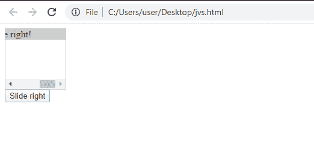
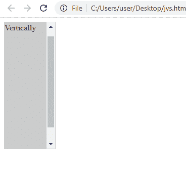

# 获取和设置元素的滚动位置

> 原文：<https://www.javatpoint.com/get-and-set-scroll-position-of-an-element>

在 [JavaScript](https://www.javatpoint.com/javascript-tutorial) 中，获取和设置 JS 元素的滚动位置非常简单容易，尤其是当用户在 web 浏览器中构建用户界面时。当创建用户界面时，我们需要有一个可以滚动的元素，并且需要知道它的水平和垂直滚动。

在本节中，我们将讨论如何获取和设置元素的滚动位置，以及使用哪些属性来实现这一点。有了这些，我们还将讨论和实现一些例子，这些例子将帮助我们更好地理解这个概念。

为了获取和设置 JS 元素的滚动位置，我们需要使用以下两个元素属性。这些属性将能够知道元素的水平和垂直滚动:

1.  **scrollTop:** 元素的属性，返回元素内容允许垂直滚动的像素数。
2.  **scrolleft:**元素的属性，返回元素内容允许水平滚动的像素数。

除此之外，元素的 scrollTop 和 scrollLeft 属性与元素的左上角高度相关，因此，默认情况下，左上角的值为(0，0)。

让我们看看一个实现，它将帮助我们理解这两个元素属性的用法。

## 履行

让我们看两个不同的示例代码，了解如何获取和设置元素的滚动位置:

**使用 scrollRight 属性设置元素的滚动位置:**

下面是给定的代码:

```

<html>
<div id="id_1">
  <div id="value">User click the button</div>
</div>
<button id="slide" type="button">Slide it right</button>
<style>
#id_1 {
  width: 150px;
  height: 100px;
  border: 1px solid #ccc;
  overflow-x: scroll;
}

#value {
  width: 250px;
  background-color: #ccc;
}
</style>

<script>
const button = document.getElementById('slide');

button.onclick = function () {
  document.getElementById('id_1').scrollLeft += 20;
};
</script>
</html>

```

**上述代码的输出如下所示:**



从代码中可以清楚地看到，元素的 scrollLeft 属性水平获取和设置元素，单击按钮时，文本在水平方向滚动。同样，使用了 scrollRight 属性。

**示例 2:实现元素的 scrollTop 属性**

我们可以使用相同的示例代码来垂直获取和设置元素滚动位置:

```

<html>
<div id="container">
  <div id="content">Slide Vertically</div>
</div>
<style>
#container {
  width: 100px;
  height: 250px;
  border: 1px solid #ccc;
  overflow-x: auto;
}

#content {
  height: 300px;
  background-color: #ccc;
}
</style>
<script>
document.getElementById('container').scrollTop;
</script>
</html>

```

**上述代码的输出如下所示:**



从代码中可以清楚地看到**元素的 scrollTop** 属性在滑动时垂直获取和设置元素，文本在垂直方向滚动。

因此，使用这两个元素属性，我们可以知道元素的位置，然后我们可以设置并获得元素的滚动位置。

* * *