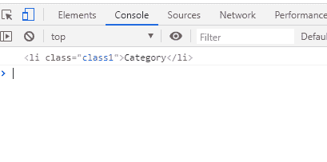
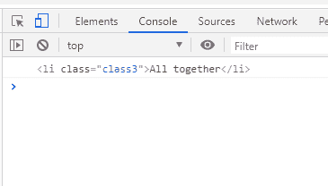
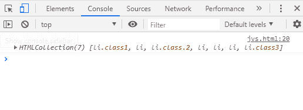

# 在 JavaScript 中获取节点的子元素

> 原文：<https://www.javatpoint.com/getting-child-elements-of-a-node-in-javascript>

JavaScript 中的父节点在 JavaScript 中可能有一个或多个子元素。现在的问题是如何在 JavaScript 中获取节点的子元素。

在本节中，我们将讨论并研究如何在 JavaScript 中获取节点的子元素。

为了在 [JavaScript](https://www.javatpoint.com/javascript-tutorial) 中访问父节点的子元素，我们可以使用以下方法:

*   获取节点的第一个子元素
*   获取节点的最后一个子元素
*   获取节点的所有子节点

让我们逐一讨论每种方法。

**例**

这是一个示例代码，将帮助我们理解如何获取特定节点的子元素:

```

<!DOCTYPE html>
<html>
<head>
  <meta charset="utf-8">
  <title>JavaScript example to Get Child Elements</title>
</head>
<body>
  <ul id="person">
    <li class="class1">Category</li>
    <li>Male or Female</li>
    <li class="class 2">Groups</li>
    <li>Young</li>
    <li>Old</li>
    <li>Child</li>
    <li class="class3">All together</li>
  </ul>
</body>
</html>

```

[Test it Now](https://www.javatpoint.com/oprweb/test.jsp?filename=getting-child-elements-of-a-node-in-javascript1)

现在，使用这个示例代码，我们将理解上面描述的每种方法。

### 获取节点的第一个子元素

为了获得节点的第一个子元素，需要使用元素的 **firstChild** 属性。

**语法:**

```

let firstChild = parentElement.firstChild;

```

在描述的语法中，变量 **firstchild** 将保存第一个子元素的值， **parentElement** 是我们试图获取其第一个子元素值的父节点。

**需要注意的点:**

*   如果**父元素**没有任何子元素，那么**第一个子元素**属性将返回**空值**作为输出。
*   如果属性找到父节点的第一个子节点，则它将返回该子节点，并且该子节点可以是文本节点、元素节点或注释节点。

**例**

让我们看看下面的代码示例，了解如何使用 firstChild 属性:

```

let frstchild = document.getElementById('person');
console.log(frstchild.firstElementChild);

```

在上面的代码中，我们已经将 [< ul >](https://www.javatpoint.com/html-unordered-list) 元素 id 存储到了 **frstchild** 变量中，然后我们获取了第一个子元素值并将其存储到了 frstchild 变量中。最后，我们得到了子元素值的输出。

**我们可以在下面的输出中看到:**



### 获取节点的最后一个子元素

为了得到节点的最后一个子元素，我们需要使用 **lastChild** 属性。

**语法:**

```

let lastChild = parentElement.lastChild;

```

lastChild 变量将保存父节点中最后一个子元素的值。

**检查示例代码的以下部分:**

```

let lstchild = document.getElementById('person');
console.log(lstchild.lastElementChild);

```

因此，在上面的代码中，我们可以看到，类似于检索节点的第一个子元素，我们使用了 **lastElementChild** 方法来获取最后一个子元素。但是，如果父节点中没有子元素，该属性将返回 **null。**否则，如果存在，将返回最后一个子元素值。

**我们有以下输出:**



**注意点:**

*   您可能已经看到，在示例代码中，我们没有使用节点的 **lastChild** 和 **firstChild** 属性来获取父节点的最后一个和第一个子元素。这是因为如果我们在示例代码中使用 firstChild 属性和 lastChild 属性，那么为了保持< ul >和< li >元素之间的空白，它会创建并输出“#text”节点。
*   因此，如果有任何空格(单个空格和多个空格)、回车和制表符，浏览器会创建#text 节点来维护它们。

### 获取节点的所有子元素

为了获得一个节点的所有子元素，使用**子节点**或**子节点**属性。这两个属性都可以用来获取父节点的所有指定子节点，但是两者之间的区别在于 child nodes 属性将返回任何节点类型的所有子元素，即任何节点类型的所有子节点的 live NodeList，而 childNodes 属性将返回仅具有该节点类型的子元素节点。

让我们看看这两个属性的语法:

**子节点属性**

```

let children = parentElement.childNodes;

```

**儿童财产**

```

let children = parentElement.children;

```

**查看下面的示例代码部分，了解如何获取所有子元素:**

```

let person = document.getElementById('person');
let children = person.children;
console.log(children);

```

在代码部分，我们使用 children 属性获取父节点的所有子元素，如下面的快照所示:



* * *