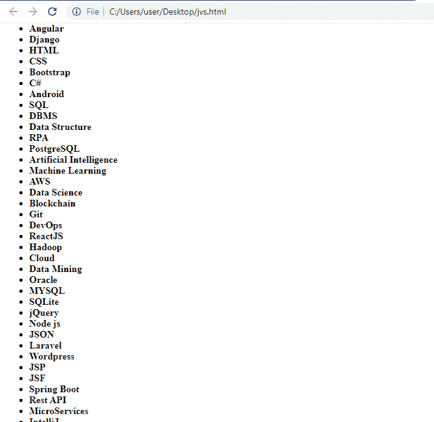

# JavaScript scroll pane

> 原文:[https://www.javatpoint.com/javascript-scrollintoview](https://www.javatpoint.com/javascript-scrollintoview)

JavaScript**scrollIntoView()**是**元素**类的一个方法，它让我们将一个元素滚动到窗口的查看部分。

在本节中，我们将学习如何使用 scrollIntoView()方法将元素滚动到视图中。我们还将实现一个例子，通过这个例子我们可以理解函数的工作和使用。

### JavaScript scrollIntoView()方法

scrollIntoView()方法用于滚动视口中的元素。

**语法:**

```

1) element.scrollIntoView (alignToTop);
2) Element.scrollIntoView (options);

```

**在上述语法中，指定的参数是:**

*   **对齐 Top:** 参数对齐 Top 包含布尔值，该值可以是真也可以是假，默认情况下，其值设置为真。对于特定代码，如果此参数为真，则元素的顶部将与可见区域的顶部或视口区域的顶部对齐。但是，如果该值设置为 false 因此，元素的底部要么与视口的底部对齐，要么与滚动条的可见区域的底部对齐。
*   **选项:**是对象类型参数，浏览器支持可能会有所不同。此参数为视图中元素的对齐提供了更多控制。
    T3 有以下属性:
    *   第一个属性是定义过渡动画的**行为** r。该属性可以具有两个值中的任何一个，即**自动**或**平滑**，其中默认值为**自动**。
    *   **块**属性是定义元素垂直对齐的另一个属性，可以具有四个值中的任何一个，即**、开始、中心、结束**或最接近的**。这里的默认值是**启动**。**
    *   最后一个属性是**内联**属性，它定义了水平对齐方式，并且可以具有四个值中的任何一个，即**起点、中心、终点**或最接近的**。这里，默认值是最接近**的**。**

现在，让我们举一个 scrollIntoView()方法的例子。

### JavaScript scrollIntoView()示例

让我们举个例子来了解一下[JavaScript](https://www.javatpoint.com/javascript-tutorial)scrollIntoView()方法的工作原理:

```

<!DOCTYPE html>
<html>
<body>
  <button onclick="funcClick()">Click it</button>
    <div>
      <p>JavaTpoint: The Best Learning Portal</p>
      <ul>
      <li><b>JavaScript</b></li>
      <li><b>Java</b></li>
      <li><b>PHP</b></li>
      <li><b>C</b></li>
      <li><b>C++</b></li>
      <li><b>Python</b></li>
      <li><b>R</b></li>
      <li><b>GO</b></li>
      <li><b>DOT NET</b></li>
      <li id="id_test"><b>Angular</b></li>
      <li><b>Django</b></li>
      <li><b>HTML</b></li>
      <li><b>CSS</b></li>
      <li><b>Bootstrap</b></li>
      <li><b>C#</b></li>
      <li><b>Android</b></li>
      <li><b>SQL</b></li>
      <li><b>DBMS</b></li>
      <li><b>Data Structure</b></li>
      <li><b>RPA</b></li>
      <li><b>PostgreSQL</b></li>
      <li><b>Artificial Intelligence</b></li>
      <li><b>Machine Learning</b></li>
      <li><b>AWS</b></li>
      <li><b>Data Science</b></li>
      <li><b>Blockchain</b></li>
      <li><b>Git</b></li>
      <li><b>DevOps</b></li>
      <li><b>ReactJS</b></li>
      <li><b>Hadoop</b></li>
      <li><b>Cloud</b></li>
      <li><b>Data Mining</b></li>
      <li><b>Oracle</b></li>
      <li><b>MYSQL</b></li>
      <li><b>SQLite</b></li>
      <li><b>jQuery</b></li>
      <li><b>Node js</b></li>
      <li><b>JSON</b></li>
      <li><b>Laravel</b></li>
      <li><b>Wordpress</b></li>
      <li><b>JSP</b></li>
      <li><b>JSF</b></li>
      <li><b>Spring Boot</b></li>
      <li><b>Rest API</b></li>
      <li><b>MicroServices</b></li>
      <li><b>IntelliJ</b></li>
      <li><b>Apache Kafka</b></li>
      <li><b>Cassandra</b></li>
      <li><b>Selenium</b></li>
      <li><b>SO on...</b></li>

    </ul>
  </div>
<script>
    function funcClick()
    {
      var e = document.getElementById("id_test");
      e.scrollIntoView();
    }
  </script>
</body>
</html>

```

[Test it Now](https://www.javatpoint.com/oprweb/test.jsp?filename=javascript-scrollintoview1)

**点击按钮一次，我们得到如下输出:**



在输出中，您可以看到，如果不滚动，我们将无法在视口中看到列表项。我们只能在按下按钮后才能看到这些列表项，在按钮点击时，列表项滚动到可见区域。

**代码说明:**

1.  上面的代码是一个由 html 和 JavaScript 代码组成的 html 文件。
2.  我们已经创建了一个项目列表，在项目之间，我们创建了一个 **id =id_test** ，这样我们就可以从窗口滚动的地方得到我们的滚动点。
3.  接下来，我们创建了一个按钮“点击它”，当用户点击它时，我们就调用了这个功能。
4.  由于该函数是 JS 函数，因此根据函数定义，将提取特定的项目列表，并将其存储在指定的变量中。
5.  当我们使用 scrolIntoView 属性时，窗口会滚动到特定的列表项。
6.  最后，该项目将在视口中可见。

因此，JavaScript 的 scrollIntoView()方法用于仅通过滚动滚动条来使不可见的部分可见。您也可以用其他方式尝试 JavaScript scrollIntoView()方法。

* * *