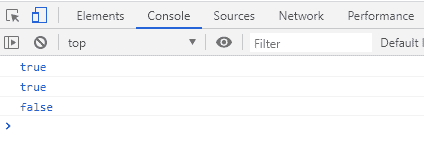
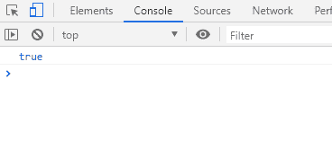

# JavaScript 字符串开始于

> 原文：<https://www.javatpoint.com/javascript-string-startswith>

startsWith()是一个字符串方法，用于确定字符串是否以字符串的指定字符开始。那么结果要么为真，要么为假，无论哪一个适合作为输出。

在本节中，我们将通过一些示例实现来讨论 startsWith()方法，以了解该方法是如何使用的。

### 用()方法收敛字符串开始

如果发现输入字符串以字符串的指定字符开头，则方法返回 true，否则返回 false 作为输出。另外，startsWith()方法区分大小写。

**语法**

```

str.startsWith(searchString[, position])

```

**在上面的语法中:**

*   **字符串:**指定的字符串
*   **搜索字符串:**指定字符串中要搜索的字符。
*   **位置:**一个可选参数，保存字符串中开始搜索的位置。默认情况下，该值为 0。

### 返回值

如果在字符串中找到指定的字符，字符串函数返回**true**；否则返回**假**。

### 用()方法开始的字符串示例

让我们看一些示例实现来更好地理解这个概念:

**例 1:**

下面是一个示例代码:

```

<html>
<body>
<script>
const test = 'Work is Worship';
console.log(test.startsWith('Work'));
console.log(test.startsWith('Worship',8));
console.log(test.startsWith('work'));
</script>
</body>
</html>

```

[Test it Now](https://www.javatpoint.com/oprweb/test.jsp?filename=javascript-string-startswith1)

在上面的代码示例中，我们为常量变量“test”分配了一个字符串:

*   **日志(test . starts with(' Work '))；**

现在，当我们用 **searchString = Work** 控制台记录字符串，并且没有指定位置时，searchString 将从 0 <sup>第</sup>个位置搜索其值，并且作为搜索的开始，字符被找到，因此它返回 **true** 作为输出。

*   **log(test.startsWith('崇拜'，8))；**

现在，当我们用 **searchString =崇拜**控制台记录字符串，并将位置值指定为 **8** 时。因此，搜索字符串将从第 8 个<sup>位置开始搜索，在第 8 个<sup>位置找到匹配的字符；因此，它返回**真**作为输出。</sup></sup>

*   **日志(test . starts with(' work '))；**

现在，当我们在没有指定位置的情况下用 **searchString = work** 控制台记录字符串时，搜索从 0 <sup>第</sup>个位置开始，由于第一个字符不匹配，它返回 **false** 。它输出 false，因为字符串 startsWith()方法区分大小写。

**输出:**



#### 注意:默认位置值 0 从字符串的第一个字符开始。因此，如果字符串中的第 0 <sup>个</sup>位置是单个空格，则输出将是具有上述搜索字符串值的 0。

**例 2:**

**下面是一个代码示例:**

```

<html>
<body>
<script>
function test() { 
    var str = 'Work is Worship'; 
    var x = str.startsWith('Wor');  
    console.log(x); 
} 
test(); 
</script>
</body>
</html>

```

[Test it Now](https://www.javatpoint.com/oprweb/test.jsp?filename=javascript-string-startswith2)

**输出:**



**在上面的代码中，**

*   我们创建了一个函数 **test ()** ，在这个函数中，我们初始化了变量**字符串**的字符串。
*   接下来，我们指定了要在指定字符串中搜索的一些字符串。
*   我们没有设置位置值，所以它从字符串中的第 0 <sup>个</sup>位置开始搜索。
*   因为它发现指定的字符与字符串中指定的字符串字符匹配。因此，它返回输出为**真**，因为找到了匹配。因此，变量 x 的值被指定为**真**。因此，在调用该函数时，输出将作为 true 返回。

* * *