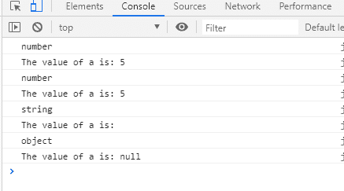

# JavaScript 默认参数

> 原文:[https://www.javatpoint.com/javascript-default-parameters](https://www.javatpoint.com/javascript-default-parameters)

术语*默认*可以理解为当没有其他选项合适时总是可用的选项。同样，默认值是一个始终可用的值。就计算机编程语言而言，几乎每种编程语言都为内置函数或属性指定了一个或另一个默认值。这同样适用于 [JavaScript](https://www.javatpoint.com/javascript-tutorial) 中，它也使函数具有默认值。

在本节中，我们将了解 JavaScript 默认参数，并查看一些示例来了解默认参数的用法。此外，需要的先决条件是应该知道参数和参数这两个术语之间的区别，因为这两个术语彼此不同。

## 参数与参数


许多人混淆了这两个术语，因此在解释默认参数之前，我们应该清楚这些术语。函数中的参数和自变量都不同。函数参数是在函数定义中传递的值，而函数参数是在函数中传递的实数值。参数值是在函数定义中作为参数值传递的值。这意味着参数被初始化为提供的参数值。在每种编程语言中，这两个术语只有相同的含义。

## JavaScript 默认参数

当函数定义中没有传递任何值时，将为函数定义设置一个默认值，称为**默认参数**。当未定义或没有传递值时，它允许用默认值初始化命名参数。

**语法**

```

function [name]([param1[ = defaultValue1 ][, ..., paramN[ = defaultValueN ]]]) {
   statements
}

```

### JavaScript 默认参数示例

通常，在 JavaScript 函数中，参数的默认值是 **undefined** ，这意味着它是默认值，并且在没有其他值作为函数参数值时提供。

虽然有各种使用默认参数的方法，但让我们看一个例子来了解默认参数实际上是如何工作的，以及如何在函数中设置默认参数:

```

<html>
<body>
<script>
function sum(a=5, b=7)
{
	return a+b;
}
console.log(" Sum of the numbers is : " + sum());   // there is no argument
console.log(" Sum of the number is : " + sum(3));   // it has one argument
console.log(" Sum is : " + sum(7,3));   // have both argument
</script>
</body>
</html>

```

[Test it Now](https://www.javatpoint.com/oprweb/test.jsp?filename=javascript-default-parameters1)

**以上输出如下所示:**


**在上例中，**

*   我们创建了一个函数 sum()，其中我们执行了两个值的简单相加。可以看到，我们已经用两个默认值初始化了这两个参数。
*   因此，当我们在没有传递值的情况下调用 consle.log 函数时，两个参数的默认值都将被传递，因此默认参数开始起作用。
*   接下来，我们调用了只有一个值的函数，这意味着第二个参数已经被提供了一个值，但是第一个参数仍然是未定义的，因此将为第一个参数提供默认值。
*   对于函数的最后一次调用，我们已经为两个参数传递了两个值，因此不会为任何参数传递默认值，因为正在提供值。
*   因此，您现在可能能够理解默认参数的工作和使用。

让我们看一些更多的例子来更有效地理解默认参数的工作。

### JavaScript 默认参数的几个例子

让我们看一些更多的例子来更好地理解这个概念:

**例 1:** 通过**未定义**作为参数

```

<html>
<body>
<script>
//passing 8 as default value
function example1(y = 8) {
  console.log(y);
}
example1(undefined); //passing undefined 1
</script>
</body>
</html>

```

[Test it Now](https://www.javatpoint.com/oprweb/test.jsp?filename=javascript-default-parameters2)

**输出:**


**在本例中，**

*   我们创建了一个函数，在这个函数中我们给参数赋值了一个默认值，在函数调用的时候，我们传递了 **undefined** ，在输出中，你可以看到这个函数不是取传递的值，而是取默认值并使用它。
*   这意味着无论参数是空参数还是未定义参数，在这两种情况下，取的值都只是默认值。

**例 2:** 传递**空值**作为函数参数

下面是一个示例代码，让您明白如果我们使用 **null** 作为参数值:

```

<html>
<body>
<script>
function example2(a = 5)
{
    console.log(typeof a);
    console.log("The value of a is: " + a);
}
example2();    // outputs number and The value of a is: 5
example2(undefined);    // output gives as 1
example2('');    // outputs string and the value of a is: 
example2(null);    // outputs object and the value of a: null
</script>
</body>
</html>

```

[Test it Now](https://www.javatpoint.com/oprweb/test.jsp?filename=javascript-default-parameters3)

**输出:**



**在上面的示例代码中，**

*   我们创建了一个函数，在这个函数中，我们为函数的参数提供了一个默认值，在调用这个函数的过程中，我们调用了这个函数四次。
*   在函数的第一次调用中，我们调用了函数，但没有传递值，因此它将只注销默认值。
*   在函数的第二次调用中，我们传递了 **undefined** 作为参数值，这意味着函数也会在这里记录默认值。
*   在函数的第三次调用中，我们传递了一个(' ')，这意味着它将控制台记录参数的**字符串**值。
*   在最后一次函数调用中，我们提供了 **null** 作为它的值，这意味着它将把 null 值视为它的值，并且控制台将 a 的值只记录为 null。

因此，这显然意味着，如果我们传递一个**空字符串**或**空**作为参数值，则不考虑默认值，如果传递一个空字符串，则输出为空字符串，如果传递空字符串，则输出为空，而不是默认值。null 和空字符串都被认为是该函数的有效值。

这是两个例子，如果我们在函数调用中使用这些值，可能会回答查询。

### 在调用时评估默认参数

默认参数的评估是它的一个重要特征，在这里我们考虑默认参数的评估。应该知道，JavaScript 默认参数从不被重用，并且总是在函数调用时被创建。它被称为函数调用时默认参数的计算。

让我们看看下面的例子，并尝试更好地理解所解释的概念:

```

<html>
<body>
<script>
function combine(value, array = []) {
    array.push(value)
    return array
}
console.log(combine(1))  // outputs [1]
console.log(combine(2))  // outputs [2], not [1, 2]
</script>
</body>
</html>

```

[Test it Now](https://www.javatpoint.com/oprweb/test.jsp?filename=javascript-default-parameters4)

**输出:**


**在上面的示例代码中，**

*   我们可以注意到这个函数被调用了两次。
*   我们第一次传递了 1 作为它的值，所以输出将是数组中的 1(只有一个元素)。
*   在函数的第二次调用中，我们使用了 2 作为它的新值。因此，新值将是[2]而不是[1，2]。因为新创造的价值是 2 而不是 1。

最后，在本节中，我们讨论了 JavaScript 默认参数，这将有助于学习者明确他们对函数的概念。此外，现在应该能够区分参数和参数。

* * *