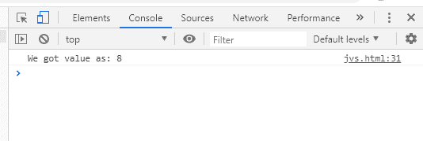
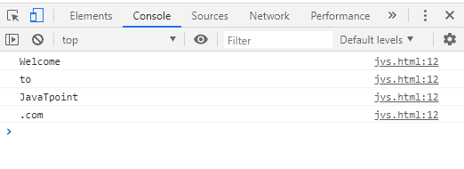
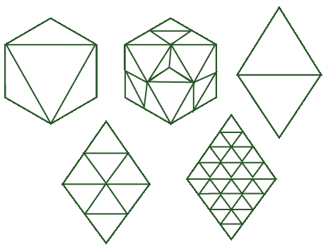
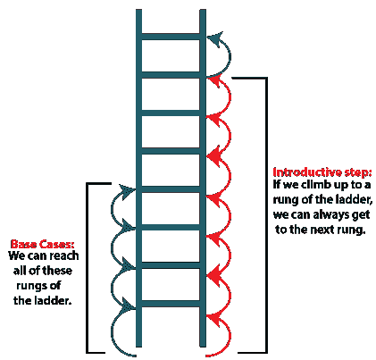

# 现实生活中的 JavaScript 递归

> 原文：<https://www.javatpoint.com/javascript-recursion-in-real-life>

当接近不同的编程语言时，我们会听到并学习递归概念。在 JavaScript 中，我们也有递归的概念，在这里我们使用递归函数。

因此，在这一节中，我们将学习递归，并将看到一些递归的实际例子。我们还将讨论什么时候应该使用递归，什么时候应该避免使用递归。

### 什么是递归和递归函数

递归只是函数对自身的递归调用，其中函数递归调用自身。这种类型的函数被称为递归函数，这种方法被称为递归。通过递归，我们可以用优雅的解决方案解决许多复杂的问题。但是，建议我们应该避免使用递归，因为如果我们误用它，它可能会对系统和存储在其中的数据造成危险。还有 [JavaScript](https://www.javatpoint.com/javascript-tutorial) 函数式编码风格不支持，部分编译器无法安全处理递归函数。

递归函数的语法如下:

```

function recurse() {
    // ...
    recurse();
    // ...
}

```

*应该注意递归函数必须有一个条件，这样它应该停止执行；否则，该函数将被调用和执行无限次。*

### 何时使用递归

递归能够把复杂的大问题分解成小问题。然而，并不是每个复杂的问题都可以通过递归来解决。递归函数的使用对于像迭代分支这样的问题是最合适和有效的，例如排序、遍历、二分搜索法和其他数据结构。此外，当需要一次又一次调用相同的函数，但在一个循环**中使用不同的参数值时，最好使用递归函数。比如**用递归求一个数(一个大数)的阶乘，斐波那契数列实现，汉诺塔都是通过递归最好且容易解决的。

### 何时避免使用递归

人们应该避免用递归解决问题，以防问题太小，只需几行简单的代码就能解决。这是因为递归函数调用自己，除非它不停止。因此，它不必要地使用了大量内存。因此，当我们在解决一个不用递归就能解决的问题时，避免使用它。有时候，可能会有这样一种情况，如果我们误用递归，整个程序可能会变得无限，没有比终止程序更好的选择了。因此，在任何需要的地方正确使用递归。

### 实现递归的真实例子

一般来说，递归是面试官最喜欢的话题，因为他们经常询问递归问题。现实生活中有各种使用递归的例子:

**示例 1:搜索算法**

在使用递归的地方，比如在二分搜索法，我们已经学习了许多搜索算法。下面的代码展示了递归在二分搜索法的使用:

```

<!DOCTYPE html>
<html>
<head>
    <meta charset="utf-8">
</head>
<body>
<script>
function binarySearch( values_Sorted, target ){
    function perform_search( beg, end ) {
        if ( beg > end ) {
            return null;
        }
        if ( values_Sorted[beg] === target ){
            return beg;
        }
        if ( values_Sorted[end] === target ){
            return end;
        }
        var mid = Math.floor( ( beg + end ) / 2 );
        var mid_value = values_Sorted[mid];
        if ( mid_value > target ) {
            return perform_search(beg+1, mid);
        } else if ( mid_value < target ) {
            return perform_search(mid, end-1);
        }
        return mid;
    }
    return perform_search(0, values_Sorted.length-1);
}
var res=binarySearch([0,1,2,3,4,5,6,7,8,9,10], 8);
console.log("We got value as: "+res);
</script>
</body>
</html>

```

[Test it Now](https://www.javatpoint.com/oprweb/test.jsp?filename=javascript-recursion-in-real-life1)

**输出:**



还有一种不用递归求解二分搜索法问题的替代方法，但是遍历和迭代整个数组来搜索元素既复杂又耗时。因此，使用递归来解决这个问题变得很简单。

**示例 2:延迟定时器**

假设在一段设定的时间后，我们想要多次执行一个函数，那么利用递归是最好的选择。那么，让我们看看相同的代码实现:

```

<!DOCTYPE html>
<html>
<head>
    <meta charset="utf-8">
</head>
<body>
<script>
var elements = ["Welcome","to", "JavaTpoint", ".com"];
var n = 0;

function delayTimer() {
    console.log(elements[n]);
    if(n++ !== elements.length - 1) {
        setTimeout(delayTimer, 1000);
    }
}
delayTimer();

</script>
</body>
</html>

```

[Test it Now](https://www.javatpoint.com/oprweb/test.jsp?filename=javascript-recursion-in-real-life2)

**输出:**



**在上面的代码中，**

*   我们已经设置了一个延迟计时器，因此阵列中的元素将在一秒钟后打印到屏幕上，正如我们在输出快照中看到的那样。
*   此外，同样的过程将继续进行，直到没有达到最后一个值。
*   您还可以注意到，我们在这里使用了递归，并且函数调用了自己，直到 if 条件变为 false。

**示例 3:解谜**

选择递归是解决难题的最佳选择，因为递归有助于获得难题的最佳优化解决方案。在日常生活中，我们可能会玩很多谜题，比如井字游戏。人们必须知道，如果我们试图用迭代解决方案来解决问题，这将是多么典型，因为对于每一步，我们都需要考虑几个因素——这是一项复杂的任务。然而，通过递归算法找到最佳移动变得容易或不那么复杂。因此，不仅对于井字游戏，而且在那些你知道有多个迭代移动并需要确定最佳移动的游戏中，递归是最好的方法。

**示例 4:分形设计**

为了解决分形设计，我们可以使用递归。分形设计/图案是递归定义的设计。这些分形设计看起来像:



该模式由几个难以解决的复杂步骤组成。但是当我们试图用递归方法解决分形设计时，我们可以判断和看到每个特定步骤的输出。

**例 5:归纳证明**

**归纳证明是基本情况和归纳步骤的组合，其中:**

*   基本情况是可以证明特定值(P(0))为真的情况。
*   归纳步骤告诉我们可以得到 P(n)到 P(n+1)。

**例如:爬梯**



*   这个例子的基本情况是‘我们能爬上梯子的第一级吗？’
*   这里的归纳步骤是‘我们能从一个梯级到下一个梯级，目标是梯子上的某个任意梯级吗？’这个问题的答案是，是的，当假设梯子是一个完美的无限长的梯子时，我们可以从梯子的一个梯级到达下一个梯级。然而，这个例子存在现实世界的局限性。这是因为梯子不一定是完美的，也就是说，它不可能无限高，而且梯级可能缺失或间隔不均匀。但我们认为它是一个完美的梯子。所以，有了这两个组件，就证明了我们可以从地面爬到梯子上的任何一个梯级。

同样，有更多的归纳证明的例子可以用递归来解决。

因此，所有这些都是递归的真实例子，也是我们使用递归的例子。

* * *