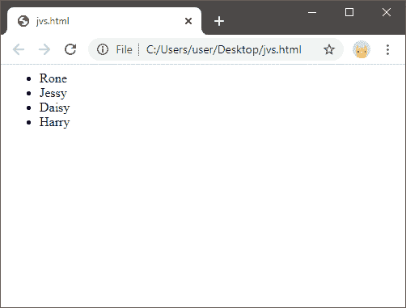
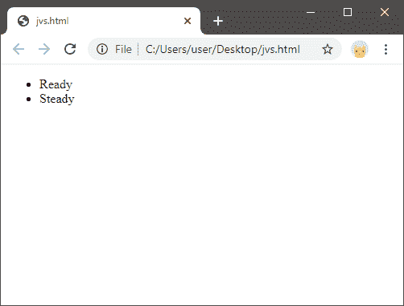

# JavaScript removeChild

> 原文：<https://www.javatpoint.com/javascript-removechild>

在 [JavaScript](https://www.javatpoint.com/javascript-tutorial) 中，我们已经学习了节点的创建，其中我们创建了几个节点，其中一个被称为**父节点**或**根节点**，来自父节点的所有其他节点被称为**子节点**。有时，我们可能需要移除父节点的一些或所有子节点，为此我们需要一种方法，通过该方法我们可以轻松地移除子节点。

因此，在本节中，我们将讨论并理解从父节点中移除子节点的方法。此外，我们将看一些例子，这将有助于我们很好地理解方法。

### removeChild()方法

为了从父节点中移除子节点，我们使用 **removeChild ()** 方法。removeChild()方法用于移除节点的子元素。

**语法**

使用 removeChild()方法的语法是:

```js

 let childNode = parentNode.removeChild(childNode);

```

在语法中，**子节点**是我们要从其父节点中移除的节点元素。因此，作为参数值，我们传递想要移除的子节点值。此外，如果子节点中指定的子节点不是指定的**父节点**的一部分，则方法将引发异常。但是，如果指定的子节点出现在其父节点中，则 **removeChild ()** 方法将从 DOM 中移除并返回该子节点，但不会从内存中移除该子节点并将其保留在内存中。

因此，如果我们不想将指定的子节点也保留在内存中，并想将其从内存中移除，请使用以下语法:

```js

parentNode.removeChild(childNode);

```

在这个语法中，我们可以注意到我们没有将移除的子节点存储在任何变量中(如上面的语法)，这意味着移除的元素也不会存储在内存中的任何地方。但是，在 JS 垃圾收集器破坏它之前，它仍然会存在于内存中。

现在，让我们看一些例子，这将有助于我们更好地理解这个概念。

## JavaScript removeChild()示例

让我们举一些例子来理解 removeChild()方法的实际实现:

**例 1:**

```js

<html>
<body>
<ul id = "id_1">
<li>John</li>
  <li>Rone</li>
  <li>Jessy</li>
  <li>Daisy</li>
  <li>Harry</li>
</ul>
<script>
   var getChild = document.getElementById("id_1");
   getChild.removeChild(getChild.childNodes[1]);//Removing the first child in the list
</script>
</body>
</html>

```

[Test it Now](https://www.javatpoint.com/oprweb/test.jsp?filename=javascript-removechild1)

**上述代码的输出如下所示:**



**代码解释**

*   上面的代码是一个 HTML 和 JavaScript 实现，其中我们创建了一个包含列表中某些项目的无序列表。此外，该列表还提供了一个 id，即 id =“id _ 1”。
*   在脚本部分，我们已经通过 document.getElementById 获取了无序列表 id。
*   我们可以理解在代码中，‘getChild’是 **parentNode，**和指定的索引 **1** 值作为 **childNode** 值是我们想要移除的子元素。
*   removeChild()方法搜索索引值为 1 的元素，返回并从列表中移除该元素。
*   如果方法找不到指定的项，它将引发找不到指定项的异常。
*   此外，从列表中删除后，该项目仍将驻留在内存中，因为我们没有将其从内存中删除。

**例 2:**

```js

<!DOCTYPE html>
<html>
<head>
    <meta charset="utf-8">
</head>
<body>
    <ul id="id_2">
        <li>Ready</li>
        <li>Steady</li>
        <li>Go</li>
    </ul>
    <script>
        let getChild = document.getElementById('id_2');
        getChild.removeChild(getChild.lastElementChild);//To remove the last element in the list
    </script>
</body>
</html>

```

[Test it Now](https://www.javatpoint.com/oprweb/test.jsp?filename=javascript-removechild2)

**上述代码的输出如下所示:**



在这个例子中，我们已经从列表中移除了最后一个子元素。

**代码中:**

*   我们通过列出其中的一些元素创建了一个无序列表。
*   另外，我们为

*   在 JS 代码中，我们已经使用 removeChild()方法从列表中移除了最后一个子元素。

#### 注意:removeChild()方法只用于从根元素中移除一个子元素，但是如果我们想从根元素中移除所有子元素，还有其他方法可以用来移除根节点的所有子元素。

### 移除所有子节点

为了移除根节点的所有子方法，我们可以通过以下方式来完成:

**方法 1**

按照以下步骤删除元素的所有子节点:

1.  使用 **firstChild** 属性，获取元素的第一个节点。
2.  同样，重复相同的步骤，直到所有子元素都从其父节点中移除。

```js

let getChild = document.getElementById('id_1');
while (getChild.firstChild) {
    getChild.removeChild(getChild.firstChild);
}

```

**方法二**

另一种方法是通过设置 innerHTML = "即空字符串"来使用父节点的 innerHTML 属性。该方法的使用如下所示:

```js

let getChild = document.getElementById('id_1');
getChild.innerHTML = '';

```

但是，innerHTML 是一种移除元素的所有子节点的方法，但是不建议使用该方法。

因此，我们可以通过这些方法移除元素的一个或所有子节点。

* * *