# JavaScript 调用堆栈

> 原文:[https://www.javatpoint.com/javascript-call-stack](https://www.javatpoint.com/javascript-call-stack)

为了管理执行上下文，JavaScript 引擎使用调用堆栈。JS 调用栈的工作是在内部执行的，但是我们将理解它在这里工作。

在本节中，我们将讨论 JavaScript 调用堆栈，它正在工作。我们还将讨论一个例子，它将使我们更好地理解这个概念。

## 什么是 JS 调用栈

[JavaScript](https://www.javatpoint.com/javascript-tutorial) 执行上下文(全局执行上下文和函数执行上下文)通过 JavaScript 引擎执行。为了管理这些执行上下文，JS 引擎使用调用堆栈。因此，JS 调用栈是一个[数据结构](https://www.javatpoint.com/data-structure-tutorial)，它记录被调用和执行的函数的信息。因此，如果用户调用一个函数来执行，指定的函数将被推入/添加到调用堆栈中，当用户从函数返回时，这意味着该函数将从调用堆栈中弹出。因此，调用堆栈是遵循堆栈顺序原则(即后进先出)的正常[堆栈数据结构](https://www.javatpoint.com/data-structure-stack)。

### JavaScript 调用堆栈的作用

JS 引擎使用调用堆栈的地方有以下几点:

*   当用户执行任何脚本时，JS 引擎会创建一个全局执行上下文，然后将它添加到调用堆栈和堆栈顶部，以便它可以被执行。
    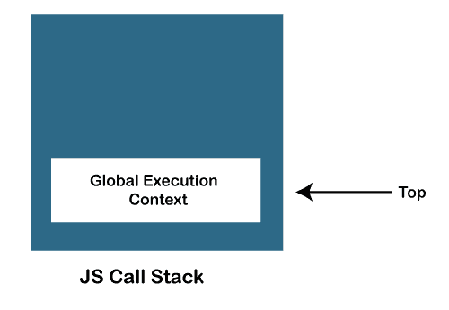
*   当任何函数被调用时，JS 引擎创建一个函数执行上下文，并将其添加到堆栈上和堆栈顶部，以便被调用的函数可以被执行。
    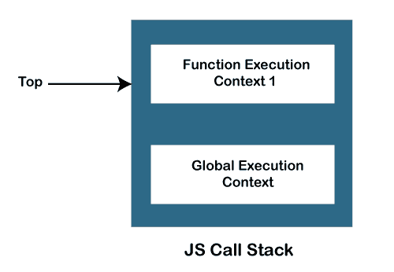
*   在一个函数调用另一个函数的情况下，JS 引擎为被调用的函数创建一个函数执行上下文，将其添加到堆栈的顶部，并开始执行。
    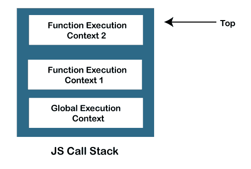
*   当任何函数执行完成时，JS 引擎会将其从堆栈中弹出，并继续执行堆栈中存储的其他函数。
    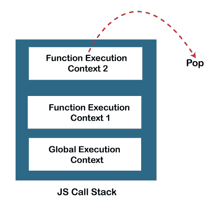
*   如果堆栈中没有剩余空间，并且我们试图推送更多的函数，它会抛出“堆栈溢出”错误，如果调用堆栈中没有进一步的执行上下文，它会抛出“堆栈下溢”错误。

### JavaScript 调用堆栈示例

让我们看一个例子来理解 JavaScript 调用堆栈函数的使用:

```

function getSum(x, y) {
    return x+ y;
}
function findavg(x,y) {
    return getSum(x,y) / 2;
}
let z = findavg(10, 20);

```

### 代码是如何工作的

在上面的代码中，我们创建了两个函数，getSum()和 findavg()，脚本的执行从下面描述的步骤开始:

1.  当脚本开始执行时，JS 引擎最初会创建一个全局执行上下文(即 global()函数)，并将其添加到调用堆栈的顶部。
2.  全局执行进入创建阶段后会移动到生命周期的执行阶段，如下图所示:
    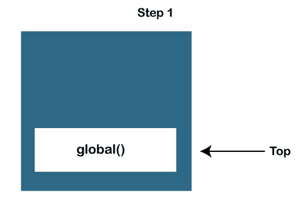
3.  findavg (10，20)函数被调用，因此 JS 引擎为它创建函数执行上下文。然后将其推到调用堆栈的顶部。
4.  所以，现在在调用栈中，推送了两个函数，即 global()和 findavg()，在栈顶出现了 findavg()函数，如下图所示:
    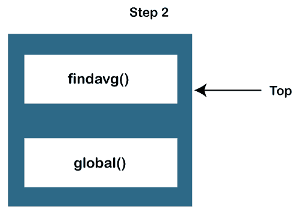
5.  JS 引擎开始执行 findavg()函数，因为它存在于堆栈的顶部，如图所示:
    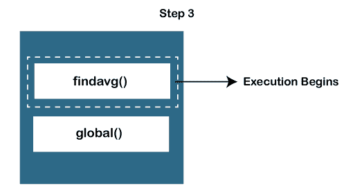
6.  与代码中一样，getSum()函数在 findavg()函数定义中调用，因此 JS 引擎为 getSum()函数创建一个函数执行上下文，并将其推送到堆栈顶部。
7.  现在，在堆栈中，存在三个函数，它们是 global()、findavg()和 getSum()函数，如下图所示:
    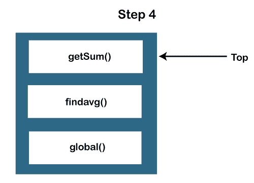
    有两个函数执行上下文和一个全局执行上下文，如下图所示:
    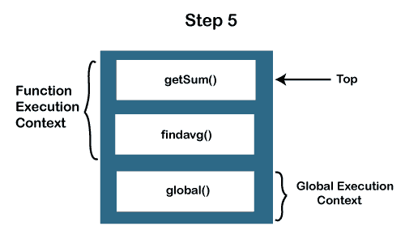
8.  因此，JS 引擎首先执行 getSum()函数，并将其从调用堆栈中弹出。
    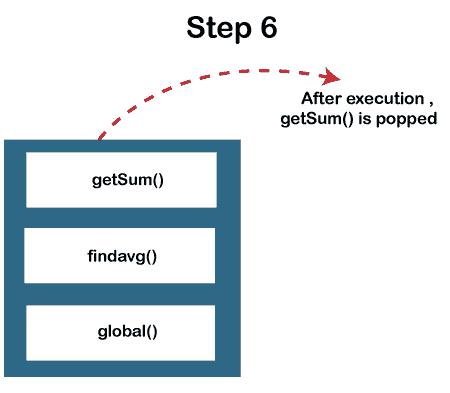
9.  类似地，findavg()函数被执行并退出调用堆栈。
    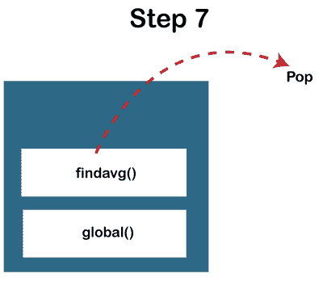
10.  由于这两个函数的执行都已完成，因此调用堆栈中没有其他要执行的函数。JS 引擎停止调用堆栈的执行，并移动到其他执行任务。

### 调用堆栈何时溢出

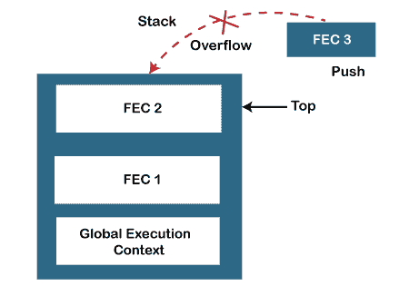

当调用堆栈中没有剩余空间时会出现溢出情况，或者当递归函数没有退出点时会出现这种情况。JavaScript 调用堆栈被定义为固定大小，这取决于宿主环境(Node.js 或 web 浏览器)的实现。因此，当超过定义的堆栈大小限制时，就会发生堆栈溢出。因此，它会引发堆栈溢出错误。

**示例:**

以下示例描述了堆栈溢出情况:

```

function test(){
  test();
}

test();

```

所以，在上面的代码中，我们可以看到我们已经递归调用了 **test ()** 函数，这意味着这个函数将一直执行，直到超过宿主环境最大调用大小，从而堆栈抛出堆栈溢出错误。

**注意点:**

JavaScript 是一种同步的单线程编程语言。这意味着当任何脚本被执行时，JS 引擎会从上到下逐行执行代码。所以，JavaScript 引擎只有一个调用栈，一次只能做一件事。

* * *