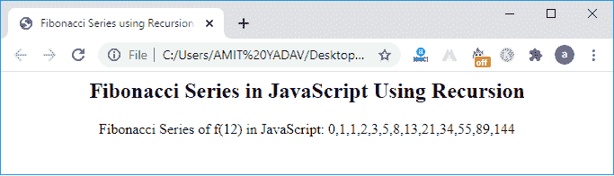

# JavaScript 中的斐波那契数列

> 原文：<https://www.javatpoint.com/fibonacci-series-in-javascript>

本节将讨论斐波那契数列，以及我们如何在 [JavaScript](https://www.javatpoint.com/javascript-tutorial) 中生成斐波那契数列。


**斐波那契数列**是将前面两个数相加生成后续数列的数列。斐波那契数列的前两项分别是**零**和**一**。下一个术语是前两个术语的加法。

### 斐波那契数列的表示

联合国=(联合国-1) +(联合国- 2)

Fn 表示添加了先前的术语 **(Fn - 1)** 和( **Fn - 2)** 。这里 Fn-1 是第一项，Fn-2 是斐波那契数列的第二项。

**示例:**

*   该系列的第一个术语是:0
*   该系列的第二个术语是:1
*   级数的第三项是:(0 + 1) = 1
*   级数的第四项是:(第二+第三)项= (1 + 1) = 2
*   级数的第五项是:(第三+第四)= 1 + 2 = 3

这里是生成的级数:0，1，1，2，3，…同样，我们可以找到下一个项的级数。

### 寻找 n 个数的斐波那契数列的步骤

以下是寻找斐波那契数列的步骤:

**第一步:**声明变量 x，y，z，n，I

**步骤 2:** 初始化局部变量 x = 1，y = 1，i = 2

**步骤 3:** 从用户处读取一个数字

**第 4 步:**显示 x 和 y 的值

**第五步:**重复斐波那契数列的过程，直到 i > n

*   z = x + y
*   显示 z 的值
*   x = y，y = z
*   i = i + 1

**步骤 6:** 停止执行斐波那契数列

### 获取多达 n 项的斐波那契数列

让我们考虑一个例子，在 JavaScript 中使用 for 循环将斐波那契数列提升到一个期望的数字。

**Program1.html**

```

<html>
<head>
<title> Fibonacci Series in JavaScript </title>
</head>
<body>
<script>
// declaration of the variables
var n1 = 0,  n2 = 1, next_num, i;
var num = parseInt (prompt (" Enter the limit for Fibonacci Series "));
document.write( "Fibonacci Series: ");
for ( i = 1; i <= num; i++)
{  document.write (" <br> " +  n1); // print the n1
	next_num = n1 + n2; // sum of n1 and n2 into the next_num

	n1 = n2; // assign the n2 value into n2
	n2 = next_num; // assign the next_num into n2
}

</script>
</body>
</html>

```

**输出:**

当我们执行上述程序时，它会显示给定的图像。有一个提示框来定义斐波那契数列极限，然后单击确定按钮继续。


之后，它显示以 0 和 1 开始的斐波那契数列。下一个术语是前两个术语的添加，如下所示。


### 得到前 8 项的斐波那契数列

让我们考虑一个例子，使用 for 和 if 语句获得 JavaScript 中前 8 个术语的斐波那契数列。

**Program3.html**

```

<html>
<head>
<title>
Fibonacci Series in JavaScript </title>
</head>
<body>
<script type = "text/javascript">
// declaration of the variables
var number = 8; 
var num1 = 0, num2 = 1;
var next_term = 0;
document.write( " Fibonacci series of the number 8: " + "<br>")
for (i = 1; i < number; i++) // use for loop to iterate the series till given number 
{
if ( i <= 1) 
next_term = i; // assign the variable i to next_term
else
{
next_term = num1 + num2; // sum the num1 and num2
num1 = num2;
num2 = next_term;
}
// print the sum of the series
document.write( " Adding " + num1 + " and " + next_term + " = " + (num1 + num2) + "<br>" );

}
</script>
</body>
<html>

```

**输出:**


### 得到斐波那契数列的前 7 项之和

让我们考虑一个例子，用函数和 for 循环在 JavaScript 中得到斐波那契数列的和。

**Simple2.html**

```

<html>
<head>
<title>
Fibonacci Series in JavaScript </title>
</head>
<body>
<script type = "text/javascript">
function fibo( num)
{
var n1 = 0; // declaration of variables n1, n2, i and temp.
var n2 = 1;
var temp;
var i = 0;
for (i = 0; i < num; i++)
{
temp = n1 + n2; // store the sum of n1 and n2 in temp variable.
n1 = n2; // assign the n2 value into the n1 variable
n2 = temp; // assign the new value of temp into n2 variable
}
return n2;
}
// get a number from the user
const f1 = parseFloat (prompt (' Enter a number to get the sum of Fibonacci Series '));
window.alert( "The sum of Fibonacci Series is: " +fibo(f1) );  /* print the sum of series */

</script>
</body>
</html>

```

**输出**

当执行上述代码时，它会显示一个提示框，该框接受一个数字来返回斐波那契数列的总和。


这里我们输入了 7 作为输入来返回序列总和，如下所示。


点击确定按钮。


在上图中，它返回前 7 项之和为 21。

### 用递归函数得到斐波那契数列

让我们考虑一个使用递归函数在 JavaScript 中获得斐波那契数列的例子。

**Recursion.html**

```

<html>
<head> 
<title> 
Fibonacci Series using Recursion in JavaScript. </title>
</head>
<body style= "text-align: center;">
<h2> Fibonacci Series in JavaScript Using Recursion </h2>

<script>
// Using Recursion to find the Fibonacci Series.
function recur(num)
{
// when num is equal to 1, it returns 0 and 1
if (num == 1)
{
return [0, 1];
}
else
{
// it continuously calls the recur function till n-1
total = recur (num - 1);
/* push function add previous two terms and returns store the result into the total variable. */ 
total.push( total[ total.length - 1] + total[ total.length - 2]);
return total;
}

}
// Series of first 12 terms using Recursion.
document.write("Fibonacci Series of f(12) in JavaScript: " + recur( 12 ) + "<br>");
</script>
</body>
</html>

```

**输出**



在上面的程序中，我们使用递归函数创建了斐波那契数列，避免了显示数列的循环。递归函数不断调用**recury()**函数打印序列，直到满足**recury(12)**。每次迭代时，**递归**()函数的值递减 1，并将该值存储到 **total** 变量中。

### 以逆序得到斐波那契数列

让我们考虑一个使用 for 循环以逆序得到斐波那契数列的例子。

**Reverse.html**

```

<html>
<head>
<title>
Reverse Fibonacci Series
</title>
</head>
<body style= "text-align: center;">
<h2> Fibonacci Series in Reverse Order </h2>
<script>
var a = 1, b = 0, res, num;
num = prompt( "Enter the number of terms ");
document.write ("Fibonacci Series of " + num + " terms  is " );
for ( var i =0; i < num; i++)
{
document.write ("  " + b);
res = a + b;
a = b;
b = res;
}
document.write( "" + "<br>");
document.write( "Fibonacci Series of " + num + " terms in Reverse Order is " + "<br>"); 
// print the series in reverse order
for ( i = 0; i < num; i++)
{
document.write( "  " +  a);
res = b - a;
b = a;
a = res;
}
</script>
</body>
</html>

```

**输出**

执行上述代码时，它会显示一个提示框，提示用户输入一个数字。


这里我们输入了 10 作为输入，然后点击确定按钮。之后，它以升序和逆序生成前 10 项的斐波那契数列。


* * *