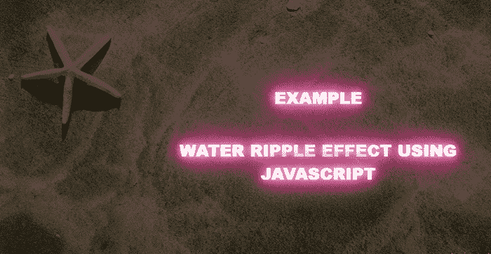
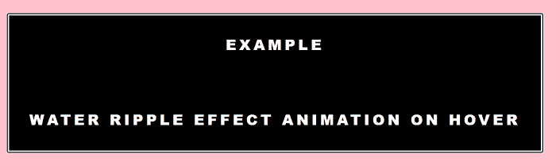
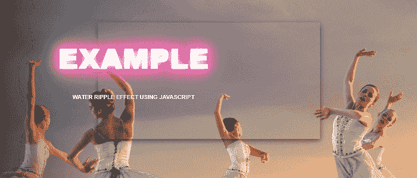

# 涟漪效应 JavaScript

> 原文：<https://www.javatpoint.com/ripple-effect-javascript>

在本文中，我们将解释 javaScript 和涟漪效应。之后，我们将借助 JavaScript 学习涟漪效应的各种实际例子。

### 你说的 JavaScript 是什么意思？

JavaScript 是一种客户端高级解释编程和脚本语言，用于使网页更具交互性。它使您能够在网页上实现复杂而美观的设计。

### 涟漪效应 JavaScript 是什么意思？

在 JavaScript 中，当用户与 UI 元素交互时，涟漪效应会在接触点提供即时的视觉确认。互动通常是你希望你的访问者采取的行动。

### 借助 JavaScript 的涟漪效应的各种例子。

## 例 1:

```js

<! DOCTYPE html>
<html lang = "en">
<head>
  <meta charset = "UTF-8">
  <meta name = "viewport" content = "width=device-width, initial-scale = 1.0">
  <meta http-equiv="X-UA-Compatible" content = "ie=edge">
  <title> Water ripple effect using JavaScript </title>
</head>
<style>
body
{
  padding: 0;
  margin: 0;
   color: #404E67;
    background: #F5F7FA;
    font-family: 'Open Sans', sans-serif;
}
.full-landing-image
{
  width: 100%;
  height: 100vh;
  background: 
    linear-gradient(
      rgba(0, 0, 0, 0.6),
      rgba(0, 0, 0, 0.6)
    ),url("1.png") no-repeat center;
  position: relative;
  float: left;
}
.mid h2 {
  font-family: 'Roboto', sans-serif;
  font-weight: 800;
  color: white;
  text-transform: uppercase;
  margin: 0;
  position: absolute;
  top: 60%;
  left: 60%;
  font-size: 2rem;
  transform: translate(-50%, -50%);
}
.mid h1 {
  font-family: 'Roboto', sans-serif;
  font-weight: 900;
  color: white;
  text-transform: uppercase;
  margin: 0;
  position: absolute;
  top: 40%;
  left: 60%;
  font-size: 2rem;
  transform: translate(-50%, -50%);
}
.glow {
  font-size: 80px;
  color: #fff;
  text-align: center;
  animation: glow 1s ease-in-out infinite alternate;
}

@-webkit-keyframes glow {
  from {
    text-shadow: 0 0 10px #fff, 0 0 20px #fff, 0 0 30px #e60073, 0 0 40px #e60073, 0 0 50px #e60073, 0 0 60px #e60073, 0 0 70px #e60073;
  }

  to {
    text-shadow: 0 0 20px #fff, 0 0 30px #ff4da6, 0 0 40px #ff4da6, 0 0 50px #ff4da6, 0 0 60px #ff4da6, 0 0 70px #ff4da6, 0 0 80px #ff4da6;
  }
}
</style>
<script src="https://ajax.googleapis.com/ajax/libs/jquery/3.4.1/jquery.min.js"> </script>
  <script src="https://cdnjs.cloudflare.com/ajax/libs/jquery.ripples/0.5.3/jquery.ripples.min.js"> </script>
  <script>
  $(document).ready (function () {
  $(".full-landing-image").ripples ({
  resolution: 500,
  perturbance: 0.04,
});
});
  </script>
<body>
  <div class="full-landing-image mid">
  <h1 class="glow"> Example <br> </h1>
<h2 class="glow"> water ripple effect using JavaScript </h2>
</div>
</body>
</html>

```

**说明:**

在上面的例子中，我们在 JavaScript 的帮助下创建了一个水波纹效果。当我们悬停在图像上时，会显示水波纹效果。

**下面是这个例子的输出:**



## 例 2:

```js

<! DOCTYPE html>
<html>
<head>
  <meta charset = "UTF-8">
  <meta name = "viewport" content = "width=device-width, initial-scale = 1.0">
  <meta http-equiv = "X-UA-Compatible" content = "ie=edge">
  <title> Water ripple effect using JavaScript </title>
  <link href = "https://fonts.googleapis.com/css?family=Open+Sans" rel = "stylesheet">
</head>
<style>
@import url('https://fonts.googleapis.com/css?family=Montserrat:700');
html {
  box-sizing: border-box;
}
* {
  box-sizing: inherit;
}
*:before {
  box-sizing: inherit;
}
*:after {
  box-sizing: inherit;
}
body {
  position: fixed;
  width: 100%;
  height: 100%;
  display: flex;
  flex-direction: row;
  justify-content: center;
  align-items: center;
  background: pink;
  font-family: 'Open Sans', sans-serif;
}
h1 {
  font-family: 'Roboto', sans-serif;
  font-weight: 900;
  color: white;
  text-transform: uppercase;
  font-size: 2rem;
}
h2 {
  font-family: 'Roboto', sans-serif;
  font-weight: 800;
  color: white;
  text-transform: uppercase;
  font-size: 2rem;
}
button {
  position: relative;
  display: block;
  margin: 0 auto;
  background: black;
  color: red;
  text-align: center;
  font-size: 26px;
  font-family: "Montserrat";
  font-weight: 700;
  padding: 20px 45px;
  letter-spacing: .25em;
  text-transform: uppercase;
  border: 0;
  overflow: hidden;
  border: 5px white solid;
  cursor: pointer;
  font-family: 'Open Sans', sans-serif;
  &:active,
  &:visited,
  &:focus {
    outline: 0;
    border: 0;
  }
}
/*  Ripple */
span {
  width: 0;
  height: 0;
  border-radius: 50%;
  background: rgba(255, 255, 255, 0.5);
  transform: scale(0);
  position: absolute;
  opacity: 1;
}
.rippleAnimation {
    animation: ripple .6s linear;
}
@keyframes ripple {
  100% {
    transform: scale(2);
    opacity: 0;
  }
}
</style>
<script src="http://ajax.googleapis.com/ajax/libs/jquery/2.0.3/jquery.min.js"> </script>
<script>
$(document).ready (function () {
let btn = document.querySelector('button');
function ripple(e) {
// Setup
  let posX = this.offsetLeft;
  let posY = this.offsetTop;
  let buttonWidth = this.offsetWidth;
  let buttonHeight =  this.offsetHeight;
   // Add the element
  let ripple = document.createElement('span');
  this.appendChild(ripple);
// Make it round!
  if(buttonWidth >= buttonHeight) {
    buttonHeight = buttonWidth;
  } else {
    buttonWidth = buttonHeight; 
  }
  // Get the center of the element
  var x = e.pageX - posX - buttonWidth / 2;
  var y = e.pageY - posY - buttonHeight / 2;
  ripple.style.width = `${buttonWidth}px`;
  ripple.style.height = `${buttonHeight}px`;
  ripple.style.top = `${y}px`;
  ripple.style.left = `${x}px`;

  ripple.classList.add('rippleAnimation');
  setTimeout(() => {
    this.removeChild(ripple);
  }, 1000);
}
btn.addEventListener('click', ripple);
});
</script>
<body>
<button> <h1> Example </h1> <br> <br>
<h2> Water ripple Effect animation on hover </h2> </button> 
</body>
</html>

```

**说明:**

在上面的例子中，我们在 JavaScript 的帮助下在按钮上创建了水波纹效果。当我们将鼠标悬停在按钮上时，会出现涟漪效应。

**下面是这个例子的输出:**



## 例 3:

```js

<! DOCTYPE html>
<html lang="en">
<head>
  <meta charset="UTF-8">
  <meta name="viewport" content="width=device-width, initial-scale=1.0">
  <meta http-equiv="X-UA-Compatible" content="ie=edge">
  <title> Water ripple effect </title>
</head>
<style>
html {
  height: 100%;
}
h1 {
  font-family: 'Roboto', sans-serif;
  font-weight: 900;
  color: white;
  text-transform: uppercase;
  margin: 0;
  top: 60%;
  left: 60%;
  font-size: 2rem;
  transform: translate(-50%, -50%);
}
h2 {
  font-family: 'Roboto', sans-serif;
  font-weight: 700;
  color: white;
  text-transform: uppercase;
  margin: 0;
  top: 60%;
  left: 60%;
  font-size: 1rem;
  transform: translate(-50%, -50%);
}
body {
  color: #fff;
  font-size: 16px;
  font-family: "Helvetica Neue",Helvetica,Arial,sans-serif;
  background-image: url("3.jpg");
  background-size: cover;
  background-position: 50% 0;
  height: 100%;
  text-align: center;
  margin: 0;
  padding: 0;
}
body:before {
  content: '';
  display: inline-block;
  vertical-align: middle;
  height: 100%;
}
section {
  display: inline-block;
  vertical-align: middle;
  padding:  100px;
  max-width: 500px;
  text-shadow: 0 1px 2px rgba(0,0,0,0.5);
  box-shadow: 0 5px 15px rgba(0,0,0,0.5);
}
/* ignore the code below */
.link-area
{
  position: fixed;
  bottom: 20px;
  left: 20px;  
  padding: 15px;
  border-radius: 40px;
  background: tomato;
}
.link-area a
{
  text-decoration: none;
  color: #fff;
  font-size: 25px;
}
.glow {
  font-size: 80px;
  color: #fff;
  text-align: center;
  animation: glow 1s ease-in-out infinite alternate;
}
@-webkit-keyframes glow {
  from {
    text-shadow: 0 0 10px #fff, 0 0 20px #fff, 0 0 30px #e60073, 0 0 40px #e60073, 0 0 50px #e60073, 0 0 60px #e60073, 0 0 70px #e60073;
  }
    to {
    text-shadow: 0 0 20px #fff, 0 0 30px #ff4da6, 0 0 40px #ff4da6, 0 0 50px #ff4da6, 0 0 60px #ff4da6, 0 0 70px #ff4da6, 0 0 80px #ff4da6;
  }
}
</style>
<script src="http://ajax.googleapis.com/ajax/libs/jquery/2.0.3/jquery.min.js"> </script>
<script src="https://cdnjs.cloudflare.com/ajax/libs/jquery.ripples/0.5.3/jquery.ripples.js"> </script>
<script>
$(document).ready (function () {
$('body').ripples ({
  resolution: 512,
  dropRadius: 20,
  perturbance: 0.04,
});
});
</script>
<body>
  <section>
  <header>
    <h1 class =?glow? > Example <br> </h1> <h2> Water Ripple Effect using JavaScript </h2>
  </header>
</section>
</body>
</html>

```

**说明:**

在上面的例子中，我们在 JavaScript 的帮助下创建了一个水波纹效果。当我们悬停在图像上时，会显示出涟漪效应。

**下面是这个例子的输出:**



* * *