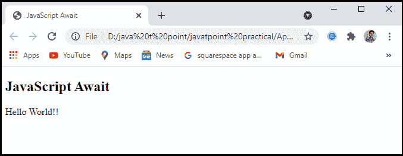
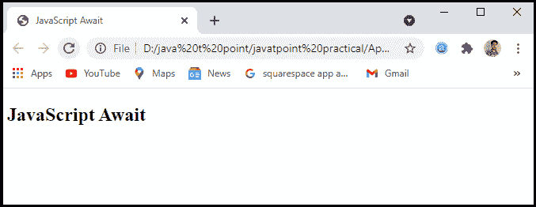
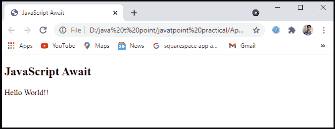
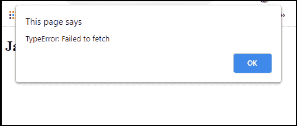

# 异步/等待

> 原文:[https://www.javatpoint.com/javascript-async-and-await](https://www.javatpoint.com/javascript-async-and-await)

JavaScript 总是同步和单线程的，提供事件循环。事件循环使我们能够对活动进行排队。在对动作进行排队的程序完成执行之后，循环才变得可用，这种活动才会发生。然而，我们的程序包含大量的功能，这导致我们的代码是异步的。**异步/等待**功能就是其中之一。**异步/等待**是**承诺**的扩展，我们获得了语言支持。

在本文中，我们将通过一些例子来讨论 [JavaScript](https://www.javatpoint.com/javascript-tutorial) 异步/等待。

## 异步 JavaScript

异步函数是一个用 async 关键字声明的函数，并允许其中包含 await 关键字。async 和 await 关键字允许更容易地编写异步的、**基于承诺的**行为，并避免配置承诺链。async 关键字可以与任何创建函数的方法一起使用。

### 语法:

JavaScript 的语法可以定义为:

```

Async function myfirstfunction() {
return "Hello World"
}

```

它和:

```

async function myfirstfunction() {
return Promise.resolve("Hello World");
}

```

### 示例:

让我们举个例子来理解我们如何在程序中使用 JavaScript 异步。

```

<!DOCTYPE html>
<html>
<head>
    <meta charset="utf-8">
<title>JavaScript Async</title>
</head>
<body>
    <h2>JavaScript Async</h2>
    <p id="main"></p>
<script>
function myDisplayer(some) {
  document.getElementById("main").innerHTML = some;
}
async function myfirstFunction() {
    return "Hello World!!!";
    }
myfirstFunction().then(
  function(value) {myDisplayer(value);},
  function(error) {myDisplayer(error);}
);
</script>
</body>
</html>

```

**输出:**执行完上面的代码后，我们会得到如下截图所示的输出。


## 等待

JavaScript Await 函数用于等待承诺。它只能在异步块中使用。它指示代码等待，直到承诺返回响应。它只延迟异步块。wait 是一个简单的命令，它指示 JavaScript 在继续该特性之前等待异步操作完成。类似于一个**“暂停直到完成”**关键词。await 关键字用于从函数中检索一个值，在该函数中我们通常使用**然后()**函数。我们将使用 wait 为结果分配一个变量，然后像在同步代码中一样在代码中使用结果，而不是在异步函数之后调用。

### 语法:

JavaScript Await 函数的语法可以定义为:

```

// Await function works only inside the async function
let value = await promise;

```

### 示例:

让我们举一个例子来理解如何在程序中使用 JavaScript Await 函数。

```

<!DOCTYPE html>
<html>
<head>
    <meta charset="utf-8">
<title>JavaScript Await</title>
</head>
<body>
    <h2>JavaScript Await</h2>
    <p id="main"></p>
<script>
async function myDisplay() {
  let myPromise = new Promise(function(myResolve, myReject) {
    myResolve("Hello World!!");
  });
  document.getElementById("main").innerHTML = await myPromise;
}
myDisplay();
</script>
</body>
</html>

```

**输出:**执行完这段代码后，我们会得到如下截图所示的输出:



### 示例 2:等待程序超时

让我们用一个程序来理解使用超时等待函数的 JavaScript Await。

```

<!DOCTYPE html>
<html>
<head>
    <meta charset="utf-8">
<title>JavaScript Await</title>
</head>
<body>
    <h2>JavaScript Await</h2>
    <p id="main"></p>
<script>
async function myDisplay() {
  let myPromise = new Promise(function(myResolve, myReject) {
    setTimeout(function() { myResolve("Hello World!!"); }, 2000);
  });
  document.getElementById("main").innerHTML = await myPromise;
}
myDisplay();
</script>
</body>
</html>

```

**输出:**执行完这段代码后，我们会得到如下截图所示的输出。



当我们执行代码时，它会在 **2** 秒后显示结果。它使用超时功能。



## 错误处理

处理异步函数中的错误非常容易。承诺有一个 **catch()** 方法来处理被拒绝的承诺，由于异步函数只返回一个承诺，我们可以调用该函数并在最后添加一个方法。我们应该像使用其他捕获物一样使用诺言捕获物。而且都很容易掌握。请记住，回调将会失败。它可能会产生错误(通过显式抛出或试图访问空变量的属性)。这些崩溃也会被抓取过程捕获。提醒自己，承诺的捕获方法类似于标准捕获。

### 语法:

错误处理的语法可以定义为:

```

asyncFunc().catch(err => 
{
Console.error(err)
// catch error and do something
});

```

但是还有一个选择:全能**试/抓挡。**如果我们想直接在异步函数内部处理错误，我们可以像在同步代码中一样使用 try/catch。

### 示例:

让我们举一个例子来理解 JavaScript 异步和等待函数中的错误处理。

```

<!DOCTYPE html>
<html>
<head>
    <meta charset="utf-8">
<title>JavaScript Await</title>
</head>
<body>
    <h2>JavaScript Await</h2>
<script>
async function f() {
try {
  let response = await fetch('http://no-url');
} catch(err) {
  alert(err); // TypeError: failed to fetch
}
}
f();
</script>
</body>
</html>

```

**输出:**执行完这段代码后，我们会得到如下截图所示的输出。



这可能看起来很草率，但这是一种非常简单的处理错误的方法，无需追加。函数调用后，使用 **catch()** 方法。如何管理错误取决于我们，我们使用哪种方法应该由我们的代码是如何编写的来决定。随着时间的推移，我们会意识到需要实现什么。

* * *