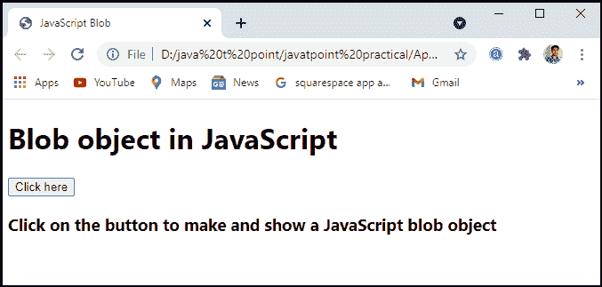
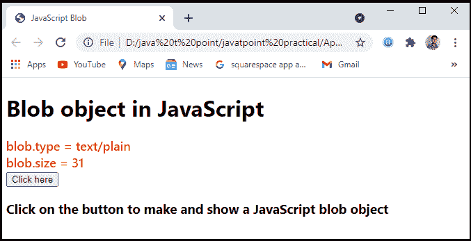
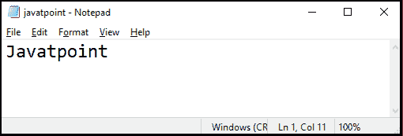
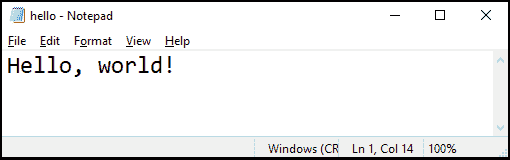

# javascript

> 原文：<https://www.javatpoint.com/javascript-blob>

Blobs 是表示未处理数据的不可变对象。该文件是从文件系统中的数据派生的 Blob。Blobs 允许我们在客户端创建类似文件的对象，我们可以将这些对象传输到**API、**，这些 API 期望**URL**，而不需要服务器提供文件。在本文中，我们将通过一些例子来讨论 [JavaScript](https://www.javatpoint.com/javascript-tutorial) Blob。

## 什么是 JavaScript Blob？

blob 对象只是包含存储在文件中的数据的字节集合。blob 可能看起来是对实际文件的引用，但实际上不是。一个 blob 的大小和简单文件一样。blob 数据存储在用户的内存中，它取决于浏览器功能和 blob 的大小。该文件是 blob 的派生文件，可以在使用该文件的相同位置使用。Blobs 对于存储二进制数据非常有用，因为它们的内容可以很容易地作为**数组缓冲区**读取。

Blobs 可以通过网络浏览器存储在内存或磁盘上，它们可以代表真正的海量数据，这些数据太大而无法放入主内存，除非首先使用 **slice ()** 方法将其分成更小的片段。

### 创建 blob 的语法如下:

创建 JavaScript blob 的语法可以定义为:

```js

new Blob("blobParts, options");

```

在这个语法中，

*   **Blobparts:** 它是 Blob、BufferSource 和字符串值的数组。
*   **选项:**是可选对象。
*   **类型:**是 Blob 类型，一般是像 image.png 一样的 MIME 类型。

### 示例:

让我们举个例子来理解如何在程序中创建一个 JavaScript blob。

```js

<!DOCTYPE html>
<html>
<head>
    <meta charset="utf-8">
    <title>JavaScript Blob</title>
</head>
<body>
    <p id="main"></p>
    <script>
var abc = new Blob(["Javatpoint"], 
{type : "text/plain"});
var def = new FileReader();
def.addEventListener("loadend", function(e) {
document.getElementById("main").innerHTML
     = e.srcElement.result;
});
def.readAsText(abc);
</script>
</body>
</html>

```

**输出:**执行完这段代码后，我们会得到如下截图所示的输出。


在这个程序中，我们只是用 **id = "main"** 做了一个简单的 **< p >** 元素。

```js

<p id = "main></p>

```

## 斑点对象

blob 对象用于表示代表原始数据的不可变 blob 对象。像文件一样，blob 具有大小和 mime 类型属性。

### 示例:

让我们举一个例子来理解如何在 JavaScript 中创建一个 blob 对象。

```js

<!DOCTYPE html>
<html lang="en">
<head>
<meta charset="UTF-8" />
<meta name="viewport" content="width=device-width, initial-scale=1.0" />
<title>JavaScript Blob</title>
<style>
   body {
      font-family: "Tahoma", Verdana;
   }
   .result{
      font-size: 18px;
      font-weight: 500;
      color: red;
   }
</style>
</head>
<body>
<h1>Blob object in JavaScript</h1>
<div class="result"></div>
<button class="Btn">Click here</button>
<h3>Click on the button to make and show a JavaScript blob object</h3>
<script>
   let resEle = document.querySelector(".result");
   document.querySelector(".Btn").addEventListener("click", () => {
      let blob = new Blob(["JavaScrit blob is a sample blob"], { type: "text/plain" });
      resEle.innerHTML = "blob.type = " + blob.type + "<br>";
      resEle.innerHTML += "blob.size = " + blob.size;
   });
</script>
</body>
</html>

```

**输出:**执行完这段代码后，我们会得到如下截图所示的输出。



我们已经看到，有一个**“点击这里”**按钮。当我们点击**【点击此处】**按钮时，屏幕截图显示如下结果。



## JavaScript Blob URL

我们有引用 Blob 的 Blob URLs，就像我们有引用本地文件系统中实际文件的文件 URL 一样。如果 blob URLs 类似于常规 URL，那么它们可以在任何可以使用常规 URL 的地方使用。JavaScript blob 可以很容易地用作[**<【img】>**标签](https://www.javatpoint.com/html-image)和其他标签的 URL，以显示其内容。 **createObjectURL** 对象可用于获取指向一个斑点的斑点 URL:

### 示例:

让我们举个例子来理解如何在程序中使用 blob URL。

```js

<!DOCTYPE html>
<html>
<head>
    <meta charset="utf-8">
    <title>JavaScript Blob</title>
</head>
<body>
    <a download="javatpoint.txt" href='#'
        id="link">Download file</a>
    <script>
        let abc = new Blob(["Javatpoint"],
                { type: 'text/plain' });
        link.href = URL.createObjectURL(abc);
</script>
</body>
</html>

```

**输出:**执行完这段代码后，我们会得到如下截图所示的输出。


在这里，我们可以看到有一个**链接**。当我们点击**链接**时，从如下截图所示的链接下载一个文本文件:



## Blob 到 base64

将斑点转换为基于 64 位编码的字符串是**的替代方法。这种编码通过将二进制数据加密为一串超安全的**“可读”**字符来保护二进制数据，这些字符的 ASCII 码范围从 0 到 64。更重要的是，这种编码可以用于**“数据 URL”**。要将 Blob 转换为 base64，我们将使用内置的 FileReader 对象。**

数据网址具有以下语法:

```js

[<mediatype>][;base64],<data>

```

这样的网址可以在任何地方使用，就像**“常规”**网址一样。

### 示例:

让我们举个例子来理解如何在 JavaScript blob 中使用 blob 到 base64。

```js

<!DOCTYPE html>
<html>
<head>
    <meta charset="utf-8">
    <title>JavaScript Blob</title>
</head>
<body>
    <a download="javatpoint.txt" href='#'
    id="link">Download file</a>
    <script>
   let link = document.createElement('a');
link.download = 'hello.txt';
let blob = new Blob(['Hello, world!'], {type: 'text/plain'});
let reader = new FileReader();
reader.readAsDataURL(blob); 
reader.onload = function() {
  link.href = reader.result; // data url
  link.click();
};
    </script>
</body>
</html>

```

**输出:**执行完这段代码后，我们会得到如下截图所示的输出。当我们执行程序时，它会在运行时直接下载文件。



## JavaScript blob 的优缺点

JavaScript Blob 有一些优点和缺点。其中一些如下:

### JavaScript Blob 的优点

1.  Blobs 是一种在数据库中存储和引用大量二进制数据文件的便捷方式。
2.  Blobs 数据库备份包含所有数据。
3.  使用 Blobs 时，通过权限管理设置访问权限很简单。

### JavaScript Blob 的缺点

1.  Blobs 的效率很低，因为它们需要大量的磁盘空间和访问时间。
2.  所有数据库都不支持 blobs。
3.  由于 Blobs 的文件大小很大，创建备份需要很长时间。

* * *