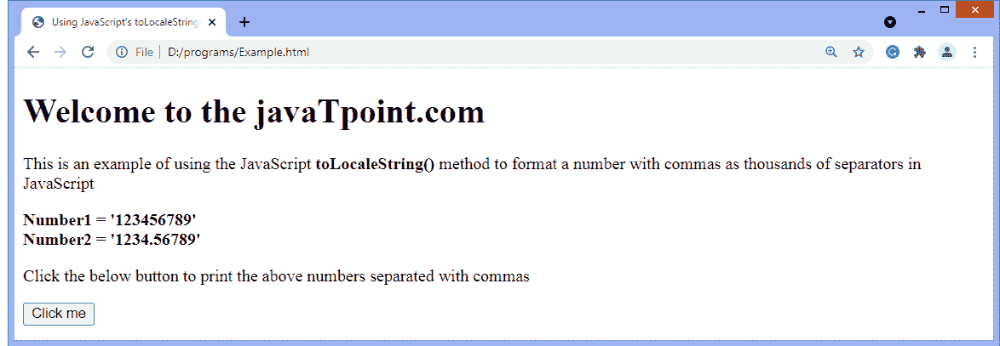

# JavaScript 用逗号格式化数字

> 原文:[https://www . javatpoint . com/JavaScript-format-numbers-带逗号](https://www.javatpoint.com/javascript-format-numbers-with-commas)

在本文中，我们将讨论在 JavaScript 中用逗号格式化数字。有时，我们需要在 HTML 页面中用逗号格式化一个数字，以便于阅读。使用 JavaScript，我们可以将一个数字转换成逗号分隔的值。在这里，我们将讨论相同的方法。

用逗号格式化数字的第一种方法是使用 **toLocaleString()** 方法。

### 使用 toLocaleString()方法

[JavaScript](https://www.javatpoint.com/javascript-tutorial)**ToLocalString()**方法用于将给定数组的元素转换为字符串，这些字符串用逗号“，”分隔。我们可以将**“en-US”**作为参数传递，这样该方法将采用美国和英语的格式，并用千位之间的逗号来表示数字。

现在，让我们通过一个例子来理解这个方法。

### 例子

在这个例子中，我们使用 [**toLocaleString()**](https://www.javatpoint.com/javascript-typedarray-tolocalestring-method) 来格式化由逗号分隔的数字。这里，我们正在格式化两个数字，一个是整数类型的，另一个是浮点类型的。单击给定按钮后，给定的数字将以逗号进行格式化。这些数字将在数千个地方用逗号隔开。

```

<!DOCTYPE html>
<html>
<head>
	<title> Using JavaScript's toLocaleString() method </title>
</head>

<body>
	<h1> Welcome to the javaTpoint.com </h1>
	<p>
		This is an example of using the JavaScript <b> toLocaleString() </b> method to format  a number with commas as thousands of	separators in JavaScript
	</p>
	<b> Number1 = '123456789' </b> </br>
	<b> Number2 = '1234.56789' </b>
<p> Click the below button to print the above numbers separated with commas </p>
	<button onclick = "fun()"> Click me </button>
	<script type = "text/javascript">
		function fun() {
			num1 = 123456789;
			num2 = 1234.56789;
			output1 = num1.toLocaleString('en-US');
			output2 = num2.toLocaleString('en-US');
			document.write("<b> Given number = </b>", num1);
			document.write("</br> <b> Formatted number = </b>", output1);

			document.write("</br> <br> <b> Given number = </b>", num2);
			document.write("</br> <b> Formatted number = </b>", output2);

		}
	</script>
</body>

</html>

```

[Test it Now](https://www.javatpoint.com/oprweb/test.jsp?filename=javascript-format-numbers-with-commas1)

**输出**

执行上述代码后，输出将是-



点击给定按钮后，输出将是-


如果你不想用上面的方法，那么我们可以用另一种用逗号格式化数字的方法。

### 使用 Intl。NumberFormat()对象

**国际号码。NumberFormat()** 对象用于表示语言敏感格式的数字，我们也可以使用它来表示基于指定区域设置的百分比或货币。提供的参数称为**地区**，用于指定数字格式。

我们可以将**“en-US”**作为参数传递，这样区域设置将采用美国和英语的格式，并用千位之间的逗号来表示数字。我们还将使用该对象的 **format()** 方法返回指定区域设置中的数字字符串。 **format()** 函数将取数字并返回逗号分隔的字符串。

现在，让我们通过一个例子来理解这个方法。

### 例子

在这个例子中，我们使用的是 Intl。整数类型和浮点数上的 NumberFormat()对象。

```

<!DOCTYPE html>
<html>
<head>
	<title> Using Intl.NumberFormat() </title>
</head>

<body>
	<h1> Welcome to the javaTpoint.com </h1>
	<p>
		This is an example of using the <b> Intl.NumberFormat() </b> object to format a number with commas as thousands of separators in JavaScript
	</p>
	<b> Number1 = '482351769' </b> </br>
	<b> Number2 = '4823.51769' </b>
<p> Click the below button to print the above numbers separated with commas </p>
	<button onclick = "fun()"> Click me </button>
	<script type = "text/javascript">
		function fun() {
			num1 = 482351769;
			obj1 = new Intl.NumberFormat('en-US');
			output1 = obj1.format(num1);
			document.write("<b> Given number = </b>", num1);
			document.write("</br> <b> Formatted number = </b>", output1);

			num2 = 4823.51769;
			obj2 = new Intl.NumberFormat('en-US');
			output2 = obj2.format(num2);
			document.write("</br> <br> <b> Given number = </b>", num2);
			document.write("</br> <b> Formatted number = </b>", output2);

		}
	</script>
</body>

</html>

```

[Test it Now](https://www.javatpoint.com/oprweb/test.jsp?filename=javascript-format-numbers-with-commas2)

**输出**

执行上述代码后，输出将是-


点击给定按钮后，输出将是-


### 使用正则表达式用逗号格式化数字

一个**正则表达式**或**正则表达式**是指定一个搜索词的字符序列。使用正则表达式，我们可以替换和查找字符串中的值，并按照要求的方式格式化它们。

让我们考虑下面的正则表达式模式。下面给出的正则表达式模式将搜索字符串，并将标记放在三个连续数字的后面。我们可以使用 regex 模式结合 **String.replace()** 方法用逗号替换标记。

```

/\B(?=(\d{3})+(?!\d))/g

```

现在，让我们用一个例子来理解它。

### 例子

在这个例子中，我们使用了 JavaScript 中的正则表达式来格式化带有逗号的数字。这里，我们使用一个正则表达式模式，在一个数字的每三个数字后放置一个标记。我们还使用 **String.replace()** 方法将标记替换为逗号。

```

<!DOCTYPE html>
<html>
<head>
	<title> Using regualar expression to format numbers with commas in javascript </title>
</head>

<body>
	<h1> Welcome to the javaTpoint.com </h1>
	<p>
		This is an example of using the regular expression in javascript to format a number with commas </p>
	<b> Number1 = '1482351769' </b> </br>
	<b> Number2 = '1000.51769' </b>
<p> Click the below button to print the above numbers separated with commas </p>
	<button onclick = "fun()"> Click me </button>
	<script type = "text/javascript">
		function fun() {
			num1 = 1482351769;
			output1 = num1.toString().replace(/\B(?=(\d{3})+(?!\d))/g, ',')
			document.write("<b> Given number = </b>", num1);
			document.write("</br> <b> Formatted number = </b>", output1);

			num2 = 1000.51769;
			output2 = num2.toString().replace(/\B(?=(\d{3})+(?!\d))/g, ',')
			document.write("</br> </br> <b> Given number = </b>", num2);
			document.write("</br> <b> Formatted number = </b>", output2);

		}
</script>
</body>

</html>

```

[Test it Now](https://www.javatpoint.com/oprweb/test.jsp?filename=javascript-format-numbers-with-commas3)

**输出**

执行上述代码后，输出将是-


点击给定按钮后，输出将是-


本教程到此结束。在本文中，我们讨论了在 JavaScript 中用逗号格式化数字的三种方法。希望你发现这篇文章内容丰富，有益于理解 JavaScript 中用逗号格式化数字的方法。

* * *