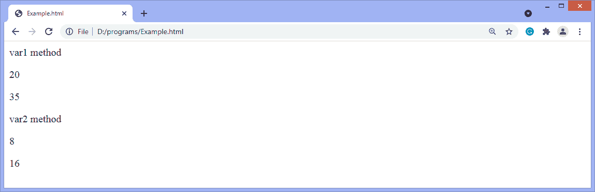

# 用 JavaScript 讨好

> 原文:[https://www.javatpoint.com/currying-in-javascript](https://www.javatpoint.com/currying-in-javascript)

在本文中，我们将讨论 JavaScript 中的 currying。在这里，我们将看到讨好是如何工作的，以及它将如何对软件开发人员有用。我们还将看到一个现有函数到 curried 版本的转换。因此，这篇文章对于 JavaScript 读者来说将会非常有趣和重要。在这里，您将学习到 JavaScript 中的一个新概念。没有任何延迟，让我们开始我们的重要话题，即在 [JavaScript](https://www.javatpoint.com/javascript-tutorial) 中讨好。

## 什么是拍马屁？

Currying 的定义是将一个具有多个参数的函数变成一个具有单个参数的函数序列。这是一个将一个具有较多 arity 的函数转换成一个具有较少 arity 的函数的过程。术语 **arity** 是指函数中的参数数量。

这是一种函数转换，将函数从可调用的 **add(1，2，3)** 转换为可调用的 **add(1)(2)(3)** 。它只是转换一个函数，而不是调用它。它会返回一个新函数，直到所有参数都用完。

假设一个函数有一些参数，所以它不是一次接受所有参数，而是接受第一个参数，并返回一个接受第二个参数的新函数，并返回一个接受第三个参数的新函数，它将一直运行，直到所有参数都满足。

例如，假设一个函数**用三个参数 **A、B、**和 **C、**来表示**，并且它返回值 **res** 。当它被咖喱时，它将被分解成三个功能，分别是 **X、Y、**和 **Z** 。新函数 **X** 将以 **A** 为自变量，返回函数 **Y，**以 **B** 为自变量，返回函数 **Z** ，以 **C** 为自变量，最终返回所需值 **res** 。

## 携带的好处

*   Currying 有助于防止一次又一次地传递同一个变量。
*   它在事件处理中很有用。
*   编写可以轻松重用和配置的小代码模块。

## 如何在 JavaScript 中实现 Currying？

默认情况下，Currying 在 JavaScript 中不是内置的(至少在当前版本中不存在)。使用一些函数技巧，我们也可以在 JavaScript 中实现讨好。我们可以用两种方法来实现讨好

*   可以通过使用 **bind()** 方法来实现
*   这可以通过使用**闭合**来实现

### 使用 bind()方法进行货币兑换

JavaScript 函数 **bind()** 方法用于创建新函数。当一个函数被调用时，它有自己的 ***这个*** 关键字被设置为提供的值，带有给定的参数序列。现在，让我们使用 JavaScript 中的 **bind()** 方法来实现这个目标。

**例**

在这个例子中，我们使用 **bind()** 方法来实现 JavaScript 中的 currying。 **bind()** 方法会给我们一个 **mul()** 方法的副本，不要直接调用它。这里，我们永久地分配第一个参数值，然后通过分配第二个参数值来重用 **var1** 和 **var2** 方法。

因此，通过这种方式，我们可以使用 currying 重用我们的函数。

```

<html>
<body>
<script>

function mul(val1, val2){
    document.write("<p>" + val1 * val2 + "</p>");
}

let var1 = mul.bind(this, 5);
document.write("var1 method");
var1(4);
var1(7);
let var2 = mul.bind(this, 4);
document.write("var2 method")
var2(2);
var2(4);
</script>
</body>
</html>

```

**输出**



## 使用闭包

这个闭包也使得在 JavaScript 中讨好成为可能。闭包可以定义为一种 JavaScript 特性，其中内部函数可以访问外部函数变量。在 JavaScript 中，每次创建函数时都会创建一个闭包。

```

<html>
<body>
<script>

function mul(val1){
    return function(val2){
        document.write("<p>" + val1 * val2 + "</p>");
    }
}

let a = mul(2);
a(5);
a(6);

</script>
</body>
</html>

```

**输出**

```
10
12

```

## 如何将现有功能转换为课程版本？

现在，让我们来看看现有函数到它的 curried 版本的转换。

### 不讨好

这里有一个简单的函数，我们不使用 currying。

```

<html>
<body>
<script>

   function multiply(a, b, c) {
            return a * b * c;
         }
document.write(multiply(2, 5, 8));
</script>
</body>
</html>

```

**输出**

```
80

```

### 搬运后

现在，我们将 currying 应用于上面示例中给出的函数。让我们看一个在 JavaScript 中讨好的例子。

```

<html>
<body>
<script>
   function multiply(a) {
      return function(b) {
         return function(c) {
            return a * b * c;
         }
      }
   }
document.write(multiply(2)(5)(8));
</script>
</body>
</html>

```

**输出**

```
80

```

在上面的代码中，我们使用 currying 作为一个接一个传递的参数，直到最后一个函数调用最后一个参数。因此，在相同的参数下，在相同的函数上，前后的输出将保持不变。

所以，这就是文章的全部内容。希望你明白讨好的概念和实现的过程。

* * *