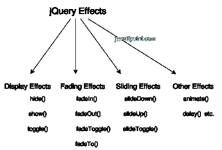

# jQuery 效果

> 原文:[https://www.javatpoint.com/jquery-effects](https://www.javatpoint.com/jquery-effects)

jQuery 使我们能够在网页上添加效果。jQuery 效果可以分为淡入淡出、滑动、隐藏/显示和动画效果。

jQuery 为网页上的效果提供了许多方法。下面给出了 jQuery 效果方法的完整列表:

| 号码 | 方法 | 描述 |
| 1) | 动画() | 执行动画。 |
| Two | clearQueue() | 它用于从所选元素中移除所有剩余的排队函数。 |
| 3) | 延迟() | 为所选元素上的所有排队函数设置延迟执行。 |
| four | 出列() | 它用于从队列中移除下一个函数，然后执行该函数。 |
| 5) | fadein() | 通过将匹配元素淡入不透明来显示匹配元素。换句话说，它会淡入所选元素。 |
| 6) | 淡出() | 通过将匹配的元素淡入透明来显示匹配的元素。换句话说，它会淡出选定的元素。 |
| 7) | 事实() | 调整匹配元素的不透明度。换句话说，它淡入/淡出选定的元素。 |
| 8) | 淡入淡出切换（） | 显示或隐藏匹配的元素。换句话说，在 fadeIn()和 fadeOut()方法之间切换。 |
| 9) | 完成() | 它会停止、移除并完成所选元素的所有排队动画。 |
| 10) | 隐藏() | 隐藏匹配或选定的元素。 |
| 11) | 队列() | 显示或操作方法队列，即在所选元素上执行的方法。 |
| 12) | 显示() | 显示或显示选定的元素。 |
| 13) | 向下滑动() | 用幻灯片显示匹配的元素。 |
| 14) | slidetoggle() | 显示或隐藏与幻灯片匹配的元素。换句话说，它用于在 slideUp()和 slideDown()方法之间切换。 |
| 15) | 滑移（） | 隐藏与幻灯片匹配的元素。 |
| 16) | 停止() | 停止在匹配元素上运行的动画。 |
| 17) | 切换() | 显示或隐藏匹配的元素。换句话说，它在 hide()和 show()方法之间切换。 |