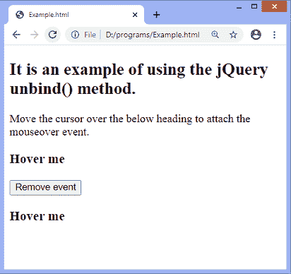
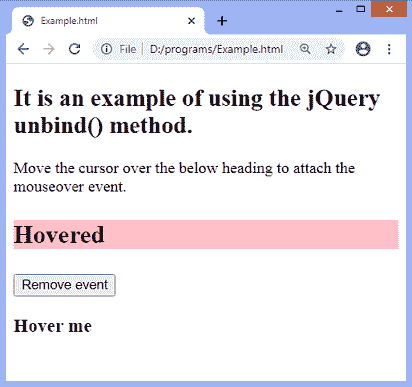
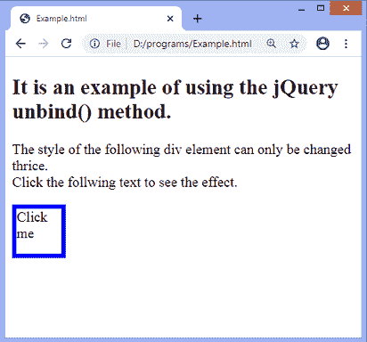
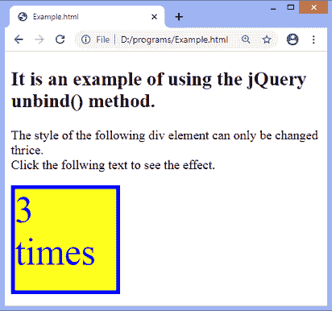

# jQuery unbind()方法

> 原文：<https://www.javatpoint.com/jquery-unbind-method>

[jQuery](https://www.javatpoint.com/jquery-tutorial) 中的 **unbind()** 方法用于从所选元素中移除事件处理程序。我们还可以使用此方法移除所有或特定的事件处理程序。它也可以用来停止指定的功能。

### 句法

```js

$(selector).unbind(event,function,eventObj)

```

### 参数值

此方法接受三个可选参数值，定义如下。

**[事件](https://www.javatpoint.com/jquery-events) :** 是可选参数。它指定要从元素中移除的一个或多个事件。如果我们想删除多个事件，它们必须用空格隔开。

**功能:**也是可选参数。此参数指定要从指定元素或事件解除绑定的函数名。

**eventObj:** 也是可选参数。它来自事件绑定函数。

当我们使用 **unbind()** 方法而不使用任何参数时，该方法将移除附加到元素的所有事件处理程序。

用一些插图来了解一下**解除绑定()**的方法。

### 示例 1

在这个例子中，有两个 **h3** 标题元素和一个按钮。在用文本悬停元素 ***悬停我*** 时，鼠标悬停在 上的 **[事件将被附加到它们。](https://www.javatpoint.com/jquery-mouseover)**

这里，我们使用 **unbind()** 函数来解除**鼠标悬停**事件的绑定。我们可以通过首先悬停一个 **h3** 元素，然后单击给定的按钮来检查**解除绑定()**方法的工作情况。在悬停时，h3 标题的样式会发生变化，当我们单击给定的按钮时，悬停不会影响另一个 h3 元素。

```js

<!DOCTYPE html>
<html>
<head>
<script src = "https://ajax.googleapis.com/ajax/libs/jquery/3.5.1/jquery.min.js"> </script>
<script>
   $(document).ready(function(){
   $("h3").bind("mouseover",function(){
	   $(this).css({"background-color": "pink", "font-size": "25px"}).text("Hovered");
      });
      $("#b3").click(function(){
         $("h3").unbind("mouseover");
      });
   });
</script>
</head>
<body>
<h2> It is an example of using the jQuery unbind() method. </h2>
<p> Move the cursor over the below heading to attach the mouseover event. </p>
<h3> Hover me </h3>
<button id = "b3"> Remove event </button>
<h3> Hover me </h3>
</body>
</html>

```

[Test it Now](https://www.javatpoint.com/oprweb/test.jsp?filename=jquery-unbind-method1)

**输出**

执行上述代码后，输出将是-



在第一个 **h3** 元素上移动光标，输出将是-



点击给定按钮后，当我们悬停第二个 **h3** 元素时，不会因为事件被移除而发生任何事情。

### 示例 2

在这个例子中，我们使用 **unbind()** 方法，一旦事件被触发了一定的次数，就移除事件处理程序。这里有一个 [div 元素](https://www.javatpoint.com/html-div-tag)，它的宽度、高度和字体大小只能增加三倍。这是因为**解除绑定()**功能一旦被触发三次就会移除其**点击**事件。每点击一次，div 的高度和宽度将增加 **25px** ，字体大小将增加 **10px** 。

```js

<!DOCTYPE html>
<html>
<head>
<script src = "https://ajax.googleapis.com/ajax/libs/jquery/3.5.1/jquery.min.js"> </script>
<style>
div{
border: 5px solid blue;
width: 50px;
height: 50px;
}
</style>
<script>
$(document).ready(function(){
var i = 0, j = 1;
$("div").click(function(e){
$("div").animate({height: "+=25px", width: "+=25px", fontSize: "+=10px"}).text(j + " times").css({"color": "blue", "background-color": "yellow"});
i++;
j++;
if (i >= 3) {
$(this).unbind(e);
}
});
});
</script>
</head>
<body>
<h2> It is an example of using the jQuery unbind() method. </h2>
<p> The style of the following heading can only be changed thrice. </br> Click the follwing text to see the effect. </p>
<div> Click me </div>
</body>
</html>

```

[Test it Now](https://www.javatpoint.com/oprweb/test.jsp?filename=jquery-unbind-method2)

**输出**

执行上述代码后，输出将是-



点击文本 ***点击我，*** 每次点击 div 的样式都会改变。点击文本三次后，输出将是-



* * *