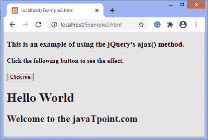
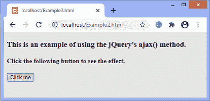
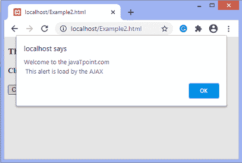

# jQuery ajax()方法

> 原文:[https://www.javatpoint.com/jquery-ajax-method](https://www.javatpoint.com/jquery-ajax-method)

AJAX 是**异步 JavaScript 和 XML** 的缩写。它是一组相互关联的技术，如 [JavaScript](https://www.javatpoint.com/javascript-tutorial) 、DOM、 [XML](https://www.javatpoint.com/xml-tutorial) 、 [HTML](https://www.javatpoint.com/html-tutorial) / [XHTML](https://www.javatpoint.com/xhtml-tutorial) 、 [CSS](https://www.javatpoint.com/css-tutorial) 、XMLHttpRequest 等。它允许我们异步发送和接收数据，而无需重新加载网页。所以很快。

jQuery 中的 **ajax()** 方法执行一个 [AJAX](https://www.javatpoint.com/ajax-tutorial) 请求。它向服务器发送一个异步的 [HTTP](https://www.javatpoint.com/http) 请求。 [JQuery](https://www.javatpoint.com/jquery-tutorial) 为开发 web 应用程序提供了一套丰富的 AJAX 方法。它被广泛用于请求。

使用 ajax()方法的语法如下。

### 句法

```

$.ajax({name:value, name:value, ... })

```

### 参数值

对于 AJAX 请求，这个方法可以有几个名称/值对。下表定义了名称和值。

| 名字 | 价值 |
| 异步 | 它是一个布尔值。其默认值为 **true** ，这意味着默认情况下，请求是异步处理的。对于同步请求，我们可以将其设置为**假**。 |
| **预发(xhr)** | 它是一个回调函数，在发送请求之前执行。 |
| **缓存** | 它是一个布尔值。其默认值为**真**。它表示浏览器是否缓存了请求的页面。设置为 **false** 时，会强制页面不被浏览器缓存。 |
| **完成(xhr，状态)** | 它是在请求完成时执行的回调函数。它有两个参数，分别是***xhr(XMLHttpRequest)***和一个 ***状态*** 。 ***状态*** 可以是“成功”、“未修改”、“无内容”、“错误”等。它是在请求完成时执行的回调函数。它有两个参数:xhr (XMLHttpRequest)和一个状态。状态可以是“成功”、“未修改”、“无内容”、“错误”等。 |
| content type | 它在向服务器发送数据时使用。它的默认值是“application/x-www-form-URL encoded”。 |
| **数据** | 它是发送到服务器的数据。它可以是字符串、数组或 JSON 对象。 |
| **数据过滤器(数据，类型)** | 这是一个处理 XMLHttpRequest 原始响应数据的函数。它接受两个参数。 |
| **数据类型** | 这是我们期望从服务器得到的数据类型。 |
| **错误(xhr，状态，错误)** | 它是一个回调函数，在请求失败时执行。它接受三个论点。 |
| **全局** | 它是一个布尔值。其默认值为**真**。它表示是否触发全局 AJAX 事件处理程序。 |
| **ifModified** | 它是一个布尔值。其默认值为**假**。它指定如果响应自上一个标头后发生了更改，请求将会成功。 |
| **jsonp** | 它是一个字符串，覆盖 jsonp 请求中的回调函数名。 |
| JSON 回调 | 它是一个字符串，包含 jsonp 请求的回调函数的名称。 |
| **密码** | 它用于指定要在 HTTP 访问身份验证请求中使用的密码。 |
| **工艺数据** | 它是一个布尔值。其默认值为**真**。它用于指定随请求发送的数据是否应转换为查询字符串。 |
| **scriptCharset** | 它为请求指定字符集。它仅在使用“脚本”传输时适用。 |
| **成功(结果、状态、xhr)** | 顾名思义，这个回调函数在请求成功时执行。它接受三个论点。 |
| **超时** | 它是请求的超时时间，以毫秒为单位。如果设置为值 **0** ，则表示没有超时。 |
| **传统** | 它是一个布尔值。如果我们想使用参数序列化的传统风格，我们可以将其设置为 **true** 。 |
| **型** | 它规定了 http 请求的类型，如 **POST、PUT、**和 **GET** 。它的默认值是 GET。 |
| **url** | 它是请求发送到的网址。它的默认值是当前页面。 |
| **用户名** | 这是一个将在 HTTP 访问身份验证请求中使用的用户名。 |
| **xhr** | 这是一个回调函数，用于创建 XMLHttpRequest 对象。 |

用一些插图来了解一下 **ajax()** 方法的用法。

### 示例 1

下面给出了一些步骤。按照以下步骤更清楚地理解 **ajax()** 方法的使用。

*   首先，我们要么下载一个 jQuery 库，要么通过去 jQuery 的官方网站找到它最新版本的链接。
*   其次，我们需要创建一个 HTML 文档，包括 jQuery 库。
*   然后，在 **<脚本内>** 标记编写 jQuery 的 **ready()** 函数，并在其体内编写 **ajax()** 方法。现在，我们可以将参数传递给 **ajax()** 函数。我们必须将发送请求的网址作为第一属性。在 **URL** 后，我们可以设置任意可选属性，如**类型、异步、缓存、成功、错误、完成**等。ajax()函数。

现在，让我们看看使用 **ajax()** 方法的代码。在这个例子中，我们包括了**网址**参数和可选的**类型**参数。在本例中， **ajax()** 方法用于使用 ajax 请求添加内容。

这里，我们将*传递给 **ajax()** 方法的 **URL** 参数。*

 ***test.html**

```

<h1> Hello World </h1>
<h2> Welcome to the javaTpoint.com </h2>

```

**Example2.html**

```

<!DOCTYPE html>
<html>
<head>
<script src="https://ajax.googleapis.com/ajax/libs/jquery/3.5.1/jquery.min.js"></script>
<script>
$(document).ready(function(){
  $("button").click(function(){
jQuery.ajax({
url: 'test.html',
type: 'GET',
  success: function(data) {
    $("#para").html(data);              
  }
});
  });
});
</script>
</head>
<body>

<h3> This is an example of using the jQuery's ajax() method. </h3>
<h4> Click the following button to see the effect. </h4>
<button> Click me </button>
<p id = "para"></p>

</body>
</html>

```

[Test it Now](https://www.javatpoint.com/oprweb/test.jsp?filename=jquery-ajax-method1)

**输出**

执行上述代码后，输出将是-


点击给定的按钮，输出将是-



### 示例 2

这是使用 **ajax()** 方法的另一个例子。这里，我们使用可选的**异步**属性，并将其设置为**假**用于异步请求。

**test.html**

```

<h1> Hello World </h1>
<h2> Welcome to the javaTpoint.com </h2>

```

### Example2.html

```

<!DOCTYPE html>
<html>
<head>
<script src="https://ajax.googleapis.com/ajax/libs/jquery/3.5.1/jquery.min.js"></script>
<script>
$(document).ready(function(){
  $("button").click(function(){
jQuery.ajax({
url: 'test.html',
type: 'GET',
async: false,
  success: function(res) {
    $("#para").html(res);              
  }
});
  });
});
</script>
</head>
<body>

<h3> This is an example of using the jQuery's ajax() method. </h3>
<h4> Click the following button to see the effect. </h4>
<button> Click me </button>
<p id = "para"></p>

</body>
</html>

```

[Test it Now](https://www.javatpoint.com/oprweb/test.jsp?filename=jquery-ajax-method2)

**输出**

执行上述代码后，输出将是-



点击给定的按钮，输出将是-


### 示例 3

这是使用 **ajax()** 方法的另一个例子。在这里，我们经过一个 ***。js*** 文件到 **URL** 参数的 **ajax()** 方法。我们还使用可选的**数据类型**参数，并将其设置为脚本值。

**test.js**

```

alert("Welcome to the javaTpoint.com \n This alert is load by the AJAX");

```

**Example2.html**

```

<!DOCTYPE html>
<html>
<head>
<script src="https://ajax.googleapis.com/ajax/libs/jquery/3.5.1/jquery.min.js"></script>
<script>
$(document).ready(function(){
  $("button").click(function(){
    $.ajax({url: "test.js", dataType: "script"});
  });
});
</script>
</head>
<body>

<h3> This is an example of using the jQuery's ajax() method. </h3>
<h4> Click the following button to see the effect. </h4>
<button> Click me </button>
<p id = "para"></p>

</body>
</html>

```

**输出**

[Test it Now](https://www.javatpoint.com/oprweb/test.jsp?filename=jquery-ajax-method3)

执行上述代码后，输出将是-


点击给定的按钮，输出将是-



以上例子将帮助你理解 **ajax()** 方法的概念。

* * **