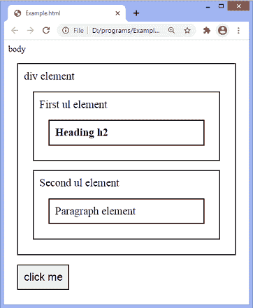
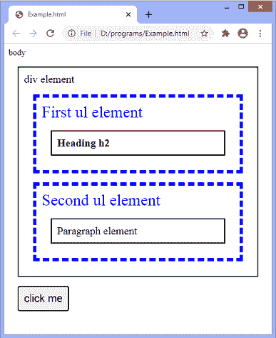
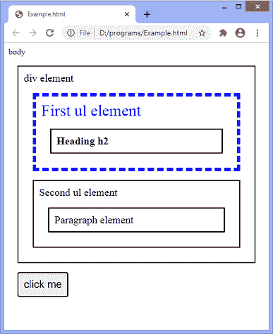

# jQuery children()方法

> 原文：<https://www.javatpoint.com/jquery-children-method>

jQuery 中的 **children()** 方法返回给定选择器的直接子级。这是 [JQuery](https://www.javatpoint.com/jquery-tutorial) 中的一个内置方法。这个方法只遍历 DOM 树中的一个层次。我们可以使用 **find()** 方法向下遍历多个层次或者返回后代(如孙子、曾孙等。).

假设我们有一个表示元素集的 jQuery 对象，那么 **children()** 方法在 DOM 树中向下搜索一个级别，并构造一个包含匹配元素子集的新 jQuery 对象。

**children()** 方法不返回文本节点。我们可以使用 **contents()** 方法获取所有有文本节点的孩子。

使用 **children()** 方法的语法如下。

### 句法

```

$(selector).children(filter)

```

该方法接受一个可选参数，即 ***滤波器*** 。

**过滤器:**这是一个可选值，用于缩小搜索范围。这是一个选择器表达式，可以与传递给 **$()** 函数的类型相同。

现在，我们将看到一些使用 **children()** 方法的例子。在第一个示例中，我们没有使用可选参数值，而在第二个示例中，我们使用可选值来缩小搜索范围。

### 示例 1

在这个例子中，有一个 div 元素和两个 **[ul](https://www.javatpoint.com/html-unordered-list)** 元素，一个标题 **[h2](https://www.javatpoint.com/html-heading)** 和一个[段落](https://www.javatpoint.com/html-paragraph)元素。这里，我们使用 **children()** 方法获取 **[div](https://www.javatpoint.com/html-div-tag)** 元素的直接子元素。两个 **ul** 元素都是 **div** 元素的直接子元素，因此 **children()** 方法将返回两个 **ul** 元素作为 **div** 元素的直接子元素。

我们必须点击给定的按钮才能看到效果。

```

<!DOCTYPE html>
<html>
<head>
<style>
.main * { 
  display: block;
  font-size: 20px;
  position: relative;
  border: 2px solid black;
  color: black; 
  padding: 10px;
  margin: 17px;
}
</style>
<script src="https://ajax.googleapis.com/ajax/libs/jquery/3.5.1/jquery.min.js"></script>
<script>
function fun(){
$(document).ready(function(){
  $("div").children().css({ "font-size": "30px", "color": "blue", "border": "6px dashed blue"});
});
}
</script>
</head>

<body class = "main"> body
  <div id = "div1"> div element
      <ul> First ul element
      <h2> Heading h2 </h2>
	  </ul>
	  <ul> Second ul element
          <p> Paragraph element </p>
		  </ul>
	</div>
<button onclick = "fun()"> click me </button>
  </body>
</html>

```

[Test it Now](https://www.javatpoint.com/oprweb/test.jsp?filename=jquery-children-method1)

**输出**



点击给定按钮后，输出将是-



现在，在下一个示例中，我们将使用 **children()** 方法的可选参数。

### 示例 2

在本例中，我们使用**过滤器**值来缩小搜索范围。这里有两个 **ul** 元素，并且都是 **div** 元素的直系子孙。我们正在传递第一个 **ul** 元素，类名 ***第一个*** 作为 **children()** 方法的可选参数。

因此，该方法将返回相应的 **ul** 元素，该元素现在是给定选择器的所有子元素之间的优先子元素。

```

<!DOCTYPE html>
<html>
<head>
<style>
.main * { 
  display: block;
  font-size: 20px;
  position: relative;
  border: 2px solid black;
  color: black; 
  padding: 10px;
  margin: 17px;
}
</style>
<script src="https://ajax.googleapis.com/ajax/libs/jquery/3.5.1/jquery.min.js"></script>
<script>
function fun(){
$(document).ready(function(){
  $("div").children("ul.first").css({ "font-size": "30px", "color": "blue", "border": "6px dashed blue"});
});
}
</script>
</head>

<body class = "main"> body
  <div id = "div1"> div element
      <ul class = "first"> First ul element
      <h2> Heading h2 </h2>
	  </ul>
	  <ul> Second ul element
          <p> Paragraph element </p>
		  </ul>
	</div>
<button onclick = "fun()"> click me </button>
  </body>
</html>

```

[Test it Now](https://www.javatpoint.com/oprweb/test.jsp?filename=jquery-children-method2)

**输出**

执行上述代码后，输出将是-


点击按钮，我们可以看到函数将首先返回类名为*的元素。这里，函数不会返回第二个 ul 元素，它也是 **div** 元素的直接子元素。*

 *点击按钮后，输出将是-



* * **