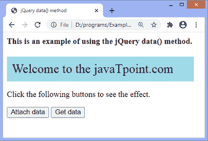
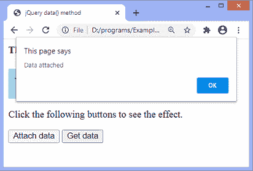
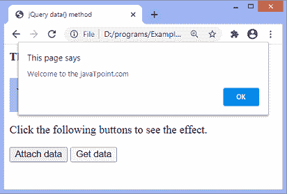

# jQuery 数据()方法

> 原文:[https://www.javatpoint.com/jquery-data-method](https://www.javatpoint.com/jquery-data-method)

**data()** 方法用于附加和获取所选元素的数据。这是 [JQuery](https://www.javatpoint.com/jquery-tutorial) 中的一个内置方法。我们可以使用**移除数据()**方法移除数据。

### 句法

这种方法的常用语法如下。下面有两种语法，第一种语法用于从选定的元素返回数据，第二种语法用于将数据附加到选定的元素。

**返回数据**

```

$(selector).data(name)

```

以上语法中的 ***名称*** 是可选参数。它是检索数据的数据名称。如果未指定，**数据()**方法会将元素的所有存储数据作为对象返回。该语法返回所选元素的检索数据。

**附上数据**

```

$(selector).data(name, value)

```

此语法用于将数据附加到选定的元素。以上语法中的参数 ***名称*** 和 ***值*** 为强制参数。名称指定要设置的数据 ***名称*** ，值指定要设置的数据 ***值*** 。

现在，让我们看一个使用 **data()** 方法来理解如何返回数据并将其附加到所选元素的例子。

### 例子

在本例中，我们将数据附加到 div 元素。这里有两个按钮，分别是**附加数据**和**获取数据**。**附加数据**按钮将数据附加到 div 元素，点击**获取数据**按钮，将检索 div 元素的数据。

如果我们先点击**获取数据**按钮，再点击**附加数据**按钮，我们会得到**未定义**。所以，要看到附加数据，我们必须在点击**附加数据**按钮后，点击**获取数据**按钮。

```

<html>

<head>
<title> jQuery data() method </title>
<script src="https://ajax.googleapis.com/ajax/libs/jquery/3.5.1/jquery.min.js"> </script>
<style>
div {
padding: 10px;
background-color: lightblue;
font-size: 25px;
width: 350px;
}
</style>
</head>

<body>
<h4> This is an example of using the jQuery data() method. </h4>
<div> This is a div element. </div>
<p> Click the following buttons to see the effect. </p>
<button id = "b1"> Attach data </button>
<button id = "b2"> Get data </button>
<script>
$("document").ready(function(){
$("#b1").click(function(){
$("div").data("name", "Welcome to the javaTpoint.com");
alert("Data attached");
})
$("#b2").click(function(){
alert($("div").data("name"));
$("div").text($("div").data("name"));
})
});
</script>
</body>

</html>

```

[Test it Now](https://www.javatpoint.com/oprweb/test.jsp?filename=jquery-data-method1)

**输出**

执行上述代码后，输出将是-



点击**附加数据**按钮，输出将为-



现在，点击**获取数据**按钮，输出将是-



* * *