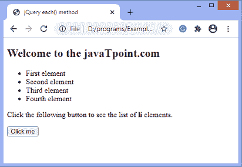
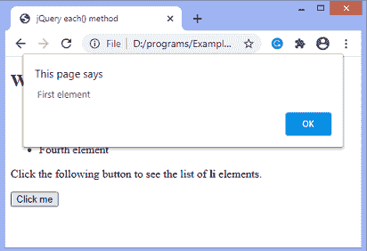
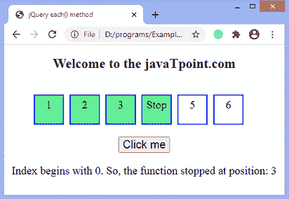

# jQuery 每个()方法

> 原文：<https://www.javatpoint.com/jquery-each-method>

jQuery 中的**每个()**方法为每个匹配的元素指定一个运行的函数。它是 [JQuery](https://www.javatpoint.com/jquery-tutorial) 中广泛使用的遍历方法之一。使用这个方法，我们可以迭代 jQuery 对象的 DOM 元素，并且可以为每个匹配的元素执行一个函数。

**每个()**接受一个参数 ***函数(索引，元素)*** ，这是一个为每个选定元素执行的回调函数。该函数还可选地需要两个参数，即索引和元素。因此，我们必须向每个()方法传递一个回调函数。

我们也可以从回调函数返回 **false** ，提前停止循环。

### 句法

```js

$(selector).each(function(index, element))

```

### 参数值

**各()**方法中使用的参数值定义如下。

**函数(索引，元素):**是必选项。它是一个回调函数，为每个选定的元素执行。它有两个参数值，定义如下。

*   **索引:**是指定选择器索引位置的整数值。
*   **元素:**是当前元素。我们可以使用这个关键字来引用当前匹配的元素。

让我们看一些插图来清楚地理解**各()**法。

### 示例 1

在本例中，点击按钮将触发**各()**方法。我们将此方法应用于 **li** 元素。所以，这个方法将迭代每个 **li** 元素。对每个选定的 **li** 执行该功能，并使用警告框显示相应的 **li** 元素的文本。

这里，我们不使用回调函数的参数值。

```js

<!DOCTYPE html>
<html>
<head>
<title> jQuery each() method </title>

<script src="https://ajax.googleapis.com/ajax/libs/jquery/3.5.1/jquery.min.js"></script>
</head>
<body>
<h2> Welcome to the javaTpoint.com </h2>
<ul>
<li> First element </li>
<li> Second element </li>
<li> Third element </li>
<li> Fourth element </li>
</ul>
<p>
Click the following button to see the list of <b> li </b> elements.
</p>
<button onclick = fun()> Click me </button>
<script>
function fun(){
$(document).ready(function(){
$("li").each(function(){
alert($(this).text())
});
});
}
</script>
</body>
</html>

```

**输出**

[Test it Now](https://www.javatpoint.com/oprweb/test.jsp?filename=jquery-each-method1)

执行上述代码后，输出将是-



单击按钮时，将显示如下警报。



同样，由于四个 **li** 元素，将显示四个警告框。

### 示例 2

在这个例子中，我们使用的回调函数的参数值是*和 ***元素*** 。*

 *我们正在对 **[li](https://www.javatpoint.com/html-lists)** 元素应用**各()**方法。因此，该方法将从索引 **0** 开始迭代 li 元素。它将在每个选定的 **li** 元素上执行，并更改相应元素的背景颜色。

一旦函数返回 **false** ，迭代停止。这里有六个 **li** 元素，当到达带有 **id = "i4"** 的元素时，功能停止。虽然是第四个元素，但是索引从 **0** 开始，所以元素的位置是 **3** 。

```js

<!DOCTYPE html>
<html>
<head>
<title> jQuery each() method </title>

<script src="https://ajax.googleapis.com/ajax/libs/jquery/3.5.1/jquery.min.js"></script>
<style>
body{
text-align: center;
}
ul{
list-style-type: none;
float: left;
}
li {
width: 40px;
height: 40px;
margin: 5px;
padding: 5px;
font-size: 20px;
float: left;
border: 2px solid blue;
}
button{
font-size: 20px;
}
</style>
</head>
<body>
<h2> Welcome to the javaTpoint.com </h2>
<ul>
<li> 1 </li>
<li> 2 </li>
<li> 3 </li>
<li id = "i4"> Stop </li>
<li> 5 </li>
<li> 6 </li>
</ul>
<button onclick = "fun()"> Click me </button>
<p></p>

<script>
function fun() {
$(document).ready(function(){
$("li").each(function(index, element) {
$(element).css("background", "lightgreen");
if ($(this).is("#i4")) {
$("p").text("Index begins with 0\. So, the function stopped at position: " + index ).css("fontSize", "20px");
return false;
}
});
});
}
</script>

</body>
</html>

```

**输出**

[Test it Now](https://www.javatpoint.com/oprweb/test.jsp?filename=jquery-each-method2)

执行上述代码后，点击给定的按钮，输出将是-



* * **