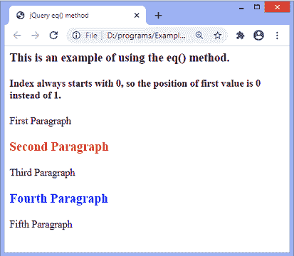
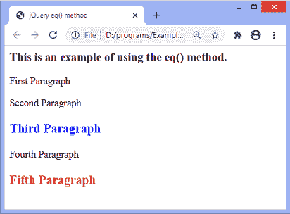

# jQuery eq()方法

> 原文：<https://www.javatpoint.com/jquery-eq-method>

jQuery 中的 **eq()** 方法返回给定索引的元素。此方法将元素集缩减为具有特定索引的元素集。指数可以是正数，也可以是负数。如果我们使用负索引，索引计数从所选元素列表的末尾开始。

假设我们有一个表示元素集合的 jQuery 对象，那么 **eq()** 方法构建一个新的 [JQuery](https://www.javatpoint.com/jquery-tutorial) 对象，它包含该集合的一个元素。

### 句法

```

$(selector).eq(index)

```

该方法接受一个名为*的参数。指数是以 **0** 开头的整数。*

 ***索引:**是指定元素索引的强制参数。它可以指定为正数或负数。负索引导致索引计数从列表的末尾开始，而不是从开头开始。它总是从 **0** 位置开始，所以第一个值的索引值是 **0** 而不是 **1** 。

让我们看一些使用 eq()方法的例子。在第一个示例中，我们将使用正索引值，在第二个示例中，我们将使用负索引值。

### 示例 1

在本例中，有五个段落元素与**class =“para”**相关。这里，我们使用的是 ***指数*** 参数的正值。

**eq()** 方法返回索引位置为 1 和 3 的元素。因为索引从 0 开始，所以它返回第二个和第四个元素。

```

<html>

<head>
<title> jQuery eq() method </title>
<script src="https://ajax.googleapis.com/ajax/libs/jquery/1.12.2/jquery.min.js"></script>
<script>
$(document).ready(function() {
$(".para").eq(1).css({ "color": "red", "fontSize": "20px", "fontWeight": "bold" });
$(".para").eq(3).css({ "color": "blue", "fontSize": "20px", "fontWeight": "bold" });
});
</script>
</head>

<body>
<h3> This is an example of using the eq() method. </h3>
<h4> Index always starts with 0, so the position of first value is 0 instead of 1\. </h4>
<p class = "para"> First Paragraph </p>
<p class = "para"> Second Paragraph </p>
<p class = "para"> Third Paragraph </p>
<p class = "para"> Fourth Paragraph </p>
<p class = "para"> Fifth Paragraph </p>
</body>

</html>

```

**输出**

[Test it Now](https://www.javatpoint.com/oprweb/test.jsp?filename=jquery-eq-method1)

执行上述代码后，输出将是-



### 示例 2

这里，我们使用的是 ***指标*** 参数的负值。 **eq()** 方法返回索引位置为-1 和-3 的元素。

在输出中，我们可以看到 **eq()** 方法返回第五个和第三个[段落](https://www.javatpoint.com/html-paragraph)元素。因为第五段的负指数值是 **-1** ，第三段的负指数值是 **-3** 。

```

html>

<head>
<title> jQuery eq() method </title>
<script src="https://ajax.googleapis.com/ajax/libs/jquery/1.12.2/jquery.min.js"></script>
<script>
$(document).ready(function() {
$(".para").eq(-1).css({ "color": "red", "fontSize": "20px", "fontWeight": "bold" });
$(".para").eq(-3).css({ "color": "blue", "fontSize": "20px", "fontWeight": "bold" });
});
</script>
</head>

<body>
<h3> This is an example of using the eq() method. </h3>
<p class = "para"> First Paragraph </p>
<p class = "para"> Second Paragraph </p>
<p class = "para"> Third Paragraph </p>
<p class = "para"> Fourth Paragraph </p>
<p class = "para"> Fifth Paragraph </p>
</body>

</html>

```

**输出**

[Test it Now](https://www.javatpoint.com/oprweb/test.jsp?filename=jquery-eq-method2)

执行上述代码后，输出将是-



* * **