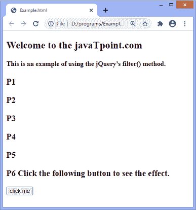

# jQuery 筛选器()

> 原文:[https://www.javatpoint.com/jquery-filter](https://www.javatpoint.com/jquery-filter)

**filter()** 方法返回符合指定条件的元素。如果元素不符合条件，它们将从选择中删除。

它可以用一个 ***选择器*** 或一个 ***函数*** 作为其过滤匹配元素集的参数。当使用 ***选择器*** 时，该方法过滤与给定选择器不匹配的元素。如果我们使用 ***函数*** ，该方法会过滤掉与给定函数不匹配的元素。通常，此方法用于减少对所选元素集中的元素的搜索。

### 句法

**使用*选择器***

```

$(selector).filter(selector)

```

**使用*功能***

```

$(selector).filter(function(index))

```

该函数的参数值定义如下。

**选择器:**可选属性。它可以是一个 [JQuery](https://www.javatpoint.com/jquery-tutorial) 对象或者一个选择器表达式。我们还可以使用逗号分隔的表达式列表一次应用多个过滤器。可以这样写:

```

filter("id1, #id2")

```

**功能:**也是可选参数。此参数指定为组中的每个元素运行的函数。如果函数返回 true，则保留元素。否则，返回 false 时，将移除元素。

*参数表示元素在集合中的位置。从 **0** 位置开始。*

 *让我们看一些例子来理解如何使用**滤镜()**方法。

### 示例 1

在本例中，我们使用了**过滤器()**功能的**选择器**属性。这里，**过滤器()**函数返回类名为 ***para*** 的所有段落元素。有一些 div 元素，段落元素和其他元素。与类 ***相关的四个段落元素中有三个段落元素，段落*** 。

我们必须点击给定的按钮才能看到结果。

```

<!DOCTYPE html>
<html>
<head>
<style>
div{
font-size: 20px;
font-weight: bold;
}
</style>
<script src="https://ajax.googleapis.com/ajax/libs/jquery/3.5.1/jquery.min.js"></script>
<script>
function fun(){
$(document).ready(function(){
  $("p").filter(".para").css({"background": "yellow"});
});
}
</script>
</head>

<body> 
<h2> Welcome to the javaTpoint.com </h2>   
<h4>This is an example of using the jQuery's filter() method. </h4>
  <div id = "div1"> This is first div element. </div>

          <p class = "para"> This is first paragraph element </p>
		  <div id = "div2"> This is second div element. </div>
		  <p class = "para"> This is second paragraph element </p>
		  <p class = "para"> This is third paragraph element </p>
<p> Click the following button to see the effect. </p>
<button onclick = "fun()"> click me </button>
  </body>
</html>

```

[Test it Now](https://www.javatpoint.com/oprweb/test.jsp?filename=jquery-filter1)

**输出**


点击按钮后，我们可以看到函数返回类名**段**相关的段落元素。


### 示例 2

在本例中，我们使用的是 ***函数(index)*** 参数的 filter()函数..此处，该功能突出显示索引位置为 **1、3、**和 **5** 的段落元素。因为索引以 **0** 开头，所以它在偶数位置突出了段落。

```

<!DOCTYPE html>
<html>
<head>
<style>
p{
font-size: 20px;
font-weight: bold;
}
</style>
<script src="https://ajax.googleapis.com/ajax/libs/jquery/3.5.1/jquery.min.js"></script>
<script>
function fun(){
$(document).ready(function(){
  $("p").filter(function(index) {
  if(index == 1 || index == 3 || index == 5){
  return true;
  }
  }).css({"background": "yellow"});
});
}
</script>
</head>

<body> 
<h2> Welcome to the javaTpoint.com </h2>   
<h4> This is an example of using the jQuery's filter() method. </h4>
  <p class = "para1"> P1 </p>
          <p class = "para2"> P2 </p>
		  <p class = "para3"> P3 </p>
		  <p class = "para4"> P4 </p>
		  <p class = "para5"> P5</p>
<p class = "para6"> P6 Click the following button to see the effect. </p>
<button onclick = "fun()"> click me </button>
  </body>
</html>

```

[Test it Now](https://www.javatpoint.com/oprweb/test.jsp?filename=jquery-filter2)

**输出**

执行上述代码后，输出是-



单击给定按钮后，我们可以看到该函数返回索引位置为 1、3 和 5 的段落元素。索引的位置从 **0** 开始。


* * **