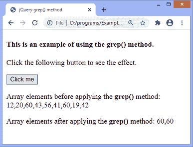

# jQuery grep()方法

> 原文:[https://www.javatpoint.com/jquery-grep-method](https://www.javatpoint.com/jquery-grep-method)

[jQuery](https://www.javatpoint.com/jquery-tutorial) 中的 **grep()** 方法找到满足给定过滤函数的数组元素。它不影响原始数组。此方法返回筛选数组，即满足给定筛选函数的元素。

### 句法

**grep()** 方法常用语法如下。

```

jQuery.grep(array, function(element, index) [, invert])

```

### 参数值

该方法包括如下定义的一些参数。

**数组:**为必输参数。它指定要搜索的类似数组的对象。

**函数(元素，索引):**指定用作过滤函数的函数。它接受两个名为 ***元素*** 和 ***索引*** 的参数，其中第一个参数保存数组元素，第二个参数保存对应元素的索引。它返回一个布尔值，要么是**真**要么是**假**。它也是一个强制参数。这个函数处理每个数组元素。如果元素通过了条件，那么它才会包含在结果中。

**反转:**是可选参数。它接受布尔值。其默认值为**假**。如果指定为 false 或未通过，则 **grep()** 函数返回数组元素，过滤器函数返回 **true** 。如果该参数被指定为 **true** ， **grep()** 函数返回过滤器函数返回 false 的数组元素。

现在，让我们看一些使用 **grep()** 方法的例子。

### 示例 1

在这个例子中，有一个名为 **arr** 的数组，其中包含一些项目。我们在此数组上应用了 **grep()** 方法，而没有指定其可选的**反转**参数。因此，该方法返回可被 2 整除且索引大于或等于 2 的数组元素。

```

<!DOCTYPE html>
<html>
<head>
<title> jQuery grep() method </title>
<script src = "https://ajax.googleapis.com/ajax/libs/jquery/3.5.1/jquery.min.js"> </script>
</head>
<body>
<h4> This is an example of using the grep() method. </h4>
<p> Click the following button to see the effect. </p>
<button id = "btn"> Click me </button>
<p id = "p1"> </p>
<p id = "p2"> </p>
<script>
$(document).ready(function() {
$("#btn").click(function(){
var arr = [ 12, 20, 60, 43, 56, 41, 60, 19, 42, 60, 78, 18];
$("#p1").html("Array elements before applying the <b> grep() </b> method: " + arr + "<br>");
arr = $.grep(arr, function(element, index) {
return ( element%2 == 0 && index >= 2 );
});
$("#p2").html("Array elements after applying the <b> grep() </b> method: " + arr);
});
});
</script>
</body>

</html>

```

[Test it Now](https://www.javatpoint.com/oprweb/test.jsp?filename=jquery-grep-method1)

**输出**

执行上述代码后，输出将是-


点击给定按钮后，输出将是-


### 示例 2

在本例中，我们使用**反转**参数，并将其设置为**真**。这里有一个名为 **arr** 的数组，里面有一些项目。如果我们不将**反转**参数设置为真，函数将返回不等于 60 的数组元素。但是由于我们使用**反转**参数并将其设置为**真**，因此该函数返回值为 **60 的数组元素。**

在输出中，我们可以看到 **grep()** 方法返回指定的 filter 函数返回 false 的数组元素。

```

<!DOCTYPE html>
<html>
<head>
<title> jQuery grep() method </title>
<script src = "https://ajax.googleapis.com/ajax/libs/jquery/3.5.1/jquery.min.js"> </script>
</head>
<body>
<h4> This is an example of using the grep() method. </h4>
<p> Click the following button to see the effect. </p>
<button id = "btn"> Click me </button>
<p id = "p1"> </p>
<p id = "p2"> </p>
<script>
$(document).ready(function() {
$("#btn").click(function(){
var arr = [ 12, 20, 60, 44, 56, 41, 60, 19, 42,];
$("#p1").html("Array elements before applying the <b> grep() </b> method: " + arr + "<br>");
arr = $.grep(arr, function(element, index) {
return ( element != 60);
}, true);
$("#p2").html("Array elements after applying the <b> grep() </b> method: " + arr);
});
});
</script>
</body>

</html>

```

[Test it Now](https://www.javatpoint.com/oprweb/test.jsp?filename=jquery-grep-method2)

**输出**

执行上述代码后，输出将是-


点击给定的按钮，输出将是-



* * *