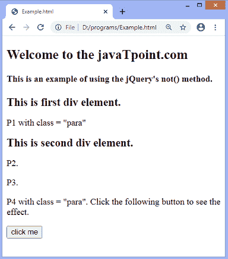
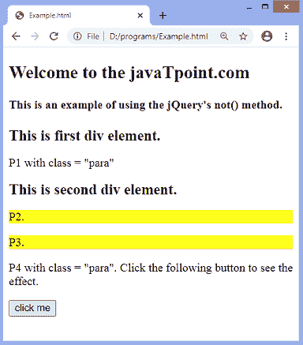
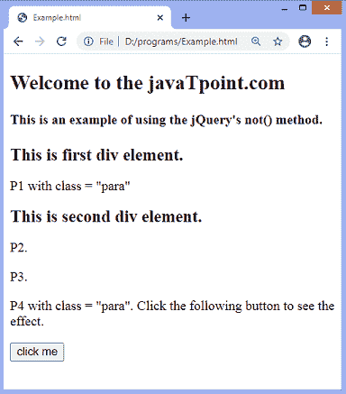
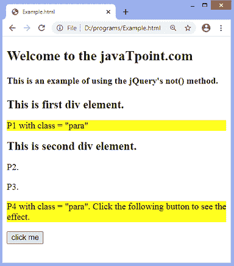

# jQuery not()方法

> 原文：<https://www.javatpoint.com/jquery-not-method>

**not()** 方法返回不符合指定条件的元素。如果元素与条件不匹配，则从选择中返回它们，同时匹配的元素将被移除。

这是一个 jQuery 的内置方法，与 [**过滤器()**方法](https://www.javatpoint.com/jquery-filter)相反。假设我们有一个代表元素集合的 [jQuery](https://www.javatpoint.com/jquery-tutorial) 对象，那么 **not()** 方法构建一个包含匹配元素子集的新 jQuery 对象。传递的参数，无论是*还是 ***函数(索引)*** 都将针对每个元素进行测试，不匹配指定参数的元素将被返回。*

 *### 句法

**使用标准**

```js

$(selector).not(criteria)

```

**使用功能**

```js

$(selector).not(function(index))

```

该函数的参数值定义如下。

**标准:**为可选参数。它可以是一个 jQuery 对象，也可以是要从元素集中删除的以逗号分隔的元素列表。它是一个选择器表达式，可以是特定元素的 **id** 和**类**。

**功能:**也是可选参数。此参数指定为组中的每个元素运行的函数。如果函数返回 false，则保留元素。否则，返回 true 时，将移除元素。

*参数表示元素在集合中的位置。从 **0** 位置开始。*

 *让我们看一些例子来理解如何使用 **not()** 方法。

### 示例 1

在本例中，我们使用的是**而不是()**函数的**条件**属性。这里， **not()** 函数返回所有与类名 ***不匹配的段落元素，para*** 。有一些 div 元素，段落元素和其他元素。与类 ***相关的四个段落元素中有两个段落元素，段落*** 。

我们必须点击给定的按钮才能看到结果。

```js

<!DOCTYPE html>
<html>
<head>
<style>
div{
font-size: 20px;
font-weight: bold;
}
</style>
<script src="https://ajax.googleapis.com/ajax/libs/jquery/3.5.1/jquery.min.js"></script>
<script>
function fun(){
$(document).ready(function(){
  $("p").not(".para").css({"background": "yellow"});
});
}
</script>
</head>

<body> 
<h2> Welcome to the javaTpoint.com </h2>   
<h4> This is an example of using the jQuery's not() method. </h4>
  <div id = "div1"> This is first div element. </div>

          <p class = "para"> P1 with class = "para" </p>
		  <div id = "div2"> This is second div element. </div>
		  <p> P2\. </p>
		  <p> P3\. </p>
<p class = "para"> P4 with class = "para". Click the following button to see the effect. </p>
<button onclick = "fun()"> click me </button>
  </body>
</html>

```

[Test it Now](https://www.javatpoint.com/oprweb/test.jsp?filename=jquery-not-method1)

**输出**



点击按钮后，我们可以看到 **not()** 返回与类名**段落无关的段落元素。**



### 示例 2

在本例中，我们使用的是**而不是()**函数的 ***函数(指数)*** 参数..这里，该功能突出显示与索引位置 **1** 和 **2** 不匹配的段落元素。

我们必须记住**指数**从 **0** 位置开始。

```js

<!DOCTYPE html>
<html>
<head>
<style>
div{
font-size: 20px;
font-weight: bold;
}
</style>
<script src="https://ajax.googleapis.com/ajax/libs/jquery/3.5.1/jquery.min.js"></script>
<script>
function fun(){
$(document).ready(function(){
  $("p").not(function(index) {
  if(index == 1 || index == 2){
  return true;
  }
  }).css({"background": "yellow"});
});
}
</script>
</head>

<body> 
<h2> Welcome to the javaTpoint.com </h2>   
<h4> This is an example of using the jQuery's not() method. </h4>
  <div id = "div1"> This is first div element. </div>

          <p class = "para"> P1 with class = "para" </p>
		  <div id = "div2"> This is second div element. </div>
		  <p> P2\. </p>
		  <p> P3\. </p>
<p class = "para"> P4 with class = "para". Click the following button to see the effect. </p>
<button onclick = "fun()"> click me </button>
  </body>
</html>

```

[Test it Now](https://www.javatpoint.com/oprweb/test.jsp?filename=jquery-not-method2)

**输出**



点击按钮后，我们可以看到 **not()** 方法返回索引位置为 **0** 和 **3** 的段落元素。



* * ***