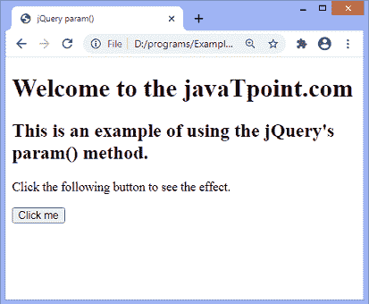
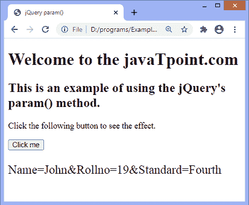
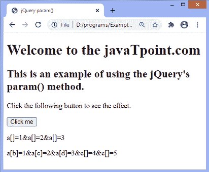

# jQuery param()方法

> 原文:[https://www.javatpoint.com/jquery-param-method](https://www.javatpoint.com/jquery-param-method)

jQuery 的 **param()** 方法允许我们创建对象或数组的序列化表示。当发出 [AJAX](https://www.javatpoint.com/ajax-tutorial) 请求时，我们可以在网址字符串中使用这些序列化值。

这个方法有两个参数，***【obj】***和 ***trad*** ，其中第一个参数是强制的，第二个参数是可选的。

### 句法

```

$.param( obj, trad )

```

该方法的参数值定义如下。

### 参数值

**obj:** 是强制参数。它可以是要序列化的数组或对象。

**trad:** 此可选参数为布尔值，用于指定是否使用传统样式的参数序列化。

让我们看一些插图来了解如何使用 **param()** 方法。

### 示例 1

在本例中，我们使用 param()方法来创建对象的序列化表示。这里有一个名为**学生**的对象，带有一些学生的详细信息。我们正在对**学生**对象实施**参数()**方法，以创建其序列化表示。

```

<!DOCTYPE html>
<html>

<head>
<title> jQuery param() </title>
<script src="https://ajax.googleapis.com/ajax/libs/jquery/3.5.1/jquery.min.js"></script></head>

<body>

<h1> Welcome to the javaTpoint.com </h1>

<h2> This is an example of using the jQuery's param() method. </h2>
<p> Click the following button to see the effect. </p>
<button> Click me</button>

<p id = "para"></p>

<script>
$(document).ready(function() {

student = new Object();

student.Name = "John";
student.Rollno = "19";
student.Standard = "Fourth";

$("button").click(function() {
$("#para").text($.param(student)).css("fontSize", "23px");
});
});
</script>
</body>

</html>

```

[Test it Now](https://www.javatpoint.com/oprweb/test.jsp?filename=jquery-param-method1)

**输出**

执行上述代码后，输出将是-



点击给定按钮后，输出将是-



### 示例 2

在这个例子中，有一些复杂的对象。我们正在这些复杂的对象上实现 **param()** 方法来查看结果。这里，我们使用**解码组件**来显示解码对象。

这里有两个对象 **obj1** 和 **obj2** 。我们正在这些对象上实现**参数()**方法，并以解码格式显示结果。

```

<!DOCTYPE html>
<html>

<head>
<title> jQuery param() </title>
<script src="https://ajax.googleapis.com/ajax/libs/jquery/3.5.1/jquery.min.js"></script></head>

<body>

<h1> Welcome to the javaTpoint.com </h1>

<h2> This is an example of using the jQuery's param() method. </h2>
<p> Click the following button to see the effect. </p>
<button> Click me</button>

<p id = "p1"></p>
<p id = "p2"></p>

<script>
$(document).ready(function() {
var obj1 = new Object ({
a: [ 1, 2, 3 ]
});
var obj2 = new Object ({
a: { b: 1, c: 2, d: 3}, e: [ 4, 5]
});

$("button").click(function() {
var res1 = decodeURIComponent( $.param(obj1));
$("#p1").text(res1);
var res2 = decodeURIComponent( $.param(obj2));
$("#p2").text(res2);
});
});
</script>
</body>

</html>

```

执行上述代码后，输出将是-


点击给定按钮后，输出将是-



* * *