# jQuery 单选按钮

> 原文:[https://www.javatpoint.com/jquery-radio-button](https://www.javatpoint.com/jquery-radio-button)

单选按钮是允许用户从几个选项中只选择一个相关选项的小圆圈。通常，单选按钮用于登记表、考试门户、测验门户等。

### 选中/未选中单选按钮

在选中的单选按钮中，一次只能选择一个选项。

我们用**。在 [jQuery](https://www.javatpoint.com/jquery-tutorial) 中创建选中/未选中单选按钮的 prop()** 方法。

**语法:**

*   **对于选中的单选按钮**

```

$("element").prop("checked", true)

```

*   对于未选中的单选按钮

```

$("element").prop("checked", false)

```

### 代码:

```

<!DOCTYPE html>
<html lang = "en">

<head>
    <meta charset = "UTF-8">
    <meta name = "viewport" content = "width=device-width, initial-scale=1.0">
    <title>jQuery radio button example</title>
    <!-- jQuery CDN -->
    <script src = "https://code.jquery.com/jquery-2.2.4.min.js"></script> 
    <!-- Bootstrap CDN -->
    <link rel="stylesheet" href="https://maxcdn.bootstrapcdn.com/bootstrap/3.3.6/css/bootstrap.min.css"/> 
    <script src="https://ajax.googleapis.com/ajax/libs/jquery/1.11.3/jquery.min.js"></script>  
  <script src="https://maxcdn.bootstrapcdn.com/bootstrap/3.3.5/js/bootstrap.min.js"></script> 
<style>
    .container {
        align: "center"
    }
</style>
</head>

<body>
    <div class = "jumbotron">
  <h1 style="color: black;"> jQuery checked/unchecked radio button</h1>
    <div class = "container text-center">
        <h3>Select your gender</h3>
    <label><input type = "radio" name = "gender" id = "male">Male</label>
    <label><input type = "radio" name = "gender" id = "female">Female</label>
</p>
</div>
<!-- Script for checked radio button -->
    <script type="text/javascript">
        $(document).ready(function () {

                $("#male").prop("checked", true);            

        }); 
    </script>
    </div>
</body>
</html>

```

**输出:**

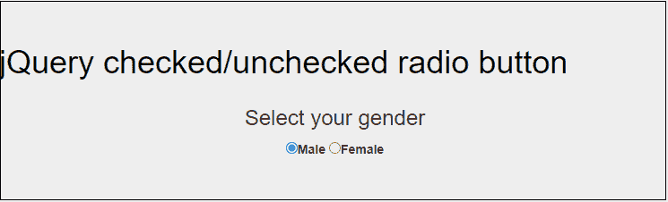

### 根据按钮点击选择单选按钮

jQuery 还允许我们根据用户点击的按钮选择相关的单选按钮。

**语法:**

```

$(".button1").click(function () {
          $("#element1").prop("checked" , true)
         });

```

**代码:**

```

<!DOCTYPE html>
<html lang = "en">
<head>
    <meta charset = "UTF-8">
    <meta name = "viewport" content = "width=device-width, initial-scale=1.0">
    <title> Radio button based on button click </title>
    <style>
        .container {
            text-align: center;
            margin: 50px;
        }
    </style>
    <!-- jQuery CDN -->
    <script src = "https://ajax.googleapis.com/ajax/libs/jquery/1.11.3/jquery.min.js"></script>
    <!-- Add javascript -->
    <script type = "text/javascript">
     $(document).ready(function () {
        // check radio botton element (y) on clicking the button 1 (yes) 
         $(".yes").click(function () {
          $("#y").prop("checked" , true)
         });
       // check radio botton element (n) on clicking the button 2 (no) 
         $(".no").click(function () {
          $("#n").prop("checked" , true)
         });
        //  uncheck both radio buttons element on clicking the reset button
         $(".reset").click(function () {
         $("#y").prop("checked" , false)
         $("#n").prop("checked" , false)
       });
     });
    </script>
    <!-- Script closed -->
</head>
<body>
    <div class = "container">
    <h2 style="color:rgb(8, 43, 109)"> Are you eligible for vote ? </h2>
   <p>
       <input type = "radio" name = "laguage" id = "y">Y
       <input type = "radio" name = "laguage" id = "n">N

    </p> 
    <p>
        <input type = "button" class = "yes" value = "Yes">
        <input type = "button" class = "no" value = "No">
        <input type = "button" class = "reset" value = "reset">
     </p>
</div>
</body>
</html>

```

**输出:**

*   **点击是按钮**

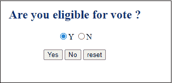

*   **点击否按钮**

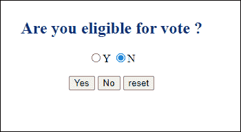

*   **点击复位按钮**

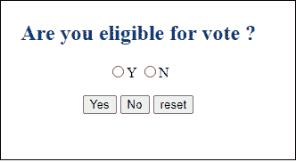

### 获取选定的选中单选按钮值

**。val ()** 方法用于轻松获取选中选中单选按钮的值。

```

<!DOCTYPE html>
<html>

<head>
    <title> Get Selected radio button value exmaple </title>
    <!-- Add jQuery and Bootstrap CDN -->
    <link rel = "stylesheet" href = "https://cdnjs.cloudflare.com/ajax/libs/twitter-bootstrap/4.4.1/css/bootstrap.min.css">
    <script src = "https://cdnjs.cloudflare.com/ajax/libs/jquery/3.4.1/jquery.js"> </script>
    <script src = "https://cdnjs.cloudflare.com/ajax/libs/twitter-bootstrap/4.4.1/js/bootstrap.min.js">
    </script>
</head>

<body>
    <form name = "jd" action="">
        <div class = "wrapper">
            <h1 align = "center" style="margin-top: 40px; padding: 20px;"> Get radio button value example </h1>
            <div class = "row">
                <div class = "col-md-4 offset-4">
                    <div class = "card mt-3">
                        <div class = "form-group text-center bg-light">

                            <div class = "card-header bg-success">
                                <h2 class = "form-group-heading text-center"> Seleat a Course </h2>
                            </div>
                            <form action = "/action_page.php">
                                <label>
                                    <input type = "radio" name = "course" onclick = "myCourseFunction(this.value)"
                                        value = "Java">Java
                                </label>
                                <label>
                                    <input type = "radio" name = "course" onclick = "myCourseFunction(this.value)"
                                        value = "C Language">C Language
                                </label>
                                <label>
                                <input type = "radio" name = "course" onclick = "myCourseFunction(this.value)"
                                    value = "C++">C++
                                    </label>
                                    <label>
                                <input type = "radio" name = "course" onclick = "myCourseFunction(this.value)"
                                    value = "Python">Python
                                    </label>
                                <br><br>

                                Your Selected Course is: <input type = "text" id = "result">
                                <input type = "submit" value = "Submit">
                            </form>
                        </div>
                    </div>
                </div>
            </div>
        </div>
    </form>
    <!-- Add script -->
    <script>
        function myCourseFunction(course) {
            document.getElementById("result").value = course;
        }
    </script>
</body>

</html>

```

**输出 1:**

点击 java 单选按钮，文本框显示您选择的课程是 [java](https://www.javatpoint.com/java-tutorial) 。

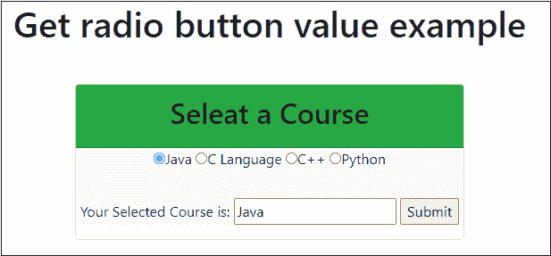

**输出 2:**

点击 C 语言单选按钮，文本框显示您选择的课程是 [C 语言](https://www.javatpoint.com/c-programming-language-tutorial)。

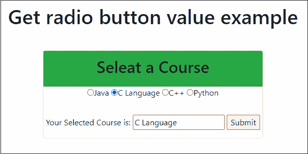

**输出 3:**

点击 C++单选按钮，文本框显示您选择的课程是 [C++](https://www.javatpoint.com/cpp-tutorial) 。

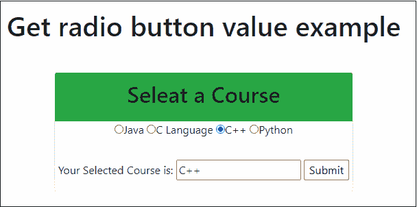

**输出 4:**

点击 Python 单选按钮，文本框显示您选择的课程是 [Python](https://www.javatpoint.com/python-tutorial) 。

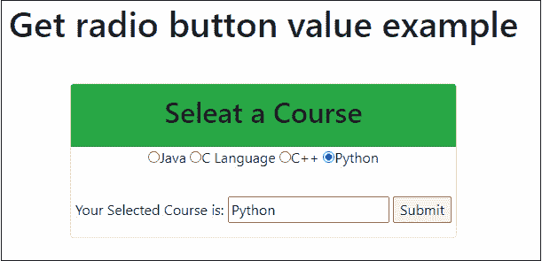

### 单选按钮验证

在 jQuery 单选按钮验证中，我们将对单选按钮应用验证，它(单选按钮)不能为空。

例如，如果任何用户不检查单选按钮，他/她将收到错误消息。

要在 jQuery 中应用单选按钮验证，请使用以下脚本-

```

<script>
       $(document).ready(function() {
         $("#button").click(function() {
             var x = $("input[type = 'radio']:checked");
             if(x.length>0)
             {
                alert("Course selected successfully!!!");
                 return true;

             }
             else {
                    $("#radio_error").text("please select a course");
                    return false;
             }
         });
       }); 
    </script>

```

**代码:**

```

<!DOCTYPE html>
<html>

<head>
    <title> Radio button validation </title>
    <!-- Add Bootstrap and jQuery CDN -->
    <link rel = "stylesheet" href = "https://cdnjs.cloudflare.com/ajax/libs/twitter-bootstrap/4.4.1/css/bootstrap.min.css">
    <script src = "https://cdnjs.cloudflare.com/ajax/libs/jquery/3.4.1/jquery.js"></script>
    <script src = "https://cdnjs.cloudflare.com/ajax/libs/twitter-bootstrap/4.4.1/js/bootstrap.min.js"></script>
</head>
 <style>
     #radio_error {
         color: red;
         font-size: 18;
     }
     .container {
         text-align: center;
         height: 30px;
         width: 350px;
     }
 </style>
<body>
    <h1 align = "center" style = "margin-top: 20px; padding: 12px; color: black">Radio button validation</h1>
    <div class = "container">
        <div class = "card mt-2 offset-0">
        <h2 style="color: darkgreen;">Select a Course</h2>

        <form>

        <label>
            <input type = "radio" name = "course" class = "course" value = "btech">B.Tech
        </label>
        <br>
        <label>
            <input type = "radio" name = "course" class = "course" value = "mtech">M.Tech
        </label>
        <br>
        <label>
            <input type = "radio" name = "course" class = "course" value = "bca">BCA
        </label>
        <br>
        <label>
            <input type = "radio" name = "course" class = "course" value = "mca">MCA
        </label>
        <br>
        <font id = "radio_error"></font>
        <br>
        <label>
            <input type = "submit" name = "submit" value = "Submit" id = "mysbutton">
        </label>
    </form>
    </div>
    </div>
    <script src = "text/script"></script>
    <!-- Script to add radio button validation -->
    <script>
       $(document).ready(function() {
         $("#mysbutton").click(function() {
             var x = $("input[type = 'radio']:checked");
             if(x.length>0)
             {
                alert("Course selected successfully!!!");
                 return true;

             }
             else {
                    $("#radio_error").text("please select a course");
                    return false;
             }
         });
       }); 
    </script>
    <!-- Script ends -->
</body>
</html>

```

**输出**

*   选择单选按钮，然后单击提交按钮。将出现一个弹出窗口，提示:**课程选择成功。**

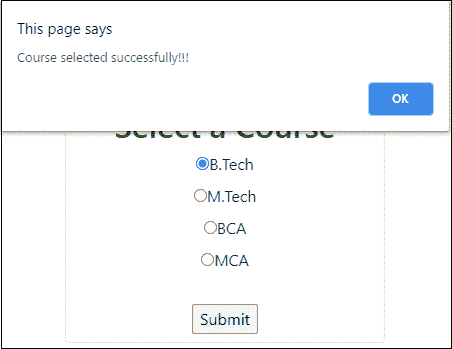

*   只需点击提交按钮，就会出现一条错误信息，提示:**请选择课程。**

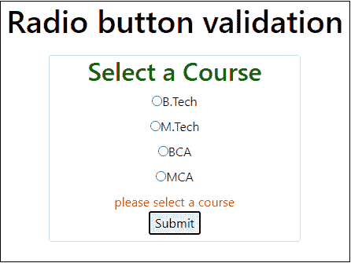

### 显示和隐藏单选按钮内容

在 jQuery 中**显示()和隐藏()**方法用于显示和隐藏内容。

**代码:**

```

<!DOCTYPE html>
<html>

<head>
    <title> Radio button validation </title>
    <!-- Add Bootstrap and jQuery CDN -->
    <link rel = "stylesheet" href = "https://cdnjs.cloudflare.com/ajax/libs/twitter-bootstrap/4.4.1/css/bootstrap.min.css">
    <script src = "https://cdnjs.cloudflare.com/ajax/libs/jquery/3.4.1/jquery.js"> </script>
    <script src = "https://cdnjs.cloudflare.com/ajax/libs/twitter-bootstrap/4.4.1/js/bootstrap.min.js"> </script>
</head>
<style>
    #radio_error {
        color: red;
        font-size: 18;
    }

    .container {
        text-align: center;
        height: 90px;
        width: 450px;
    }
    #container {
        border: 2px sloid black;
        background-color: aqua;
        color: green;
        margin: 10px;
        padding: 5px;
        }
</style>

<body>
    <h1 align = "center" style = "margin-top: 20px; padding: 12px; color: black"> Show/Hide Radio button Content </h1>
    <div class = "container">
        <div class = "card mt-2 offset-0">
            <h2 style = "color: darkgreen;"> Show and hide Content </h2>

            <form>
                <label>
                    <input type = "radio" name = "sh" id = "hi" value = "hide">Hide Content
                </label>
                <br>
                <label>
                    <input type = "radio" name = "sh" id = "sh" value = "show">Show Content
                </label>
                <div id = "container">
                    <!-- Content that displayed after clicking the Show Content radio button -->
                    <h3>Welcome to javaTpoint</h3>
                </div>
            </form>
        </div>
    </div>
    <script src = "text/script"></script>
    <!-- Script to add show and hide content -->
    <script>
        $(document).ready(function () {
            $("div#container").hide();
            $("input[name=sh]").on("click", function () {
                var selectedValue = $("input[name=sh]:checked").val();
                if (selectedValue == "show") {
                    $("div#container").show();
                }
                else {
                    if (selectedValue == "hide") {
                        $("div#container").hide();
                    }
                }

            });
        });

    </script>
    <!-- Script ends -->
</body>

</html>

```

**输出:**

*   单击“显示内容”单选按钮，将显示内容“欢迎使用 javaTpoint”。

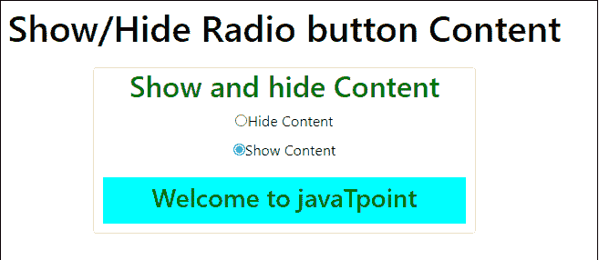

*   单击隐藏内容单选按钮，欢迎使用 javaTpoint 的内容将消失。

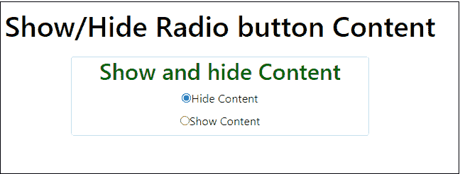

* * *