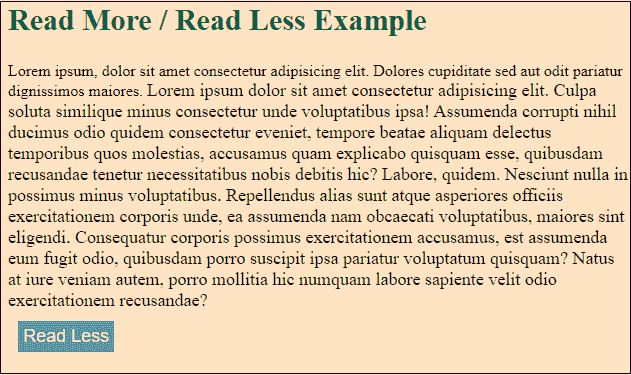

# jQuery 读得多/读得少

> 原文：<https://www.javatpoint.com/jquery-read-more-read-less>

多读和少读用于提高页面文本的可见性。它允许用户通过按“阅读更多”按钮阅读页面的全部内容，并通过按“阅读更少”按钮隐藏内容。

下面的 jQuery 脚本用于创建读多读少。

**脚本:**

```

    <script>
    $(document).ready(function(){
        $(".read").click(function(){
            $(this).prev().toggle();
            $(this).siblings('.dots').toggle();
            if($(this).text()=='Read More'){
                $(this).text('Read Less');
            }
            else{
                $(this).text('Read More');
            }

        });
    });
    </script>

```

在 jQuery 中，下面的代码用于创建“多读”和“少读”按钮。

**代码:**

```

<!DOCTYPE html>
<html lang="en">
<head>
    <meta charset = "UTF-8">
    <meta name = "viewport" content="width=device-width, initial-scale=1.0">
    <title>jQuery read more / read less example</title>
     <!-- jQuery CDN -->
    <script src = " https://cdnjs.cloudflare.com/ajax/libs/jquery/2.2.4/jquery.min.js"></script>
     <script src = "assets/jquery.min.js"></script>
<style>
    body {
        background-color: bisque;
        padding: 0;
        margin: 0;
    }
    .container {
        font-size: 20px;
    }
    section {
        padding: 20px;
        margin: 10px;
    }
    h1 {
        color: green;
        font-size: 30px;
    }
     .more {
         display: none;
         font-size: 18px;
     }
     button {
         margin: 10px;
         padding: 5px;
         background-color:cadetblue;
         border: none;
         font-size: 18px;
         outline: none;
         display: block;
         cursor: pointer;
         color: wheat;
    }
</style>
</head>
<body>
    <section>
        <div calss = "container">
            <h1>Read More / Read Less Example</h1>
            Lorem ipsum, dolor sit amet consectetur adipisicing elit. Dolores cupiditate sed aut odit pariatur dignissimos maiores.
            <span class = "dots">.....</span>
            <span class = "more" style ="font-size : 18px;">
            Lorem ipsum dolor sit amet consectetur adipisicing elit. Culpa soluta similique minus consectetur unde voluptatibus ipsa! Assumenda corrupti nihil ducimus odio quidem consectetur eveniet, tempore beatae aliquam delectus temporibus quos molestias, accusamus quam explicabo quisquam esse, quibusdam recusandae tenetur necessitatibus nobis debitis hic? Labore, quidem. Nesciunt nulla in possimus minus voluptatibus. Repellendus alias sunt atque asperiores officiis exercitationem corporis unde, ea assumenda nam obcaecati voluptatibus, maiores sint eligendi. Consequatur corporis possimus exercitationem accusamus, est assumenda eum fugit odio, quibusdam porro suscipit ipsa pariatur voluptatum quisquam? Natus at iure veniam autem, porro mollitia hic numquam labore sapiente velit odio exercitationem recusandae?
            </span>

            <button class = "read">Read More</button>
        </div>
    </section>
    <!-- Script to add read more and read less -->
    <script>
    $(document).ready(function(){
        $(".read").click(function(){
            $(this).prev().toggle();
            $(this).siblings('.dots').toggle();
            if($(this).text()=='Read More'){
                $(this).text('Read Less');
            }
            else{
                $(this).text('Read More');
            }

        });
    });
    </script>
</body>
</html>

```

[Test it Now](https://www.javatpoint.com/oprweb/test.jsp?filename=jquery-read-more-read-less1)

**输出:**

单击“阅读更多”按钮-



单击少读按钮-


* * *