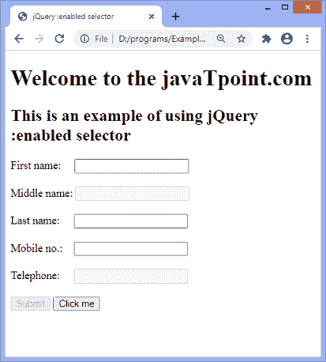
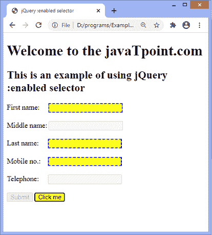
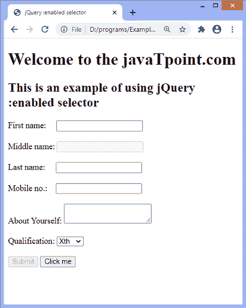
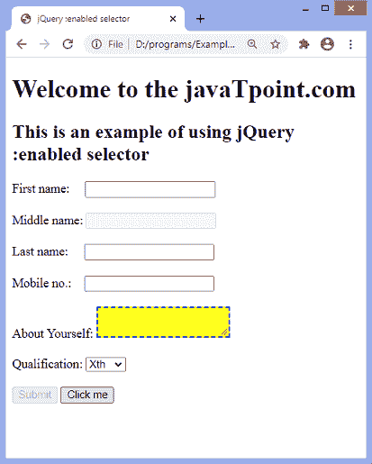

# jquery:启用的选择器

> 原文：<https://www.javatpoint.com/jquery-enabled-selector>

**:启用**选择器用于选择所有启用的表单元素。它是一个伪类选择器，也可以用来设置已启用的用户界面元素的样式。默认情况下，表单元素处于启用状态。如果一些表单元素被禁用，那么使用**:启用**选择器，我们可以突出显示启用的元素。

该选择器只能用于支持**禁用的**属性的 [HTML](https://www.javatpoint.com/html-tutorial) 元素，即 **[<输入>](https://www.javatpoint.com/html-input-tag) 、 [<文本区>](https://www.javatpoint.com/html-textarea) 、 [<按钮>](https://www.javatpoint.com/html-button-tag) 、 [<选项>](https://www.javatpoint.com/html-option-tag) 、 [<字段集>](https://www.javatpoint.com/html-fieldset-tag) 、[<opt group>T16](https://www.javatpoint.com/html-optgroup-tag)**

### 句法

```js

$(":enabled")

```

上面的语法类似于 **$(''*:enabled'')** 选择所有启用的表单元素。

如果我们必须选择特定的启用元素，我们可以通过在选择器前面加上元素类型或组件名称来过滤元素。假设我们必须只选择启用的按钮元素，那么它可以写成如下。

```js

$("button:enabled")

```

让我们看一些使用**:启用**选择器的例子。

### 示例 1

在本例中，我们使用 **:enabled** 选择器为所有启用的表单元素设置样式。这里有一个表单，包括一些禁用和启用的元素。

我们必须点击给定的启用按钮才能看到效果。单击按钮时，选择器将突出显示所有启用的元素。

```js

<!DOCTYPE html>
<html>

<head>
<title> jQuery :enabled selector </title>
<script src = "https://ajax.googleapis.com/ajax/libs/jquery/3.3.1/jquery.min.js"> </script>

<script>
$(document).ready(function() {
$('button').click(function(){
$(":enabled").css({"background-color": "yellow", "border": "2px dashed blue"});
});
});
</script>

</head>

<body>
<form action = "#">
<h1> Welcome to the javaTpoint.com </h1>
<h2> This is an example of using jQuery :enabled selector </h2>

<div>
First name:  <input type = "text"> <br/> <br/>
Middle name: <input type = "text" disabled = "disabled"> <br/>  <br/>
Last name:   <input type = "text"> <br/>  <br/>
Mobile no.:  <input type = "text"> <br/>  <br/>
Telephone:   <input type = "text" disabled = "disabled"> <br/> <br/>
<input type = "submit" id = "inp" disabled = "disabled">
<button> Click me </button>
</div>

</form>

</body>

</html>

```

[Test it Now](https://www.javatpoint.com/oprweb/test.jsp?filename=jquery-enabled-selector1)

**输出:**

执行上述代码后，输出将是-



点击给定按钮后，输出将是-



### 示例 2

在本例中，我们使用 **:enabled** 选择器来设置特定类型的已启用元素的样式。这里有一个表单，包括一些禁用和启用的元素。虽然启用了多个元素，但程序只会突出显示已启用的**文本区**。

我们必须点击给定的启用按钮来突出显示**文本区域**。有一个单独的 textarea 元素，因此它将选择该单独的元素。但是如果有多个 textarea 元素，那么所有的 textarea 元素都会高亮显示。

```js

<!DOCTYPE html>
<html>

<head>
<title> jQuery :enabled selector </title>
<script src = "https://ajax.googleapis.com/ajax/libs/jquery/3.3.1/jquery.min.js"> </script>

<script>
$(document).ready(function() {
$('button').click(function(){
$("textarea:enabled").css({"background-color": "yellow", "border": "2px dashed blue"});
});
});
</script>

</head>

<body>
<form action = "#">
<h1> Welcome to the javaTpoint.com </h1>
<h2> This is an example of using jQuery :enabled selector </h2>

<div>
First name:  <input type = "text"> <br/> <br/>
Middle name: <input type = "text" disabled = "disabled"> <br/>  <br/>
Last name:   <input type = "text"> <br/>  <br/>
Mobile no.:  <input type = "text"> <br/>  <br/>
About Yourself: <textarea> </textarea> <br/>  <br/>
Qualification: <select>
<option> Xth </option>
<option> XIIth </option>
<option> UG </option>
<option> PG </option>
</select> <br/>  <br/>
<input type = "submit" id = "inp" disabled = "disabled">

<button> Click me </button>
</div>

</form>

</body>

</html>

```

[Test it Now](https://www.javatpoint.com/oprweb/test.jsp?filename=jquery-enabled-selector2)

**输出:**

执行上述代码后，输出将是-



点击给定按钮后，输出将是-



* * *