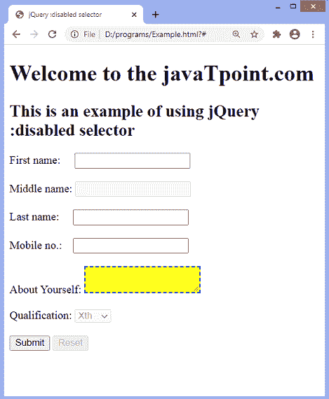

# jQuery:禁用的选择器

> 原文：<https://www.javatpoint.com/jquery-disabled-selector>

**:禁用**选择器用于选择所有禁用的表单元素。这是一个伪类选择器，也可以用来设置禁用的用户界面元素的样式。此选择器只能用于支持**禁用的 **[<属性的](https://www.javatpoint.com/html-input-tag) [HTML](https://www.javatpoint.com/html-tutorial) 元素，即输入> 、 [<文本区域>](https://www.javatpoint.com/html-textarea) 、 [<按钮>](https://www.javatpoint.com/html-button-tag) 、 [<选项>](https://www.javatpoint.com/html-option-tag) 、 [<字段集>](https://www.javatpoint.com/html-fieldset-tag) 、 [<选项组>](https://www.javatpoint.com/html-optgroup-tag)****

### 句法

```

$(":disabled")

```

上面的语法类似于选择所有禁用的表单元素的 **$(''*:disabled'')** 。

如果我们必须选择特定的禁用元素，我们可以通过在选择器前面加上元素类型或组件名称来过滤元素。假设我们必须只选择禁用的按钮元素，那么它可以写成如下形式。

```

$("button:disabled")

```

让我们看一些使用**:禁用**选择器的例子。

### 示例 1

在本例中，我们使用**:禁用**选择器来设置所有禁用的表单元素的样式。这里有一个表单，包含一些禁用的文本字段和按钮。选择器将找到所有禁用的元素，并对它们应用样式。

```

<!DOCTYPE html>
<html>

<head>
<title> jQuery :disabled selector </title>
<script src = "https://ajax.googleapis.com/ajax/libs/jquery/3.3.1/jquery.min.js"> </script>

<script>
$(document).ready(function() {
$('#inp').click(function(){
$(":disabled").css({"background-color": "yellow", "border": "2px dashed blue"});
});
});
</script>

</head>

<body>
<form action = "#">
<h1> Welcome to the javaTpoint.com </h1>
<h2> This is an example of using jQuery :disabled selector </h2>

<div>
First name:  <input type = "text"> <br/> <br/>
Middle name: <input type = "text" disabled = "disabled"> <br/>  <br/>
Last name:   <input type = "text"> <br/>  <br/>
Mobile no.:  <input type = "text"> <br/>  <br/>
Telephone:   <input type = "text" disabled = "disabled"> <br/> <br/>
<input type = "submit" id = "inp">
<button disabled = "disabled"> Reset </button>
</div>

</form>

</body>

</html>

```

[Test it Now](https://www.javatpoint.com/oprweb/test.jsp?filename=jquery-disabled-selector1)

**输出**

执行上述代码后，输出将是-


点击给定按钮后，输出将是-


### 示例 2

在本例中，我们使用**:禁用**选择器来设置禁用元素的特定类型。这里，有一个表单包含一些禁用的元素，如文本字段、文本区域和按钮。虽然禁用了多个元素，但程序将只对禁用的文本区域设置样式。

该表单包括两个按钮，一个是禁用的，另一个是启用的。我们必须单击“启用”按钮来设置禁用的 textarea 元素的样式。有一个单独的 textarea 元素，所以它将选择这个单独的元素。但是如果有多个 textarea 元素，那么所有 textarea 元素都将被设置样式。

```

<!DOCTYPE html>
<html>

<head>
<title> jQuery :disabled selector </title>
<script src = "https://ajax.googleapis.com/ajax/libs/jquery/3.3.1/jquery.min.js"> </script>

<script>
$(document).ready(function() {
$('#inp').click(function(){
$("textarea:disabled").css({"background-color": "yellow", "border": "2px dashed blue"});
});
});
</script>

</head>

<body>
<form action = "#">
<h1> Welcome to the javaTpoint.com </h1>
<h2> This is an example of using jQuery :disabled selector </h2>

<div>
First name:  <input type = "text"> <br/> <br/>
Middle name: <input type = "text" disabled = "disabled"> <br/>  <br/>
Last name:   <input type = "text"> <br/>  <br/>
Mobile no.:  <input type = "text"> <br/>  <br/>
About Yourself: <textarea disabled = "disabled"> </textarea> <br/>  <br/>
Qualification: <select disabled = "disabled">
<option> Xth </option>
<option> XIIth </option>
<option> UG </option>
<option> PG </option>
</select> <br/>  <br/>
<input type = "submit" id = "inp">

<button disabled = "disabled"> Reset </button>
</div>

</form>

</body>

</html>

```

[Test it Now](https://www.javatpoint.com/oprweb/test.jsp?filename=jquery-disabled-selector2)

**输出**

执行上述代码后，输出将是-


点击给定按钮后，输出将是-



* * *