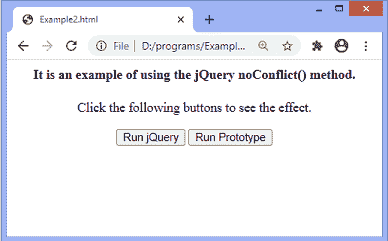
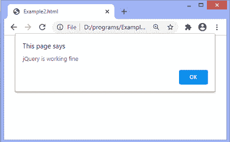
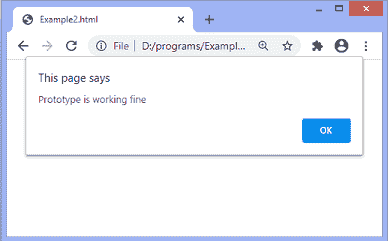

# jQuery noConflict()方法

> 原文：<https://www.javatpoint.com/jquery-noconflict-method>

jQuery 中的 **$(美元)**符号用作别名或快捷方式。许多 JavaScript 库也使用 **$** 符号作为快捷方式，在同一页面上还有 jQuery。但是如果两个不同的框架使用相同的别名，可能会发生冲突，其中一个框架可能会停止工作。

在 [jQuery](https://www.javatpoint.com/jquery-tutorial) 中实现的 **noConflict()** 方法来处理这种情况。用于避免使用 **$** 变量与其他库的冲突。该方法释放对 **$(美元)**标识符的保留，以便其他库可以使用它。

这个方法也可以用来创建新的快捷方式。这意味着我们可以使用这个方法来创建一个自定义别名。如果我们不想定义另一个快捷方式，或者我们喜欢使用 **$** 符号，因为它节省时间且易于使用，那么我们可以使用一种新的方法；也就是说，我们可以将 **$** 作为参数传递给 **$(文档)。ready()** 功能。可以写成-

```

jQuery.noConflict();
jQuery(document).ready(function($){
 });

```

### 句法

该方法的常用语法如下。

```

$.noConflict();

```

它不接受任何论点。

让我们看一些插图来了解如何使用 **noConflict()** 。

### 示例 1

在这个例子中，我们使用了两个 [JS](https://www.javatpoint.com/javascript-tutorial) 库，它们是原型和 jQuery。这两个库都使用 **$** 作为别名，所以我们使用 **noConflict()** 方法来避免冲突。 **noConflict()** 方法允许 jQuery 释放对 **$** 标识符的保留，并使其可用于其他库。这里，另一个库是原型。

加载文档后，jQuery 进入无冲突模式。这里，我们使用 jQuery **noConflict()** 创建一个新的别名。我们正在声明一个名为 ***j*** 的变量，并为其分配 **noConflict()** 方法。现在，这个变量将作为 jQuery 代码的别名。将使用该新别名，而不是使用 **$** 。因此，它避免了与原型库的冲突。

我们必须点击给定的按钮才能看到效果。

```

<html> 

<head> 
<script src="https://ajax.googleapis.com/ajax/libs/prototype/1.7.2.0/prototype.js"></script>
<script src="https://ajax.googleapis.com/ajax/libs/jquery/3.5.1/jquery.min.js"></script>
	<script> 
var j = $.noConflict();
j(document).ready(function(){
j("#b1").click(function(){
alert("jQuery is working fine");
});
});

document.observe("dom:loaded", function(){
$("b2").observe("click", function(event){
alert("Prototype is working fine");
});
});
</script>
</head> 

<body style = "text-align: center;"> 
<h4> It is an example of using the jQuery noConflict() method. </h4>
	<p> Click the following buttons to see the effect. </p>
	<button id = "b1"> Run jQuery </button> 
	<button id = "b2"> Run Prototype </button>
</body> 

</html> 

```

[Test it Now](https://www.javatpoint.com/oprweb/test.jsp?filename=jquery-noconflict-method1)

**输出:**

执行上述代码后，输出将是-



点击给定的**运行 jQuery** 按钮后，输出将为-



点击给定的**运行原型**按钮后，输出将为-



假设我们有一段 jQuery 代码，其中我们使用了 **$** 快捷方式，我们不想修改代码，或者我们喜欢使用 **$** ，因为它很容易使用，所以我们可以使用下一个示例中给出的方法。

### 示例 2

这里，我们只是传递 **$** 符号作为 **$(文档)的参数。ready()** 功能。这允许我们在函数内使用 **$** 访问 jQuery。但是在函数之外，我们必须使用全名 **jQuery** 。

输出与上面的示例相同。

```

<html>

<head>
<script src="https://ajax.googleapis.com/ajax/libs/prototype/1.7.2.0/prototype.js"></script>
<script src="https://ajax.googleapis.com/ajax/libs/jquery/3.5.1/jquery.min.js"></script>
<script>
jQuery.noConflict();
jQuery(document).ready(function($){
$("#b1").click(function(){
alert("jQuery is working fine");
});
});

document.observe("dom:loaded", function(){
$("b2").observe("click", function(event){
alert("Prototype is working fine");
});
});
</script>
</head>

<body style = "text-align: center;">
<h4> It is an example of using the jQuery noConflict() method. </h4>
<p> Click the following buttons to see the effect. </p>
<button id = "b1"> Run jQuery </button>
<button id = "b2"> Run Prototype </button>
</body>

</html>

```

[Test it Now](https://www.javatpoint.com/oprweb/test.jsp?filename=jquery-noconflict-method2)

**输出:**

执行上述代码后，输出将是-


点击给定的**运行 jQuery** 按钮后，输出将为-


点击给定的**运行原型**按钮后，输出将为-


* * *