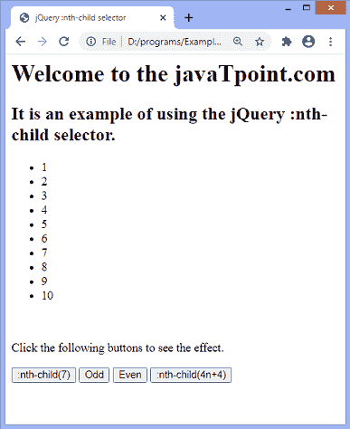
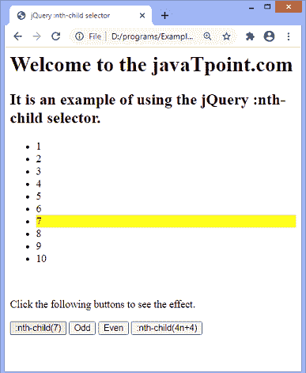
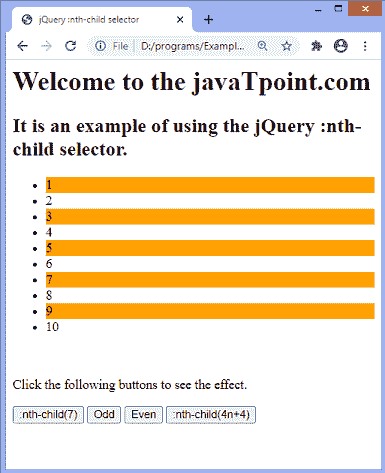
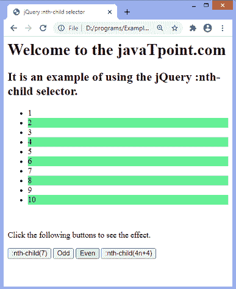
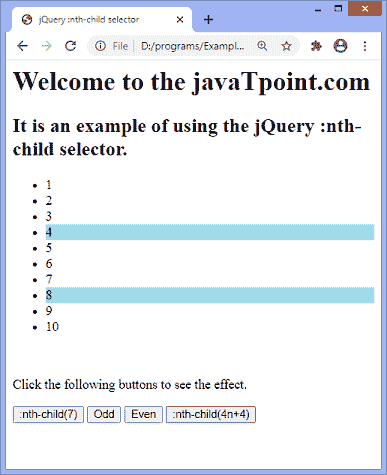

# jQuery:第 n 个子选择器

> 原文：<https://www.javatpoint.com/jquery-nth-child-selector>

**:第 n 个子()**选择器用于根据元素的位置匹配元素，而不考虑其父元素的类型。该选择器用于根据元素在一组同级元素中的位置来匹配元素。它匹配每个元素，即第 n 个子元素。

如果我们必须选择特定类型的父元素的第 n 个子元素，我们可以使用**:第 n 个类型的**选择器。

### 句法

使用**:第 n 个子**选择器的语法如下。

```js

:nth-child( n | odd | even | formula)

```

### 参数值

上述语法中提到的值定义如下。

**n:** 上面语法中的 ***n*** 必须是整数。它表示要匹配的每个子级的索引。此参数指示选择器选择出现在指定索引值的子级。第一个元素的索引号是 1。

**奇数:**它选择每一个奇数子元素。

**偶数:**它选择每个偶数子元素。

**公式:**选择出现在公式值处的子元素。寻找不同孩子的公式是 **an+b** 。

如果我们考虑 a = 2 和 b = 1，公式将是 2n+1，它将只选择索引值 1，3，5，..…索引。为了解出这个公式，我们可以把 n 的值设为 0，1，2，…n。

现在，让我们看一个使用所有参数值的例子:**第 n 个子**选择器。

### 例子

在这个例子中，我们使用了 **[:第 n 个子选择器](https://www.javatpoint.com/css-nth-child-selector)** 的所有参数值。从 1 到 10 有十个列表项，四个按钮命名为**:第 n 个子(7)、奇数、偶数、**和**第 n 个子(4n+4)** 。第一个按钮将选择索引号为 7 的列表项，第二个按钮将选择奇数列表项，第三个按钮将选择偶数列表项，第四个按钮将选择索引值为 4 和 8 的列表项。

我们必须点击给定的按钮才能看到效果。

```js

<html>
<head>
<title> jQuery :nth-child selector </title>

<script src = "https://ajax.googleapis.com/ajax/libs/jquery/3.5.1/jquery.min.js"></script>
</head>
<body>

<h1> Welcome to the javaTpoint.com </h1>
<h2> It is an example of using the jQuery :nth-child selector. </h2>
<ul>
	<li> 1 </li>
	<li> 2 </li>
	<li> 3 </li>
	<li> 4 </li>
	<li> 5 </li>
	<li> 6 </li>
	<li> 7 </li>
	<li> 8 </li>
	<li> 9 </li>
	<li> 10 </li>
</ul>
<br/>

<p> Click the following buttons to see the effect. </p>
<button id = "n"> :nth-child(7) </button>
<button id = "odd"> Odd </button>
<button id = "even"> Even </button>
<button id = "formula"> :nth-child(4n+4) </button>

<script>
$(document).ready(function(){
    $("#n").click(function () {
    $("li:nth-child(7)").css("background-color", "yellow");    
    });

	$("#odd").click(function () {
	$("li").css("background-color", "white");
    $("li:nth-child(odd)").css("background-color", "orange");    
    });

	$("#even").click(function () {
	$("li").css("background-color", "white");
    $("li:nth-child(even)").css("background-color", "lightgreen");    
    });

	$("#formula").click(function () {
    $("li").css("background-color", "white");
	$("li:nth-child(4n+4)").css("background-color", "lightblue");    

    });

	});
</script>

</body>
</html>

```

[Test it Now](https://www.javatpoint.com/oprweb/test.jsp?filename=jquery-nth-child-selector1)

**输出:**

执行上述代码后，输出将是-



点击第一个按钮后，将选择索引为 7 的列表项，如下所示-



点击第二个按钮后，所有奇数列表项将被选中，如下所示-



点击第三个按钮后，所有偶数列表项将被选中，如下所示-



点击第四个按钮后，索引值为 4 和 8 的列表项将被选中，如下所示-



* * *