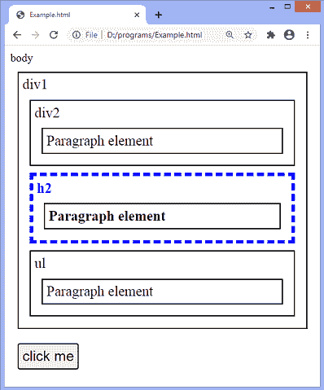

# jQuery parent()方法

> 原文：<https://www.javatpoint.com/jquery-parent-method>

jQuery 中的 **parent()** 方法找到给定选择器的直接父项。它是 jQuery 中的一个内置函数。这个方法只遍历 DOM 树中的一个层次，并返回所选元素的直接父元素。

**parent()** 方法类似于 **parents()** 方法，因为两者都向上到达 DOM 树并返回父元素。但不同的是， **parents()** 方法遍历 DOM 树中的多个层次，返回所有祖先，包括祖父母、曾祖父母等。而 **parent()** 方法向上遍历单个级别，只返回给定选择器的直接父级。

### 句法

```

$(selector).parent(filter)

```

以上语法中的 ***选择器*** 代表要搜索其父元素的所选元素。上述语法中的 ***过滤器*** 是指定选择器表达式的可选参数，用于缩小搜索范围。

### 示例 1

在本例中，我们没有使用 **parent()** 方法的可选参数。这里有一个 div 元素，包含一个 **[ul](https://www.javatpoint.com/html-unordered-list)** 元素，一个标题 **h2** 和一个段落元素。

我们正在应用 **parent()** 方法来搜索标题 h2 的父项。如果我们使用 **parents()** 方法而不是使用**parents()**方法，标题 h2 的所有祖先，包括主体元素，都将被突出显示。

```

<!DOCTYPE html>
<html>
<head>
<style>
.main *{ 
  font-size: 20px;
  border: 2px solid black;
  color: black; 
  padding: 10px;
  margin: 17px;
}
</style>
<script src = "https://ajax.googleapis.com/ajax/libs/jquery/3.5.1/jquery.min.js"></script>
<script>
function fun(){
$(document).ready(function(){
  $("h2").parent().css({ "font-size": "30px", "color": "blue", "border": "6px dashed blue"});
});
}
</script>
</head>
<body class = "main"> 
  <div> div
    <ul> ul 
      <h2> Heading h2
          <p> Paragraph element </p>
      </h2>
    </ul>   
	</div>
<button onclick = "fun()"> click me </button>
  </body>
</html>

```

[Test it Now](https://www.javatpoint.com/oprweb/test.jsp?filename=jquery-parent-method1)

**输出:**

执行上述代码后，输出将是-


点击给定按钮后，输出将是-


### 示例 2

在本例中，我们使用 **parent()** 方法的可选参数来查找第一个[段落](https://www.javatpoint.com/html-paragraph)元素的父元素。这里有不止一个段落元素，但是我们必须找到第一个段落元素的父元素。所以，我们传递伪选择器(**:首先**)作为**父()**方法的可选值。

```

<!DOCTYPE html>
<html>
<head>
<style>
.main *{ 
  font-size: 20px;
  border: 2px solid black;
  color: black; 
  padding: 5px;
  margin: 10px;
}
</style>
<script src = "https://ajax.googleapis.com/ajax/libs/jquery/3.5.1/jquery.min.js"></script>
<script>
function fun() {
$(document).ready(function(){
  $("p").parent(":first").css({"color": "blue", "border": "3px dashed blue"});
});
}
</script>
</head>

<body class = "main"> body
    <div> div1
  <div> div2
    <h2> h2
          <p> Paragraph element </p>
    </h2>   
	    <h2> h2
          <p> Paragraph element </p>
    </h2>   
	</div>
  </div>
<button onclick = "fun()"> click me </button>
</body>

</html>

```

执行上述代码后，输出将是-


点击给定按钮后，输出将是-


### 示例 3

在本例中，我们使用 **parent()** 方法的可选参数来查找给定选择器的特定父项。这里有三个段落元素，父母不同。我们正在寻找段落元素的父元素 **h2** 。所以，为了达到同样的效果，我们必须通过 **h2** 作为**父()的可选值**方法。

```

<!DOCTYPE html>
<html>
<head>
<style>
.main *{ 
  font-size: 20px;
  border: 2px solid black;
  color: black; 
  padding: 5px;
  margin: 10px;
}
</style>
<script src = "https://ajax.googleapis.com/ajax/libs/jquery/3.5.1/jquery.min.js"></script>
<script>
function fun() {
$(document).ready(function(){
  $("p").parent("h2").css({"color": "blue", "border": "5px dashed blue"});
});
}
</script>
</head>

<body class = "main"> body
    <div> div1
    <div> div2 
          <p> Paragraph element </p>
    </div>   
	    <h2> h2
          <p> Paragraph element </p>
    </h2>   
	<ul> ul
          <p> Paragraph element </p>
    </ul>
  </div>
<button onclick = "fun()"> click me </button>
</body>

</html>

```

[Test it Now](https://www.javatpoint.com/oprweb/test.jsp?filename=jquery-parent-method3)

**输出:**

执行上述代码后，输出将是-


点击给定按钮后，输出将是-



* * *