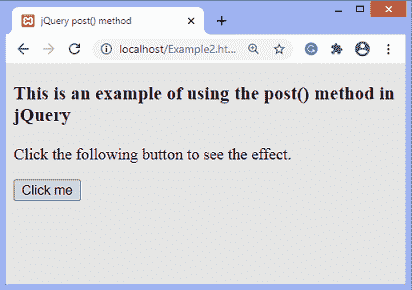

# jQuery post()方法

> 原文：<https://www.javatpoint.com/jquery-post-method>

**post()** 方法是常用的 HTTP 方法之一。它用于使用 HTTP POST 请求从服务器加载页面。此方法从不缓存数据，通常用于随请求发送数据。我们无法为开机自检请求添加书签。

### 句法

```js

$(selector).post(URL, data, function(data, status, xhr), dataType)

```

### 参数值

此方法包括四个参数值，其中一个是必需的，其他是可选的。我们必须将**网址**参数包含到**帖子()**方法中。下表定义了 **post()** 方法的参数值。

| 参数 | 价值观念 |
| **URL** | 它是请求发送到的网址。这是一个强制参数。 |
| **数据** | 这是一个可选参数。它是与请求一起发送到服务器的数据。 |
| **功能(数据、状态、xhr)** | 这也是一个可选参数。它是一个回调函数，对成功的服务器请求执行。
它还有三个参数: ***数据、状态、*** 和 ***xhr*** 其中 ***数据*** 包含来自服务器的结果数据， ***状态*** 代表请求状态如“成功”、“错误”等。，而 ***xhr*** 包含了 XMLHttpRequest 对象。 |
| **数据类型** | 这也是一个可选参数，它定义了我们期望从服务器获得的数据类型。类型可以是“文本”、“json”、“jsonp”、“html”、“脚本”和“XML”。 |

现在，让我们看一个使用 **post()** 方法的简单例子。

### 例子

在这个例子中，我们使用 **post()** 方法发出一个 post 请求。我们使用的两个参数是的网址和 **post()** 方法的回调函数。这里 [Http](https://www.javatpoint.com/computer-network-http) Post 请求用于从服务器加载数据。

网址参数设置为值***【test.html】***。回调函数有两个参数 ***数据*** 和 ***状态*** ，其中第一个参数保存请求页面的数据，第二个参数保存请求状态。

在输出中，我们可以看到来自服务器的数据加载，请求的状态为**成功。**

**test.html**

```js

<h1> Hello World </h1>
<h2> Welcome to the javaTpoint.com </h2>

```

### Example2.html

```js

<!DOCTYPE html>
<html>

<head>
<title> jQuery post() method </title>

<script src= "https://ajax.googleapis.com/ajax/libs/jquery/3.5.1/jquery.min.js"> </script>
</head>

<body>
<h3> This is an example of using the post() method in jQuery </h3>
<p> Click the following button to see the effect. </p>
<button> Click me </button>
<p id = "p1"> </p>
<p id = "p2"> </p>
<script>
$(document).ready(function() {
$("button").click(function() {
$.post("test.html", function(data,status) {
document.getElementById("p1").innerHTML = data;
document.getElementById("p2").innerHTML = "Status: " + status;
});
});
});
</script>
</body>

</html>

```

[Test it Now](https://www.javatpoint.com/oprweb/test.jsp?filename=jquery-post-method1)

**输出:**

执行上述代码后，输出将是-



点击给定按钮后，输出将是-


* * *